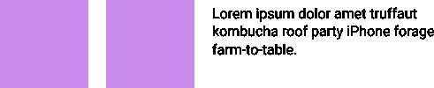
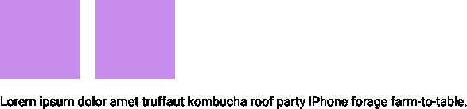

# 什么是:之前和之后伪元素？

> 原文：<https://dev.to/neshaz/what-are-before-and-after-pseudo-elements-48o6>

CSS **:before 和:after** 属性也称为**伪元素**。它们用于在元素内容之前或之后添加内容。这些伪元素有很多很好的用途，所以让我们来探索其中的一些。

## 语法

如果你有这样一个元素:

`<h2>welcome to our website</h2>`

你可以使用 CSS 在它之前添加一个伪元素，就像这样:

```
h2:before {
  content: “Hello“;
  color : blue;
} 
```

结果将是:

[T2】](https://res.cloudinary.com/practicaldev/image/fetch/s--zZ-GgYpZ--/c_limit%2Cf_auto%2Cfl_progressive%2Cq_auto%2Cw_880/https://kolosek.com/conteimg/2018/03/before_add_element.png)

这是一个非常简单的原则。您正在某个元素之前或之后添加内容。在**添加图标、[清除浮动](https://kolosek.com/css-clear-float/)** 以及其他许多情况下，这非常有用。

伪元素的**内容**属性可以用空引号`content: “”`将**留空**。这样，您可以将伪元素视为一个没有内容的**框**。如果内容属性被完全移除，伪元素**将不能工作**。

## 添加图标

可能 before 和 after 伪元素最流行的用法是用它们来添加图标。我们可以添加一个简单的图标 png 图标。

让我们看看标记。

HTML

```
<h2>Weather report</h2> 
```

CSS

```
h2:before {
  content: “ ”; 
  display: block;
  height: 15px;
  width: 25px;
  url: (‘images/icon.png’’);
  margin-right: 5px;
} 
```

结果是:

[T2】](https://res.cloudinary.com/practicaldev/image/fetch/s--JKcr8wVP--/c_limit%2Cf_auto%2Cfl_progressive%2Cq_auto%2Cw_880/https://kolosek.com/conteimg/2018/03/before_add_icon.png)

现在，您已经成功地在文本前添加了一个图标。很简单，对吧？

## 结算浮动

在元素[被浮动](https://kolosek.com/css-float/)之后，需要添加另一个元素来清除浮动。你可以**避免添加一个新元素**而简单地使用一个伪元素。

假设你有这种情况:

[T2】](https://res.cloudinary.com/practicaldev/image/fetch/s--nPZ3Oqt1--/c_limit%2Cf_auto%2Cfl_progressive%2Cq_auto%2Cw_880/https://kolosek.com/conteimg/2018/03/after_clear_float.png)

您可以使用下一个代码来实现对浮点数的学习。

HTML

```
<div class="box-container">
  <div class=”box”></div>
  <div class=”box”></div>
</div>
<p>Lorem ipsum dolor amet truffaut kombucha roof party iPhone forage farm-to-table.</p> 
```

CSS

```
.box-container:before,
.box-container:after {
  content: "";
  display: block;
}

.box-container:after {
  clear: both;
}

.box {
  height: 100px;
  width: 100px;
  background-color: #C98EED;
  margin: 5px;
  float: left;
} 
```

现在，让我们看看结果。

[T2】](https://res.cloudinary.com/practicaldev/image/fetch/s--M6_preI9--/c_limit%2Cf_auto%2Cfl_progressive%2Cq_auto%2Cw_880/https://kolosek.com/conteimg/2018/03/after_float_cleared.png)

通过使用这个方法，你可以**清除浮动**并且段落被移动到两个元素下面。

## 使用背景图像

您还可以**将背景图像**添加到伪元素中。这通常在设计标题样式时使用。

HTML

```
<h2>Hello World</h2> 
```

CSS

```
h2:after {
  content: “”;
  width: 100%;
  height: 30px;
  background: url(‘underline.png’) center center no-repeat;
  display: block;
} 
```

取得的成果:

[T2】](https://res.cloudinary.com/practicaldev/image/fetch/s--FAhC1vac--/c_limit%2Cf_auto%2Cfl_progressive%2Cq_auto%2Cw_880/https://kolosek.com/conteimg/2018/03/after_add_background.png)

## 浏览器支持

和 CSS 中的其他东西一样，需要检查浏览器支持。通过咨询[我能使用](https://caniuse.com/#search=%3Abefore)服务，你可以看到这些伪类有很高的浏览器支持度(**超过 98%** )所以你在使用的时候不会头疼。

## 总结

在这里，我已经解释了 CSS 伪元素的基本原理。这些例子只是说明了许多可能的用法中的一部分。如果一开始不太清楚，不要担心。一点点练习会有很大帮助。

希望这篇文章能对未来的项目有所帮助。感谢您的阅读！

这篇文章最初发表在 [Kolosek 博客](https://kolosek.com/css-before-and-after/?utm_source=dvt)上。