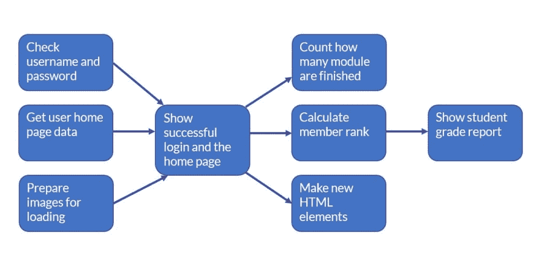

# JavaScript 承诺是什么？超高水平的解释。

> 原文：<https://dev.to/flippedcoding/what-are-javascript-promises-super-high-level-explanation-1g75>

无论您是否打算异步做任何事情，了解如何用 JavaScript 来做都是一个不错的小金块。异步问题的答案是承诺。

JavaScript 承诺基本上是表示异步执行的代码成功或失败的对象。这听起来没什么大不了的，因为这是 JavaScript 中发生的微妙问题之一。

使用事件侦听器是监视异步操作的一种方式，但是有些时候侦听器触发得太早，事件会错误地发生。这就是承诺的来源。

它们不是什么新东西，只是经过了改良。JavaScript 承诺已经以某种形式的 API 存在了很多年。甚至 jQuery 也有类似的延迟，尽管它们的工作方式不尽相同。

承诺解决的问题是在另一个操作完成后在正确的时间执行代码的问题。例如，当你在一个网站上看到加载轮时，后台正在发生一堆事情。可能有一些数据库调用正在进行，或者有一些计算正在运行，以确定在页面上显示哪些内容。

当所有的背景资料完成后，你会看到你一直在等待的屏幕或一个错误。这就是承诺的来源。promise 将等待所有的后台工作以各自的计时结束，然后执行适当的代码。

因此，在所有操作完成后，承诺将返回成功或失败的结果。根据您希望代码如何工作，您可以设置回调函数来处理成功或失败的情况。这样，无论后端发生了什么，您都可以确定用户在屏幕上会看到什么。

promise 还将捕获导致失败的错误链中发生的所有错误，这对调试非常有用。你可能听说过的 JavaScript promises 最显著的特征是它们是如何“可移植”的。

这实际上意味着您可以在承诺的末尾加上 then()方法，并使用结果运行全新的异步流程。您可以根据需要将它们链接在一起，它们都将异步运行代码。

这是一张承诺的图片:

[T2】](https://res.cloudinary.com/practicaldev/image/fetch/s--DB2KNVr7--/c_limit%2Cf_auto%2Cfl_progressive%2Cq_auto%2Cw_880/https://thepracticaldev.s3.amazonaws.com/i/okumq5ktknswifg28774.JPG)

正如你在这个例子中看到的，在它等待的所有任务完成之前，promise 不会做任何事情。然后，它执行一个使用这些任务结果的回调。然后，您可以使用 Then()通过一些其他任务继续这个过程。

咻！简而言之，这些都是 JavaScript 的承诺。与多态和继承等其他概念不同，承诺在不使用代码的情况下更难解释，但希望您对它们的工作方式、用途以及我们为什么使用它们有更好的理解。

* * *

嘿！你应该在推特上关注我，因为原因:[https://twitter.com/FlippedCoding](https://twitter.com/FlippedCoding)