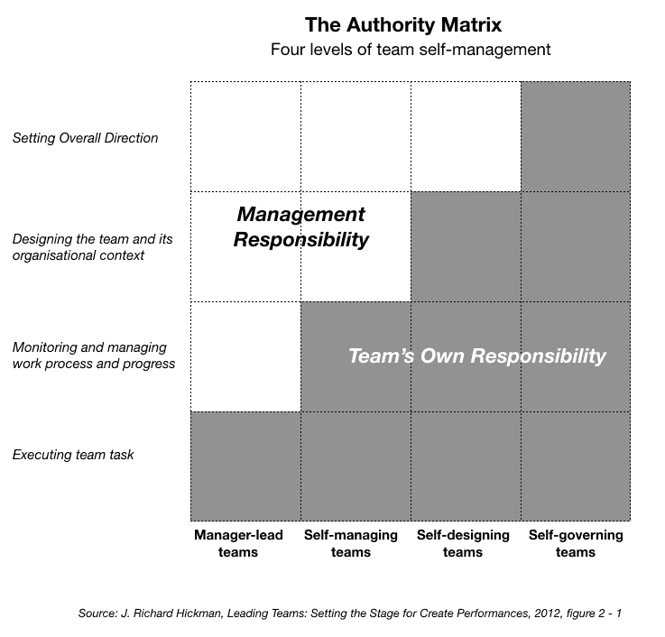

# 什么是自我管理的团队？

> 原文：<https://dev.to/andreeavis/what-are-self-managed-teams-5bgi>

注:*本文原载于[我的博客，allagile.wordpress.com](https://allagile.wordpress.com)T3*

自我管理或自我组织的团队是任何敏捷框架或组织的前提。但这意味着什么呢？含义因组织和人而异，但有一个标准的定义。我们来调查一下！

已故的哈佛心理学教授、群体心理学的主要专家之一 j .理查德·哈克曼在他的名著《领导团队》 [*中提出了自我管理团队的概念，他花了 50 多年的时间来确定高绩效团队和群体动力的品质。为伟大的演出*搭建舞台](https://www.amazon.com/Leading-Teams-Setting-Stage-Performances/dp/1578513332)，2002 年。

根据希克曼的观点，决定团队的权限是至关重要的，应该由管理层明确地完成。它不应该允许歧义，因为它会造成巨大的混乱，并对高性能造成许多障碍。

在决定团队的权限范围时，管理层应确保他们透明地与执行以下各项工作职能的团队保持一致:

1.  **工作*执行*** :指的是谁将完成工作本身(在产品开发中，参与创建产品的每个人:构建设计、编写代码、编写规格、文档、与利益相关者的沟通等。).
2.  ***监控和管理*工作流程**:指的是持续学习——需要决定由谁来监控团队的表现，并确保团队持续改进他们的流程并持续学习。
3.  ***设计*团队并安排来自组织的支持**:第三个功能包括设计团队本身(决定谁应该在团队中)，决定谁做什么，谁创建团队行为规范，以及谁确保团队拥有执行任务所需的所有资源和工具。
4.  **为团队**设置*方向*:最终功能是设置团队的方向或策略；谁是整个团队愿景或目标设定的负责单位？

希克曼创建了 ***权威矩阵*** (此处重新创建)，该矩阵显示了自我管理不断增加的四个层次，考虑到谁拥有上述职能的权威:

[T2】](https://allagile.files.wordpress.com/2018/07/hickman-authority-matrix.png)

1.  **经理领导的团队:**
    *   管理者管理，工人工作，这两种职能尽可能分开(摘自该书)
    *   只有他们有权执行交给他们的任务
    *   经理监控和管理过程和进度，决定团队设计及其环境，并为团队设定方向
    *   瀑布环境、[传统管理、科学管理](https://allagile.wordpress.com/2018/06/09/what-is-modern-traditional-theory-and-why-its-changing-the-agile-manager-1/)是一些组织模型的例子，在这些模型中，团队只是做工作，而绝对没有决策权。
2.  **自我管理团队:**
    *   有权执行交给他们的任务
    *   监控他们的进度，并在他们认为合适的时候调整流程
    *   出现在新公司、服务提供商、建筑公司
    *   离敏捷工作环境更近了一步，但还没有到那一步。
3.  **自行设计团队:**
    *   有全权执行他们的任务
    *   负责监控他们的绩效和进度，并调整他们的流程
    *   有权决定完成任务所需的团队设计、工作规范、资源和工具
    *   管理层设定方向，不要挡他们的路
    *   例子包括创业公司、管理任务组。
4.  **自治团队:**
    *   对他们的方向、设计、背景、进度、过程和执行负全部责任
    *   例子有小型创业公司、立法机构、公司董事会、社区服务机构咨询委员会、工人合作社、专业合作伙伴。

***大多数敏捷环境在自我管理的团队和自我设计的团队之间摇摆不定，理想状态是自我设计的团队*** 。当这个类别的团队设计良好并有好的领导者时，他们可以成为高绩效的团队，自我修正并利用他们的集体智慧，培养他们的员工。主要条件是，他们的权限级别与管理层明确达成一致，并被整个团队所理解。