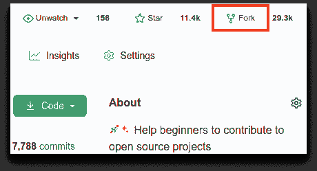
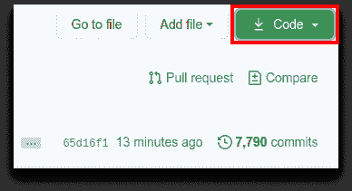

# 对你来说，为开源项目做贡献有哪些障碍？

> 原文：<https://dev.to/sudo_bangbang/what-are-some-blockers-for-you-on-contributing-to-open-source-projects-5g30>

我正在做一个项目，帮助初学者开始贡献开源项目。这叫做第一次捐款

##  [首笔捐款](https://github.com/firstcontributions) / [首笔捐款](https://github.com/firstcontributions/first-contributions)

### 🚀✨帮助初学者为开源项目做贡献

<article class="markdown-body entry-content container-lg" itemprop="text">

[](https://github.com/firstcontributions/open-source-badges)[](https://join.slack.com/t/firstcontributors/shared_invite/zt-mog68oas-dFnCPhZzJMd9A9dboJhi2g)[](https://opensource.org/licenses/MIT)[T11】](https://www.codetriage.com/roshanjossey/first-contributions)

#### *用[其他语言](https://raw.githubusercontent.com/firstcontributions/first-contributions/master/translations/Translations.md)阅读这篇文章。*

`[](https://raw.githubusercontent.com/firstcontributions/first-contributions/master/translations/README.al.md)``[](https://raw.githubusercontent.com/firstcontributions/first-contributions/master/translations/README.aze.md)``[](https://raw.githubusercontent.com/firstcontributions/first-contributions/master/translations/README.bn.md)``[](https://raw.githubusercontent.com/firstcontributions/first-contributions/master/translations/README.bg.md)``[](https://raw.githubusercontent.com/firstcontributions/first-contributions/master/translations/README.pt_br.md)``[](https://raw.githubusercontent.com/firstcontributions/first-contributions/master/translations/README.ca.md)``[")](https://raw.githubusercontent.com/firstcontributions/first-contributions/master/translations/README.chs.md)``[](https://raw.githubusercontent.com/firstcontributions/first-contributions/master/translations/README.cs.md)``[](https://raw.githubusercontent.com/firstcontributions/first-contributions/master/translations/README.de.md)``[](https://raw.githubusercontent.com/firstcontributions/first-contributions/master/translations/README.da.md)``[](https://raw.githubusercontent.com/firstcontributions/first-contributions/master/translations/README.eg.md)``[](https://raw.githubusercontent.com/firstcontributions/first-contributions/master/translations/README.es.md)``[](https://raw.githubusercontent.com/firstcontributions/first-contributions/master/translations/README.fr.md)``[](https://raw.githubusercontent.com/firstcontributions/first-contributions/master/translations/README.gl.md)``[](https://raw.githubusercontent.com/firstcontributions/first-contributions/master/translations/README.gr.md)``[](https://raw.githubusercontent.com/firstcontributions/first-contributions/master/translations/README.ge.md)``[](https://raw.githubusercontent.com/firstcontributions/first-contributions/master/translations/README.hu.md)``[](https://raw.githubusercontent.com/firstcontributions/first-contributions/master/translations/README.id.md)``[](https://raw.githubusercontent.com/firstcontributions/first-contributions/master/translations/README.hb.md)``[](https://raw.githubusercontent.com/firstcontributions/first-contributions/master/translations/Translations.md)``[](https://raw.githubusercontent.com/firstcontributions/first-contributions/master/translations/README.fa.md)``[](https://raw.githubusercontent.com/firstcontributions/first-contributions/master/translations/README.fa.en.md)``[](https://raw.githubusercontent.com/firstcontributions/first-contributions/master/translations/README.it.md)``[](https://raw.githubusercontent.com/firstcontributions/first-contributions/master/translations/README.ja.md)``[")](https://raw.githubusercontent.com/firstcontributions/first-contributions/master/translations/README.kws.md)``[ ](https://raw.githubusercontent.com/firstcontributions/first-contributions/master/translations/README.ko.md)``[](https://raw.githubusercontent.com/firstcontributions/first-contributions/master/translations/README.lt.md)``[ ](https://raw.githubusercontent.com/firstcontributions/first-contributions/master/translations/README.ro.md)``[](https://raw.githubusercontent.com/firstcontributions/first-contributions/master/translations/README.mx.md)``[](https://raw.githubusercontent.com/firstcontributions/first-contributions/master/translations/README.my.md)``[](https://raw.githubusercontent.com/firstcontributions/first-contributions/master/translations/README.nl.md)``[](https://raw.githubusercontent.com/firstcontributions/first-contributions/master/translations/README.no.md)``[](https://raw.githubusercontent.com/firstcontributions/first-contributions/master/translations/README.np.md)``[](https://raw.githubusercontent.com/firstcontributions/first-contributions/master/translations/README.tl.md)``[")](https://raw.githubusercontent.com/firstcontributions/first-contributions/master/translations/README.en-pirate.md)``[](https://raw.githubusercontent.com/firstcontributions/first-contributions/master/translations/README.ur.md)``[](https://raw.githubusercontent.com/firstcontributions/first-contributions/master/translations/README.pl.md)``[")](https://raw.githubusercontent.com/firstcontributions/first-contributions/master/translations/README.pt-pt.md)``[](https://raw.githubusercontent.com/firstcontributions/first-contributions/master/translations/README.ru.md)``[](https://raw.githubusercontent.com/firstcontributions/first-contributions/master/translations/README.ar.md)``[](https://raw.githubusercontent.com/firstcontributions/first-contributions/master/translations/README.se.md)``[](https://raw.githubusercontent.com/firstcontributions/first-contributions/master/translations/README.slk.md)`

# 首次捐款

这个项目旨在简化和指导初学者做出第一次贡献的方式。如果你想做出你的第一份贡献，请遵循以下步骤。

*如果你不习惯命令行，[这里有使用 GUI 工具的教程。](https://raw.githubusercontent.com/firstcontributions/first-contributions/master/#tutorials-using-other-tools)T3】*

[T2】](https://camo.githubusercontent.com/fcf9a4ed664cc63de2fcb14d1135072ba6d4c74a8e9bdb224ad6ab1e72600c3b/68747470733a2f2f6669727374636f6e747269627574696f6e732e6769746875622e696f2f6173736574732f526561646d652f666f726b2e706e67)

#### 如果你的机器上没有 git，[安装它](https://help.github.com/articles/set-up-git/)。

## 派生此存储库

通过单击此页面顶部的分叉按钮来分叉此存储库。这将在您的帐户中创建此存储库的副本。

## 克隆存储库

[T2】](https://camo.githubusercontent.com/4c3f7f1bec4f04db40ecf58dc2e19c2d8992f100f3bbbc4767a9d20b29f4a43d/68747470733a2f2f6669727374636f6e747269627574696f6e732e6769746875622e696f2f6173736574732f526561646d652f636c6f6e652e706e67)

现在将分叉的存储库克隆到您的机器上。转到你的 GitHub 账户，打开分叉库，点击代码按钮，然后点击*复制到剪贴板*图标。

打开终端并运行以下 git 命令:

```
git clone "url you just copied" 
```

其中“您刚才复制的 url”(不带引号)是此的 URL…

</article>

[View on GitHub](https://github.com/firstcontributions/first-contributions)

目前，我们有一个[实践教程](https://github.com/Roshanjossey/first-contributions/blob/master/README.md)来帮助初学者通过为同一个项目做出他们的第一份贡献。其次，我们有一个[网络应用](https://roshanjossey.github.io/first-contributions/)，建议欢迎开源项目和社区做出贡献。第三，我们有一个 [slack 社区](https://join.slack.com/t/firstcontributors/shared_invite/enQtMzE1MTYwNzI3ODQ0LTZiMDA2OGI2NTYyNjM1MTFiNTc4YTRhZTg4OWZjMzA0ZWZmY2UxYzVkMzI1ZmVmOWI4ODdkZWQwNTM2NDVmNjY)，在那里任何人都可以获得帮助或者讨论开源。

我们想发展这个项目来解决社区面临的各种问题。我们很想了解您在开源社区的历程，您遇到的问题、阻碍、棘手问题等等。