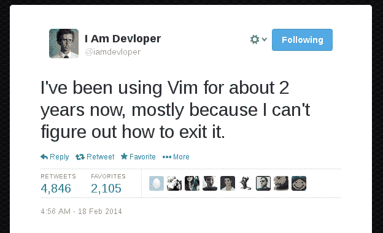

# 当你开始学习 Vim 时，你希望有人告诉你什么？

> 原文：<https://dev.to/alchermd/what-are-some-stuff-that-you-wish-somebody-told-you-when-you-started-learning-vim-1hfi>

[T2】](https://res.cloudinary.com/practicaldev/image/fetch/s--S7TopOJe--/c_limit%2Cf_auto%2Cfl_progressive%2Cq_auto%2Cw_880/https://i.pinimg.com/originals/b1/63/47/b1634709499836fb581b22dcd5e8eff6.png)

* * *

背景:我被迫使用一台性能极其低下的笔记本电脑来完成轻度的网络开发工作(不要问为什么)。 **VSCode** 带着几个扩展名让机器痛得直哭。我在考虑 Vim + Chromium 作为测试浏览器(有没有更轻便的替代品？)，但是丫知道，我只知道神奇的`:q`命令。

不过，我渴望学习。有什么建议吗？