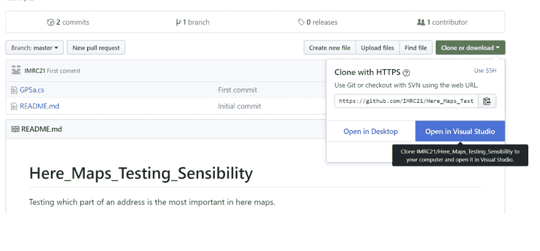

# 微软买下 GitHub 后，你注意到的第一个不同是什么？把你的贴在这里！

> 原文：<https://dev.to/imrc21/what-are-the-first-differences-you-noticed-in-github-after-microsoft-bought-it-post-here-yours-1jp0>

[T2】](https://res.cloudinary.com/practicaldev/image/fetch/s--1VfKln4l--/c_limit%2Cf_auto%2Cfl_progressive%2Cq_auto%2Cw_880/https://thepracticaldev.s3.amazonaws.com/i/ubh8ib6xbd37ux0wh1u3.png)

[编辑]它显示“在 vs 中打开”，因为我的 pc 上安装了 VS，不知道 lol。当 github 中出现真正的变化时，我会保留这篇文章。如果你曾经注意到一个，就在这里写下评论。