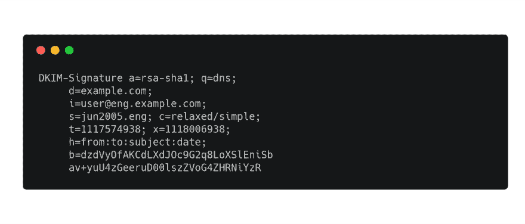
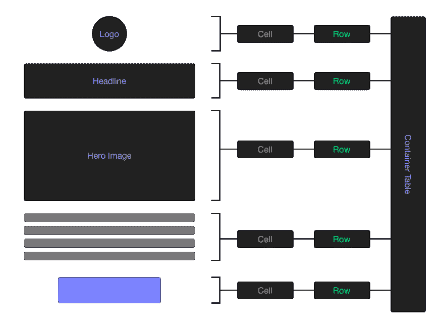
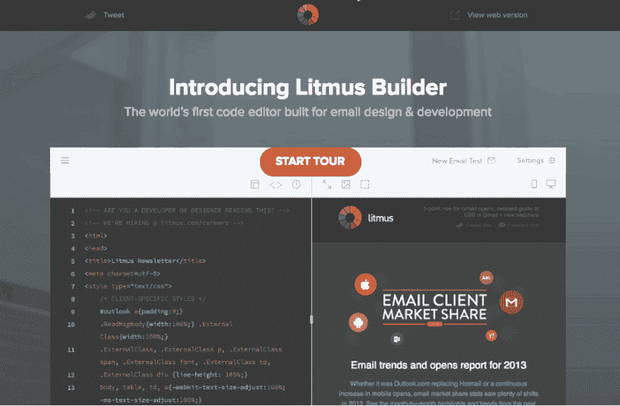

# 每个开发人员需要了解的 HTML 电子邮件

> 原文：<https://dev.to/bnevilleoneill/what-every-developer-needs-to-know-about-html-email-318i>

[T2】](https://res.cloudinary.com/practicaldev/image/fetch/s--Zk-936k1--/c_limit%2Cf_auto%2Cfl_progressive%2Cq_auto%2Cw_880/https://cdn-images-1.medium.com/max/1024/1%2A_aQDJV7CZJ6gEW9KLd9VLQ.jpeg)

HTML 电子邮件:你可能喜欢它，也可能讨厌它——但你听说过它。我打赌你对此也有自己的看法。但是您知道吗，HTML 电子邮件在历史上是公司最有价值和最重要的沟通渠道之一。

当涉及到营销和广播电子邮件时(例如，所有那些被转储到 Gmail 的促销标签中的东西)，公司可以期望平均每花费 1 美元得到 35-44 美元的回报，这取决于[你问谁](https://www.campaignmonitor.com/blog/email-marketing/2016/01/70-email-marketing-stats-you-need-to-know/)。电子邮件的投资回报率通常会超过联盟营销、付费搜索、展示广告和社交媒体，使其成为每个公司的重要工具。

交易电子邮件—基于某些操作(如购买、帐户更新、发货通知等)触发的电子邮件。)—甚至更有价值。益百利的一项研究认为，交易类电子邮件的价值是营销和广播类电子邮件的 8 倍。

虽然许多开发人员不会从事营销或广播电子邮件，但大多数人会在某个时候接触事务性电子邮件活动。事实上，开发人员通常是唯一能够直接控制事务性电子邮件的人，因为许多电子邮件都是应用程序生成的，或者直接绑定到代码库。

由于交易型电子邮件被证明能为公司带来巨大的投资回报，而最好的开发人员是那些了解业务的人，所以开发人员了解 HTML 电子邮件的基础知识是至关重要的。

以下是你需要知道的。

### 邮件类型

有两种主要类型的电子邮件:营销(或广播)和交易。

**营销邮件**当你想到 HTML 邮件时，你可能会想到这些。它们被发送给已经注册接收它们的人的列表。它们可以是优惠券、时事通讯、活动邀请或许多其他东西，但它们是一对多的。尽管它们可以(也应该)被个性化，但仍然有一大群人从一个发送事件中收到一封电子邮件。

**另一方面，事务性电子邮件**是一对一的通信，是对某些触发事件的反应。这些内容包括收据电子邮件、发货通知和服务电子邮件，如密码重置和帐户更新通知。

有时这两者之间有一点灰色地带，但重要的是要尝试将任何电子邮件归入这两个类别中的一个，尤其是当你开始考虑订户权限时。随着 GDPR 于 5 月 25 日生效，任何发送电子邮件的人都必须获得用户的明确许可，并保留许可记录，否则将面临巨额罚款。

[T2】](https://logrocket.com/?cid=banner_a)

### 认证

当开始发送 HTML 电子邮件时——无论是营销邮件还是交易邮件——第一步是设置你的发送环境。尽管大多数人会选择第三方电子邮件服务提供商(ESP ),如 Campaign Monitor、MailChimp 或 Salesforce Marketing Cloud(或用于交易的邮戳和 Sendgrid ),但在发送电子邮件时，仍有必要了解底层基础架构和身份验证流程。ESPs 将为您处理很多事情，但您需要建立适当的认证记录，以确保您的电子邮件被发送给订户。

电子邮件通过**简单消息传输协议(SMTP)** 工作。它依靠 ISP 进行的一系列检查来确保你是你发送电子邮件时所说的那个人。比如 IP 地址和反向 DNS 查找。虽然这是一个很好的起点，但是还必须正确设置其他三种身份验证方法，以确保良好的可送达性。

**发件人策略框架(SPF)** 是存储在您的域中的记录，可提供额外的身份验证检查。基本上，您可以在发送电子邮件的域的 DNS 设置中添加 SPF 和 TXT 记录，其中包括邮件服务器的 IP 地址。然后，ISP 可以验证您的 IP 地址是合法的，这使得您的电子邮件更有可能被发送。SPF 记录看起来像这样:

[T2】](https://res.cloudinary.com/practicaldev/image/fetch/s--pkESidpV--/c_limit%2Cf_auto%2Cfl_progressive%2Cq_auto%2Cw_880/https://cdn-images-1.medium.com/max/1024/0%2ACgPuTtNUkTGS87uy)

发件人政策框架项目在其网站上有更多关于 SPF 记录和语法[的信息。](http://www.openspf.org/Project_Overview)

**域名密钥识别邮件(DKIM)** 是另一种验证邮件的机制。有了 DKIM，你实际上是在设置负责电子邮件的密钥。DKIM 用私钥签署电子邮件，然后在公钥的帮助下解码。公钥是您的发送域的另一个 DNS 条目，看起来与此类似(取自 [DKIM 网站](http://dkim.org/info/dkim-faq.html)):

[T2】](https://res.cloudinary.com/practicaldev/image/fetch/s--h7WMXLen--/c_limit%2Cf_auto%2Cfl_progressive%2Cq_auto%2Cw_880/https://cdn-images-1.medium.com/max/1024/0%2A-JMte4Beayuv-wmD)

最后，还有**基于域的消息认证、报告和一致性(DMARC)** 。虽然 DMARC 本身在技术上不是一种身份验证机制，但它通知收件人邮件受到 SPF 和 DKIM 等其他机制的保护。如果这两种机制中的任何一种失败了，DMARC 会告诉接收方如何处理消息:通过、隔离或失败。然后，它提供了一种机制来通知发送者消息发生了什么。这是一种监控您的发送信誉并查看谁(如果有人)正在滥用您的邮件基础设施的强大方法。

就像上面的两种机制一样，dmarc 作为 DNS 条目存在，但这一次是在像 _dmarc.example.com 这样的子域上。您可以使用 pct 标记在 DMARC 中设置阈值，然后使用 p 或 policy 标记告诉收件人如何处理这些电子邮件，该标记的值为 none、quarantine 和 reject。

[T2】](https://res.cloudinary.com/practicaldev/image/fetch/s--mi4QMPnT--/c_limit%2Cf_auto%2Cfl_progressive%2Cq_auto%2Cw_880/https://cdn-images-1.medium.com/max/1024/0%2AocpyMqXK3i7TMKse)

值得注意的是，DMARC 与其他认证协议协同工作。正确配置后，所有这些都是有助于防止垃圾邮件的传递链的一部分。

[](https://res.cloudinary.com/practicaldev/image/fetch/s--HFu3FL0A--/c_limit%2Cf_auto%2Cfl_progressive%2Cq_auto%2Cw_880/https://cdn-images-1.medium.com/max/864/1%2AUKOs_XKjBIhpQtPVlwnPgg.png) 

<figcaption>邮件传递链的基本概述。</figcaption>

虽然还有其他认证方法，如 SenderID 和 DomainKeys，但实施它们的 ISP 较少。我将把它留给你去进一步研究。

### MIME 类型

一旦你的域名被正确认证并准备好发送电子邮件，是时候开始创建这些电子邮件了。一开始，你可能会认为 HTML 邮件就是简单的 HTML 文档。但事实远不止如此。

电子邮件是邮件本身以及标识邮件信息的标题的混合。说到可送达性，邮件头中的键/值对(如发件人姓名、发件人、主题和返回路径)会告诉电子邮件客户端是谁在发送邮件。其中许多与上述机制一起使用来认证消息。

但是还有另一个键/值对来构建实际的消息。这是 Content-Type 键，它采用类似 multipart/alternative 的值来通知接收者消息中有多个部分，并根据订阅者的偏好向他们显示适当的部分。当消息中包含多个部分时，该电子邮件被称为**多用途互联网邮件扩展(MIME)** 电子邮件。

所有 HTML 电子邮件中使用的主要内容类型有两种，文本/普通和文本/html 类型。HTML 类型是将实际的 HTML 注入到消息中的地方，而普通类型是电子邮件的纯文本版本所在的地方。出于可送达性的目的，您应该始终包含一个与 HTML 版本的电子邮件紧密匹配或相关的纯文本版本的电子邮件。

还有其他可以使用的内容类型，但是 ESPs 对它们的支持非常有限。text/watch-html 类型可用于向 Apple Watch 用户发送有限的 html 版本的信息，从而生成丰富的类似文本的信息。

最近，谷歌的 AMP 项目引入了 text-x-amphtml，当使用 AMP 标记时，它将允许更丰富、更具交互性的电子邮件。

应该注意的是，在撰写本文时，该项目仍处于早期阶段，没有 ESPs 支持将 AMP MIME 类型添加到外发电子邮件中，这使得它在 Google 的开发人员预览和测试环境之外几乎没有用处。

构建一封完整的电子邮件并考虑各种邮件头和 MIME 部分可能很复杂。幸运的是，大多数 esp 会替你完成这项艰巨的工作，允许你只上传 HTML 和纯文本版本的消息。尽管如此，了解这些信息是如何构建的仍然很重要，因为许多公司仍然在没有第三方 ESP 安全网的情况下建立内部电子邮件服务。

### HTML & CSS 基础知识

虽然你可能处于 web 开发的最前沿，但就编码活动所用的标记而言，HTML 电子邮件往往落后于 web。你可能习惯于使用 div 和语义标记，再加上最新的 CSS，如 flexbox 和 grid，但是大多数流行的电子邮件客户端只支持 HTML 和 CSS 的子集。由于安全问题和激进的(通常是过时的)渲染引擎，电子邮件客户端会剥离、修改或忽略大量的 HTML 和 CSS。Campaign Monitor 有一个很好的指南，介绍了所有主要电子邮件客户端的支持内容。

这就是为什么今天大多数电子邮件活动依赖表格来组织内容，并使用内联 CSS 来设计内容的样式。如果您正在创建简单的单栏电子邮件，您可以使用基于 div 的电子邮件，但是对于任何需要多栏的电子邮件，您不得不在某种程度上使用表格。

让我们复习一下基础知识。

### 邮件结构

你的电子邮件的结构和内容很大程度上存在于 HTML 表格中。虽然很痛苦，但您不必担心所有与表格相关的标记，只需要三个:表格(table)、表格行(tr)和表格单元格(td)。表格将是您的电子邮件的容器，行和单元格是电子邮件中的独立模块。

例如，如果您有一封简单的电子邮件，带有徽标、标题、图像、段落和按钮，其结构将如下所示:

[T2】](https://res.cloudinary.com/practicaldev/image/fetch/s--j1h4btFO--/c_limit%2Cf_auto%2Cfl_progressive%2Cq_auto%2Cw_880/https://cdn-images-1.medium.com/max/937/1%2AemhMm_w0J01AUMiXlwtzLA.png)

这些单独的元素中的每一个都可以是它自己的模块，在它自己的表格行和表格单元格中。保持电子邮件的模块化可以让您更轻松地解决电子邮件中的问题，并快速组合不同类型的模块来构建各种类型的电子邮件布局。

出于可访问性的原因，您应该在电子邮件的每个表格元素中包含 ARIA 属性 role="presentation"。这将防止屏幕阅读器以表格数据的形式读取内容，使电子邮件更容易理解。

在这些模块中，您应该为您的内容使用熟悉的语义标记。如果你正在标记一个标题，使用 h1、h2 等标题元素。如果你有一段文字，使用 p 标签。并不是每个电子邮件客户端都支持新的语义标签，比如标题或文章，但是对于使用屏幕阅读器的人来说，增加的语义价值非常有用。

图像稍微复杂一点，但不算太糟。一些旧的电子邮件客户端喜欢在图像周围添加空白，或者没有根据其父元素的大小适当地插入或限制图像大小。这两种情况都会导致布局混乱和用户体验不佳。此外，由于[将近一半的用户在移动设备上打开电子邮件](https://litmus.com/blog/the-2017-email-client-market-share-infographic)，我们希望图像在默认情况下跨设备响应。虽然有点冗长，但是这种标记将涵盖电子邮件中的所有内容:

```
 
```

对于非装饰性的图片，应该总是包含替换文字。这在电子邮件中尤其重要，因为许多电子邮件客户端默认情况下会屏蔽图像。在这些情况下，将显示替代文本。在许多客户端中，您甚至可以通过对图像标签应用颜色和字体大小来设置样式。

宽度属性用于无法推断正确图像大小的客户端，边框属性设置为零以防止链接图像周围出现蓝色边框。使用显示:块；确保图像周围没有添加额外的空白。最大宽度、最小宽度和宽度的组合允许图像根据设备大小放大和缩小，而不会扩大电子邮件布局或在小型设备上变得太小。

在基于表格的布局中使用默认响应图像和语义标记可以让你完成 90%的电子邮件工作。对于其余的 10%，你可能需要挖掘更复杂的技术，如混合编码，它使用流动的布局和固定宽度，微软条件代码来实现强大的，响应迅速的电子邮件活动。查看我的在线书签网站获取更多资源。

### 造型内容

当涉及到样式内容时，您可以保持事情相对简单。为了获得最大的兼容性，您应该在您尝试设置样式的特定 HTML 元素上应用内联样式。虽然现在大约 90%的主要电子邮件客户端都支持嵌入式风格，但仍有少数客户端不显示嵌入式风格，导致电子邮件格式不佳。如果你想深入了解这个主题，我最近写了一篇关于嵌入式风格和内联风格之争的文章。

对于文本，颜色、字体系列、字体大小、字体样式、字体粗细和行高这些基本的 CSS 属性将会创造奇迹，因为它们在所有主要的电子邮件客户端中都得到普遍支持。对于像标题和段落这样的块级元素，您可能希望重写 margin 属性以删除额外的空白。在单个表格单元格本身包含空白作为填充通常更可靠，因为一些老客户不喜欢 margin 属性。

你甚至可以像在网上一样，在很多电子邮件客户端使用网络字体。使用@font-face CSS 规则或链接到外部样式表，并在字体堆栈中调用它们。只需为不支持 web 字体的客户端提供可靠的备用字体。

电子邮件中的按钮稍微复杂一些。虽然我通常建议你把链接变成块级元素，并使用背景色、颜色、边框、边框半径和填充的组合来构建按钮，就像你在 web 上做的那样，但是一些电子邮件客户端不能正确地呈现所有这些属性。

有几种不同的技术可以用来构建电子邮件世界中所谓的“防弹按钮”,使用边框、填充以及两者的结合。如果你需要真正防弹的东西，那么你可以随时使用 Campaign Monitor 的优秀的[防弹按钮生成器](https://buttons.cm)，它会给你一个 HTML 和微软专有的矢量标记语言(VML)的组合，将在任何地方工作。如果可以的话，不要用图片做按钮。正如我之前提到的，许多电子邮件客户端默认情况下会阻止图像，所以任何基于图像的按钮都不会被看到，也不会被点击。

### 现代电子邮件工具

如果你不喜欢为电子邮件手写 HTML 和 CSS，有一些工具可以帮助你更容易地创建。很有可能你在框架环境中工作得很舒服，这些框架抽象出了某个领域的一些复杂性，并依靠惯例来使开发更容易。如果是这样的话，像 MJML T1 和 T2 电子邮件基金会 T3 这样的框架可能是最合适的。

两者都提供了简单的标记、内置组件和构建工具，允许您快速开发跨客户端运行良好的电子邮件代码。快速的 GitHub 搜索也会找到大量用于创建 HTML 邮件的模板、框架和工具。

[](https://res.cloudinary.com/practicaldev/image/fetch/s--dg4igtiw--/c_limit%2Cf_auto%2Cfl_progressive%2Cq_66%2Cw_880/https://cdn-images-1.medium.com/max/962/1%2Ak1yOzhkuINMr7szgVeZqCg.gif) 

<figcaption>一封来自[石蕊](https://litmus.com)的互动邮件。</figcaption>

尽管上面描述的标记和技术相当简单，但不要让它们欺骗了你。邮件不一定是静态的。HTML 电子邮件允许一些非常复杂和强大的应用程序，如给电子邮件添加交互性，允许用户在收件箱中体验丰富的交互。

电子邮件代理 REBEL 开创了很多这方面的工作。他们将从简单的旋转木马到完整的零售结账体验的一切都融入到电子邮件活动中。他们甚至[开放了一个 API](https://www.rebelmail.com/api.html) 让开发者在他们自己的活动中建立互动，而不必从头开始创建一切。

如果你真的想从头开始开发自己的交互性，那就去读一读电子邮件开发高手马克·罗宾斯所说的“穿孔卡片编码”技术。使用简单的 HTML 单选按钮和复选框按钮，结合查看这些按钮的状态并应用条件格式的 CSS，您可以为您的订户创建一些真正令人惊叹的体验。

### 不要轻视 HTML 邮件

HTML 电子邮件可能不是你项目的第一选择，但它对每个公司来说都是一个非常强大的工具。营销和交易电子邮件都提供了令人厌恶的投资回报率，让你将你的开发技能投入到工作中，直接影响你的业务。

更重要的是——尽管电子邮件在消费者中很受欢迎——许多公司都把电子邮件作为事后的想法。电子邮件标准低得离谱，所以如果你正在开发比竞争对手略胜一筹的电子邮件，你就有机会实现伟大的成就，不仅会影响你的业务，还会影响你的订户的生活。

* * *

### Plug: [LogRocket](http://logrocket.com) ，一款适用于网络应用的 DVR

[T2】](http://logrocket.com)

LogRocket 是一个前端日志工具，可以让你回放问题，就像它们发生在你自己的浏览器中一样。LogRocket 不需要猜测错误发生的原因，也不需要向用户询问截图和日志转储，而是让您重放会话以快速了解哪里出错了。它可以与任何应用程序完美配合，不管是什么框架，并且有插件可以记录来自 Redux、Vuex 和@ngrx/store 的额外上下文。

除了记录 Redux 操作和状态，LogRocket 还记录控制台日志、JavaScript 错误、堆栈跟踪、带有头+正文的网络请求/响应、浏览器元数据和自定义日志。它还使用 DOM 来记录页面上的 HTML 和 CSS，甚至为最复杂的单页面应用程序重新创建像素级完美视频。

免费试用。

* * *

每个开发者需要知道的关于 HTML 电子邮件的帖子最先出现在[博客](https://blog.logrocket.com)上。