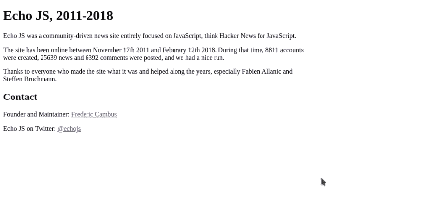

# echojs.com 怎么了

> 原文：<https://dev.to/omenlog/what-happen-with-echojscom--9ja>

昨天早上，和往常一样，我去查看了 echojs.com 的网站，上面有很多关于 javascript 环境的报道，我发现了这个

[T2】](https://res.cloudinary.com/practicaldev/image/fetch/s--2cSpj8Tp--/c_limit%2Cf_auto%2Cfl_progressive%2Cq_auto%2Cw_880/https://thepracticaldev.s3.amazonaws.com/i/n448unqev14895gdpjim.png)

有人知道，因为网站没有像往常一样发布新闻...？？