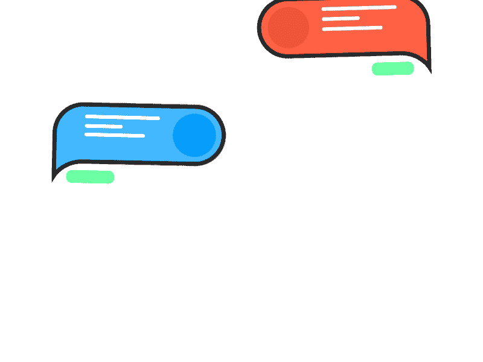
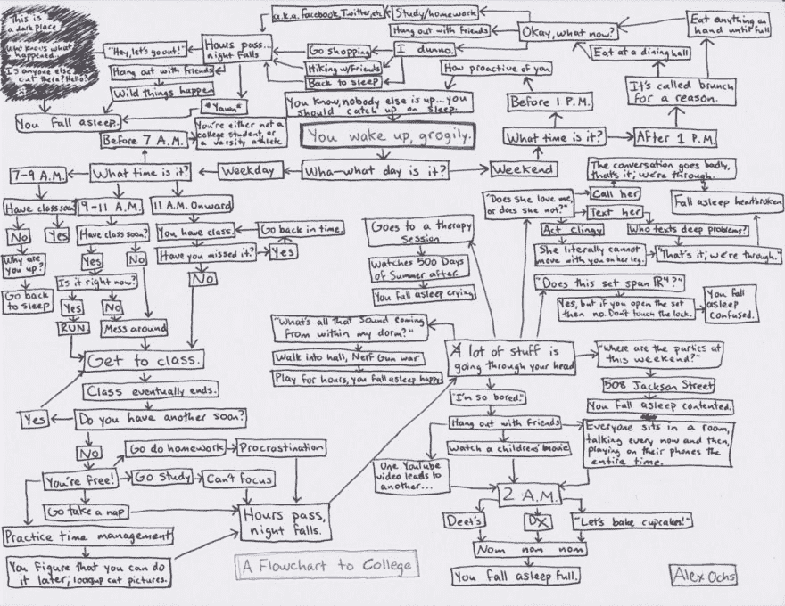
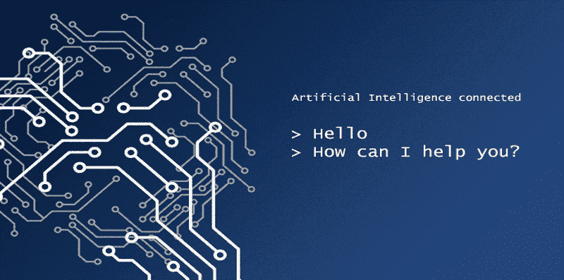
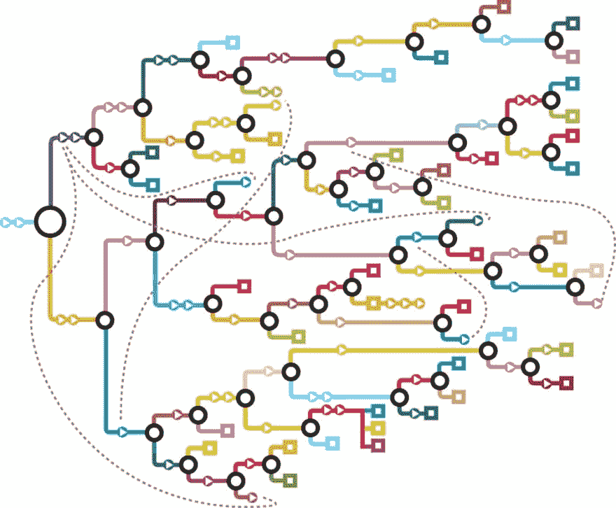

# 我从创建聊天机器人中学到了什么

> 原文：<https://dev.to/oninross/what-i-have-learned-from-building-a-chatbot-2hl5>

# 我从创建聊天机器人中学到了什么

## 炒作是怎么回事？

[T2】](https://res.cloudinary.com/practicaldev/image/fetch/s--Xmwd-0CU--/c_limit%2Cf_auto%2Cfl_progressive%2Cq_66%2Cw_880/http://adelphi.digital/assets/adelpimg/articles/conversational-ui.gif)

技术书呆子和爱好者一直梦想着与人工智能或人工智能进行对话。完美人工智能的活的化身将是钢铁侠电影中的贾维斯。没有键盘，没有鼠标，没有手写笔。只是你的声音，与你的虚拟私人助理进行对话，为你工作。

但那是科幻小说。人工智能仍处于起步阶段，要击败图灵测试，它还有很长的路要走。

当 Siri 在 iPhone 中问世时，它是第一个为用户制造的数字个人助理。我很惊讶它是如何用声音立即识别你的请求并回复你的。几年后，谷歌助手不仅出现在智能设备上，还出现在智能扬声器上。这是第一个可以双向对话的虚拟个人助理。然后聊天机器人突然兴起。

## 什么是聊天机器人？

聊天机器人或对话式用户界面是任何模拟与真人聊天的界面。它可以像网站中的聊天窗口一样简单，也可以像智能设备中与人工智能交互一样复杂。无论媒介是什么，如果是双向对话，你就是在和聊天机器人互动。

业界有几种类型的对话式 ui，流类型、AI 类型和混合类型。

[T2】](https://res.cloudinary.com/practicaldev/image/fetch/s--KZ-7ejGY--/c_limit%2Cf_auto%2Cfl_progressive%2Cq_auto%2Cw_880/http://adelphi.digital/assets/adelpimg/articles/flow-type.jpg)

**流类型**是一种基于树的交互方式，在这种方式下，用户可以选择并通过特定的路径进行驱动。这个路径是开发人员预先定义的，只能“去”界面告诉用户去的地方。这里的一个例子是选择你自己的冒险书籍。

[T2】](https://res.cloudinary.com/practicaldev/image/fetch/s--f0swsQrm--/c_limit%2Cf_auto%2Cfl_progressive%2Cq_66%2Cw_880/http://adelphi.digital/assets/adelpimg/articles/ai-type.gif)

人工智能类型依赖于人工智能，用户可以自由参与并进行真正的对话。类似谷歌助手、Siri 和 Cortana 之类的东西，所有的对话背后都有一个 AI 在驱动。

[T2】](https://res.cloudinary.com/practicaldev/image/fetch/s--dL9KZgZY--/c_limit%2Cf_auto%2Cfl_progressive%2Cq_auto%2Cw_880/http://adelphi.digital/assets/adelpimg/articles/hybrid-type.jpg)

混合类型是最常见的对话式用户界面类型，这就是聊天机器人的用武之地。这是流类型和人工智能的结合，用户被驱动通过特定的路径，同时他们可以在对话中与聊天机器人互动。

## 要不要造一个聊天机器人？

作为一名开发人员，您只会认为从互联网上获取代码并部署到服务器上是如此简单。它不仅仅是代码行和艺术像素。

### 第一课:“不要因为炒作而造一个”

这是我的第一个错误，我相信这是创建聊天机器人的黄金法则。仅仅因为它现在的趋势意味着人们应该进入乐队马车，并希望它做好自己的工作。我所做的基本上是让 Nathan Mk I 下架，并让我的朋友测试它。因为它没有唯一的目的，测试它的用户认为他们是在和 JARVIS“交谈”。

简而言之，聊天机器人应该有一个目的。向你的观众介绍聊天机器人。告诉他们他的目的是什么，能做什么。通过这种方式，你可以根据聊天机器人的能力水平来设定观众的期望。

### 第二课:绘制用户旅程

在断定聊天机器人的目的应该是我的数字作品集导游后，我心想:“这能有多难？我有一个在线作品集，里面有我的用户旅程。”我“编程”了内森 Mk II 来捕捉某些关键词，并相应地回复它们。然而，我面临的问题是，如果用户想去网站的不同部分，他们可能会去。将它们连接在一起很麻烦。我迷失在一个用户可以从 A 点到他们想去的任何地方有多少种不同的排列中。除此之外，还有很多我没有预见到的漏洞。感觉好像永远不会结束。

吸取经验教训，绘制用户旅程将使开发人员在编写聊天机器人时更加轻松。你也会预见到任何需要堵塞的漏洞。

### 第三课:构建脚本

由于我没有很好地规划用户旅程，所以我认为我可以在运行中编写脚本。又来了，“能有多难？我有自己的网站，还有我的剧本。”复制粘贴应该可以。随着我构建聊天机器人的进展，我发现很难给出好的回复和答案。要么太宽泛，太无聊，要么有开放式的问题。这使得用户无法告诉聊天机器人正确的关键词。'

你需要领导你的用户。指导他们可以采取哪些行动来取得进一步进展。如果你想不出一个有意义的剧本，那就雇一个文案。解决逻辑是一回事，进行有意义的对话是另一回事。

### 第四课:给它加点味道

聊天机器人仍然是一个没有生命的物体，文本对话很快就会变得无聊。然而，无论你给它编什么程序，它都会说。你可以把它和动画 gif、照片、表情符号等混合在一起。(如果适用)只是为了保持对话的趣味性。给它一点个性。赋予聊天机器人一点个性会让用户记住它。

### 第五课:“我需要一个人类”

经过数小时的使用和测试，我习惯了使用 Nathan 在网站上导航。我部署了一下，让朋友们试试。最终，用户陷入了“我不知道”回复的死循环。这对用户来说意味着糟糕的体验。不要让你的用户陷入困境，确保如果你的用户最多只能说三个“我不知道”，就给他们选择和人类对话的机会。我们需要通过达到用户的目标来让他们开心。

## 纳森 Mk III

创建 Nathan 是一次很好的学习经历，我在探索这项新兴技术的过程中获得了很多乐趣。我了解到计划是必不可少的，因为这是整个聊天机器人项目的支柱。就像你可能遇到的任何项目一样，我们需要为项目制定计划，预见可能出现的问题，并提出必要的问题。如果计划得当，从那以后会一帆风顺。

聊天机器人随处可见，它们使用自然语言与用户交流。我们可以通过利用语音交流来进一步增强用户体验。语音交互和语音用户界面将是该行业的下一个大事件。这是我学习经历的一个演示。有戏！

[http://adel.ph/nat](http://adel.ph/nat)