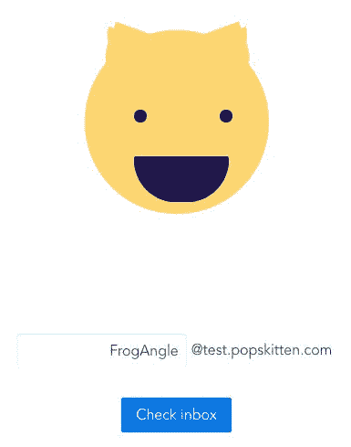

# 我从 14 小时的项目中学到了什么😼

> 原文：<https://dev.to/uilicious/what-i-have-learnt-from-a-14-hours-project-2joo>

# “嘿，让我们为一个简短的‘黑客马拉松’创建一个私人处理邮件服务器，它会很有趣的！”

于是， [@Eugene](https://twitter.com/picocreator?lang=en) 和我开始开发 [Inboxkitten](https://inboxkitten.com) ，这是一个开源的一次性电子邮件服务，有一个简单的用户界面，利用 Mailgun 接收电子邮件。

我们想尝试一些技术，因为这是一个“黑客马拉松”，我们打算在 Inboxkitten 中使用它们。

第 14 小时推出的是由 3 个组件组成的原型一次性电子邮件服务，可以使用 ExpressJS 部署的 API 与 Mailgun 交互，这是一个为使用 Vue 的用户和那些没有 UI 的人提供简单界面的 UI，这是一个使用 go 的 CLI 工具。最重要的是，我们将 Inboxkitten 作为无服务器应用程序部署到 Firebase 上。如果你想知道更多关于它为什么以及如何建造的，你可以在这里和这里[看到文章。](https://blog.uilicious.com/making-a-free-open-source-serverless-disposable-email-service-inboxkitten-com-in-14-hours-b7c4915b9593)

这是我学到的。

### 产品的适当布局

我所拥有的只是一个产品的模型，但我应该做的是增加更多的细节，如包含元素的网格的位置。用 CSS 设计风格并不容易，部分原因是我在这方面的经验很少，而且当你改变一个与他们无关的类时，那些小家伙不想呆在原地，但是通过我的导师和 dev.to 的人的帮助，我从中学到了很多。

你现在在 Inboxkitten 上看到的 UI 就是精工细作。(原型机的设计令人发指，请不要窥探我黑暗的过去。)

[T2】](https://res.cloudinary.com/practicaldev/image/fetch/s--RkLy58Kz--/c_limit%2Cf_auto%2Cfl_progressive%2Cq_auto%2Cw_880/https://thepracticaldev.s3.amazonaws.com/i/48efu40739ui5zmio4oo.jpg)

### 明确设定目标和优先顺序

在 Inboxkitten 的开发过程中，我只对它的未来有一个大致的概念，但我没有为之奋斗的里程碑。结果，我发现自己偏离了完成原型所需要做的事情。

### 少即是多

我倾向于努力保持代码的整洁，并最终由于我倾向于编写大量彼此相似的验证而导致代码膨胀。

### 不同的产品部署方式

利用我所知道的可用技术，让您的应用程序部署更加灵活。这为您的应用程序的分发和部署提供了更大的灵活性。同样的，在 Inboxkitten 中，可以通过 [5 步](https://github.com/uilicious/inboxkitten)部署到:D 的 Firebase 上

这就是我所知道的，现在，请告诉我你的想法和建议:)

P.S. Inboxkitten 将于 2018 年 9 月 22 日启动[产品搜索](https://www.producthunt.com/posts/inboxkitten)！