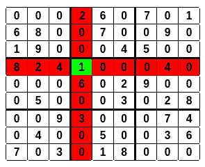
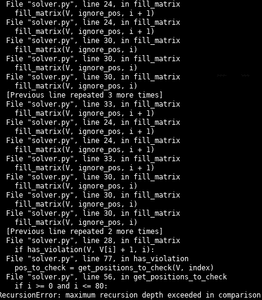

# 我从用 Python 实现数独解算器中学到了什么

> 原文：<https://dev.to/willamesoares/what-i-learned-from-implementing-a-sudoku-solver-in-python-3a3g>

[T2】](https://res.cloudinary.com/practicaldev/image/fetch/s--a8EdRZpR--/c_limit%2Cf_auto%2Cfl_progressive%2Cq_auto%2Cw_880/https://thepracticaldev.s3.amazonaws.com/i/qf1060mcg8cetjxjmeoj.jpg)

你好。

对于那些喜欢讲故事的人来说，这篇文章可能是一本好书。然而，如果你对讲故事不感兴趣，或者只是为了技术部分，请跳到`Show me the code`部分。

在这篇文章中，我决定写下当我决定用 Python 实现一个数独解算器时的经历(我希望我记得所有的细节以及我的遗留代码在做什么)。

事实上，我选择解决这个问题的语言是我写这篇文章的主要原因之一。没有它，也许这整个故事就不是一次值得讲述的旅程。

首先，我将解释在什么样的环境下我决定实现一个针对[数独](http://www.sudoku.com/)游戏的解决方案。当然，有很多事情我通常认为我可以用代码解决，但那些事情最终很少被实现。那么，为什么这个案例与其他案例不同呢？

嗯，去年我从计算机科学专业毕业，幸运的是，同年巴西教育部评估了所有公立和私立大学的本科课程。这是一种叫做 T2 的考试，每三年在各个研究领域进行一次。

因为我已经是一名高年级学生，所以我必须参加考试来完成我的学位([这是巴西现在的法律](http://portal.inep.gov.br/perguntas-frequentes4))。我做得很舒服(我只是不同意这是一种责任)，我认为只要快速回顾一下一些与 CS 相关的概念，我就会没事的。良好的...

众所周知，这个测试从整个课程(一般是 4 年)中收集主题，并尝试制定问题，在这些问题中，你将把事情放在一起以解决它们。我意识到我将面对相当基本的问题和非常困难的问题(那些你通常跳过并在测试结束时回来只是为了确定你真的不知道如何解决的问题)。原来有这么一个问题，我原以为它很容易回答，但后来它变成了我肯定要跳过的问题。

事实是，当我回到这个问题时，我以为我解决了它，但是当我写完一个伪语言解决方案时，我意识到我的解决方案中有一个错误，我没有时间来修复它

我被这个问题吸引住了，真的！所以我决定在家里实现它。

我们为什么不马上讨论技术细节呢？

### 给我看看代码！(快到了)

在提到的问题中，你必须编写一个算法，应用递归编程和回溯的概念来解决一个数独游戏。为此，您可以假设已经实现了一些必需的函数，例如，负责告诉您特定的列和行中是否允许特定的数字的函数(当然，它必须是最简单的函数，在这里没有多大帮助，对吗？).

基本上，您将有一个预先填充的位置数组和一个公共数字(或任何其他允许的字符)作为输入，来表示您的算法必须填充的位置。

这就是问题给你提供的情况。关于编程语言和一般逻辑(你甚至可以使用一种伪语言)，达成解决方案的方式取决于你自己。要求是您实现一个带有回溯行为的递归解决方案。

如果你不记得或从未听说过这两个概念，这里有一个快速回顾。

#### 递归编程

当你应用递归方法来解决一个问题时，你基本上是把程序的功能分解成解决相同问题的更小的程序。最后，你要做的是重用(这就是为什么它被称为递归)你创建的更小的函数来完全解决你的问题。

我知道，前一段还不足以把概念说清楚(我自己第一次或者第二次，可能第三次尝试都没想明白？).

让我再试一次，用更简单的方式来说，递归程序是试图通过调用自身来解决问题的程序。事实是，在第二次调用中，输入将是原始输入的一部分，因此它可以解决更小的问题，并最终将所有内容整合在一起，为您提供最终的解决方案。

嗯，你能想象如果一个函数一次又一次地调用自己，跟踪它在做什么是多么令人困惑吗？相信我，这可不好玩。

这里很酷的一点是，为了理解这个概念，你不必真的这么做。如果您确信您实现的用于解决一小部分问题的递归函数给出了正确的输出，这就足够了。如果这对你有帮助，就接受这是某种魔法:)

也许，到现在为止，你在想，如果这个东西一直在自我召唤，它将如何停止？

那么，这里有一个递归编程中的重要概念:*基本情况* -这是你的程序到达，比方说，你的程序的最小部分的情况，并且能够返回一个值，而不是调用同一个函数。这时你的程序开始返回值，这样它就能得到最终的解。

我们来看一个真实的例子。

```
def sum (n):                           def sumR (n):
    res = 0                                if n == 1:
    for i in range(1, n+1):                    return 1
        res = res + i                      else:
                                               return n + sumR(n-1)
    return res 
```

Enter fullscreen mode Exit fullscreen mode

上面的两个函数负责对给定的数字求和并返回总值。不同之处在于，在左边，你有一个迭代函数(“传统”的解决问题的方式)，而在右边，它是它的递归版本。

注意，在递归方法中，函数`sumR`是在自身内部调用的，但是输入是`n-1`。这里发生了什么事？这就是我提到的*魔法*部分。

让我们假设`sumR`函数的输入是`3`，那么`n = 3`。

在第一次调用中，由于 3 不等于 1，程序将执行`else`块:

`return 3 + sumR(3 - 1)`

从这里开始，程序将进入新的迭代和调用堆栈中的新级别，但此时输入将是`3 - 1`，即 2。

同样，2 不等于 1，因此将再次执行 else 块，现在`sumR`的输入将是`2 - 1`，即 1。

哦，嘿，现在将执行`if`块，因为输入等于 1。这里发生的是，相同的函数不会被再次执行，取而代之的是，返回值 1。

随着该值的返回，它将在之前的调用中使用:

`return 2 + sumR(2 -1)`，相当于`return 2 + 1`，也就是 3

现在我们又解决了一个级别，获得的值将用于对`sumR`的第一次递归调用，即:

`return 3 + sumR(3 - 1)`，相当于`return 3 + 3`，也就是 6。

这是从 1 到 3 的总和。

你有没有注意到，即使是很小的输入，跟踪它也是很累人的？如果没有，尝试对 5 或 10 的输入做同样的事情:)

理解了递归的工作原理后，如果你想继续练习，这个[测试](https://ocw.mit.edu/courses/electrical-engineering-and-computer-science/6-189-a-gentle-introduction-to-programming-using-python-january-iap-2011/lectures/MIT6_189IAP11_rec_problems.pdf)是一个很好的起点。开始的时候可能没那么容易，但是一旦你学会了，就像变魔术一样！

#### 回溯

在阅读本文提出的解决方案之前，记住这个概念也很重要。这里的想法是简单地在一系列可能的候选方案中寻找一个解决方案，尝试其中的每一个，然后在错误路径的第一个迹象时放弃它。

这看起来像是一个愚蠢的解决问题的方法，但仅此而已。它递归地尝试所有可能的解决方案，直到找到一个。想象一下，程序一次遍历所有的分支，然后遗憾地返回，因为那是错误的路径，然后它转到下一条。

但也没那么糟，对吧？一些解决方案实现了回溯方法的启发式，其中算法自动拒绝明显不好的候选。这里有一篇关于回溯的很好的[文章](http://jeffe.cs.illinois.edu/teaching/algorithms/notes/03-backtracking.pdf)。

### 给我看看代码！(真的)-天真的解决方案

在开始这次冒险之前，我首先想到的是选择一种语法让我感到舒服的语言。这是我选择 Python 的主要原因。我不想一开始就花时间检查分号或花括号。我实际上试图只关注算法逻辑。

所以我们开始吧。从头开始。

作为一名开发人员，我总是试图将问题分解成小块，为这些小块实现一个解决方案，然后将所有东西放在一起。对于这个问题，我从最基本的函数开始，比如前面提到的:验证数组中特定位置的输入。

简单回顾一下:这个算法的输入应该是一个带有一些预填充位置的数组，这些是固定的数字，不能改变，就像在真正的数独游戏中一样。

对于输入数组，我设置了这个例子(用 0 代表要填充的位置):

```
V = [
    0, 0, 0, 2, 6, 0, 7, 0, 1,
    6, 8, 0, 0, 7, 0, 0, 9, 0,
    1, 9, 0, 0, 0, 4, 5, 0, 0,
    8, 2, 0, 1, 0, 0, 0, 4, 0,
    0, 0, 4, 6, 0, 2, 9, 0, 0,
    0, 5, 0, 0, 0, 3, 0, 2, 8,
    0, 0, 9, 3, 0, 0, 0, 7, 4,
    0, 4, 0, 0, 5, 0, 0, 3, 6,
    7, 0, 3, 0, 1, 8, 0, 0, 0
] 
```

Enter fullscreen mode Exit fullscreen mode

这里你有很多选择，关于这个数组应该是什么形状。我决定使用一个长度为 81 的数组，在我看来是因为简单。注意到目前为止我还没有考虑过性能问题:)

您还可以有一个`(9,9)`数组形状，其中每个项目都是另一个包含 9 个项目的数组。嵌套数组可以表示列或行，这取决于您。

##### `has_violation`

```
def has_violation(V, value, index):
    pos_to_check = get_positions_to_check(V, index)

    if pos_to_check:
        for i in pos_to_check:
            if V[i] == value:
                return True
        return False
    else :
        return "No index available." 
```

Enter fullscreen mode Exit fullscreen mode

这是负责在给定位置插入值时检查违规情况的函数。它接收带有已填充位置的当前状态、要插入的值和将要填充的索引的数组“V”。

在这里，我基本上是使用`get_positions_to_check`来获取与给定索引垂直和水平相交的所有位置。这样，该函数检查这些位置中是否至少有一个与作为参数传递给`has_violation`函数的值相同。如果没有违规发生，则返回`False`，否则返回`True`。

##### `get_positions_to_check`

请注意，这可能会让你的眼睛不舒服:)

```
def get_positions_to_check(V, i):
    positions_to_check = [i]
    before_up = i - 9
    after_down = i + 9
    before_left = i
    after_right = i + 1

    if i >= 0 and i <= 80:
        while before_up >= 0:
            positions_to_check.append(before_up)
            before_up -= 9

        while after_down <= 80:
            positions_to_check.append(after_down)
            after_down += 9

        while before_left % 9 != 0:
            before_left -= 1
            positions_to_check.append(before_left)

        while after_right % 9 != 0:
            positions_to_check.append(after_right)
            after_right += 1

        return positions_to_check 
```

Enter fullscreen mode Exit fullscreen mode

这是前面提到的函数的实现。它主要检查与给定索引相交的所有位置。

它通过检查特定索引的上、下、右和左的所有位置来实现。这些位置由从作为参数接收的索引开始的因子 9 确定。例如，如果收到的索引是 30(在下图中以绿色显示)，则向上方向的所有位置都将位于与每个位置正好相差 9 个位置的索引中。

[](https://res.cloudinary.com/practicaldev/image/fetch/s--E7g_nr9F--/c_limit%2Cf_auto%2Cfl_progressive%2Cq_auto%2Cw_880/https://thepracticaldev.s3.amazonaws.com/i/kkevm02pt6eib147uk1k.png) 
<small>记住，0 是用来表示空的位置。</small>

在此图中，绿色位置上方的值分别位于位置 3、12 和 21。由于我们收到了 30 作为检查的指标，我们有:

`3 == 30 - (9 * 3)`
`12 == 30 - (9 * 2)`
T2】

这样很容易得到与接收到的索引垂直相交的位置。

对于同一排的位置，我们要有不同的工作方式。这里我使用了这样一个事实，即每一行都以 9 的倍数作为它的位置号。对于收到的索引，同一行的第一个位置的索引是 27(可以在上图中计数)。所以，很容易把它作为左边位置的停止点。我们可以对右边的位置使用相同的逻辑，不同的是 9 的倍数将是下一行的第一个数字，所以我们不想将它包含在`positions_to_check`数组中。

您应该注意到，数组的形状使得这一步有点麻烦。如果我使用了一个形状为`(9, 9)`的数组，这一步可能会更容易。

##### `fill_matrix`

```
def fill_matrix(V, ignore_pos, i = 0, direction = 'fw'):
    if i > 80:
        return True

    if i in ignore_pos:
        if direction == 'fw':
            fill_matrix(V, ignore_pos, i + 1)
        else :
            fill_matrix(V, ignore_pos, i - 1, 'bw')
    elif V[i] < 9:
        if has_violation(V, V[i] + 1, i):
            V[i] += 1
            fill_matrix(V, ignore_pos, i)
        else :
            V[i] += 1
            fill_matrix(V, ignore_pos, i + 1)
    else :
        V[i] = 0
        fill_matrix(V, ignore_pos, i - 1, 'bw') 
```

Enter fullscreen mode Exit fullscreen mode

最后，我们到了递归函数，所有的*魔法*都在这里发生。

在这里，我使用了一个非常简单的方法，它不需要那么简单，但是对于这篇文章的目的来说，它实际上非常有效。

为了控制算法应该遵循的路径，我在这里使用了一些*标志* ( `fw`和`bw`)作为标志，告诉函数继续前进`forward`或`backward`，以防它找到错误的候选者。这正是回溯需求发挥作用的地方。

很容易看出，对于给定的索引`i`，如果它在要忽略的位置列表中，或者如果该位置的值已经是可能的最高值(9)，那么算法应该返回，因为该路径不是正确的路径。这就是函数的最后一行所做的:

```
fill_matrix(V, ignore_pos, i - 1, 'bw') 
```

Enter fullscreen mode Exit fullscreen mode

或许，你已经注意到了这个函数中的第一个`if`语句，这正是你所想的:*基本情况*。这是算法的停止点。它假设如果索引没有错误地到达了最后一个位置，就意味着数独已经解决了。耶！

这个函数中的其他`if`语句非常简单，只要看一下就能理解，当然，前提是你已经掌握了递归函数是如何工作的。

为了看一下整个脚本，你可以检查这个[要点](https://gist.github.com/willamesoares/77c598269f409f3d50d09bf11246dfe8)。

#### 那又怎样？这一切的真正意义是什么？

嗯，到目前为止，我感觉我真的做得很好，最终开发出了一个数独解算器，直到我最终测试了它。猜猜发生了什么？

它不起作用！

是的，所有这些艰苦的工作和花哨的概念并没有给我预期的输出，相反，它抛出了一个丑陋的大错误日志，就像下图中的那个。

[T2】](https://res.cloudinary.com/practicaldev/image/fetch/s--RXth33sJ--/c_limit%2Cf_auto%2Cfl_progressive%2Cq_auto%2Cw_880/https://thepracticaldev.s3.amazonaws.com/i/2f949giy3l9xwxqpaywv.png)

不幸的是，由于当时我非常沮丧，我没有真正看到写着`RecursionError: maximum recursion depth exceeded in comparison`的消息，并最终试图调试整个错误日志。是的，我试图一步一步地跟踪算法在做什么(这可能需要大约 30 分钟)，直到我意识到问题与我所遵循的逻辑无关，而是与语言本身有关。

当我读到问题是超出了递归层次的限制时，我就想:为什么会这样？我只是想解决一个简单的数独板！

事实上，该算法构建的递归调用堆栈开始变得非常大，经过一些研究，我意识到 Python 的一个有趣之处。

```
 Python does not offer you Tail Recursion Elimination. 
```

Enter fullscreen mode Exit fullscreen mode

但是等等，`Tail Recursion Elimination`到底是什么意思？我知道递归编程，我认为这是我必须编写的唯一递归类型。然而，我意识到我所做的实际上是一种叫做尾部递归的递归。

尾递归是指递归函数的最后一行是对自身的调用，之后就没什么了。这正是`fill_matrix`函数的样子，对吗？

这里的事情是，尾部递归方法更好地节省了内存空间，因为计算机在调用递归函数后不必做任何其他事情，所以它可以忘记该函数中的所有变量，甚至可以重用该空间。

实际上，所用方法的真正问题是我选择用来解决它的语言。因为问题的要求是我应该实现一个递归算法，所以 Python 并不是最好的选择。

即使我在做尾部递归(不知道)，Python 并没有真的用它做什么，因为它根本不支持它(或者不知道用它做什么)。因此，调用堆栈变得太大。

这里有什么解决方法？也许使用一种提供尾部递归消除的编程语言(函数式编程语言经常提供这种功能)，或者使用一些技巧使它与 Python 一起工作。

毕竟，我不为此责怪 Python，它不是围绕递归的思想建立的。

只是让您知道，通过简单地增加 Python 中支持的递归限制，我得到了我想要的输出。这是一个非常肮脏和危险的解决方法，但我只是想看看我的算法是否有效。实际上，有一些模块可以让你在语言中加入这个特性。参见下面有用的链接。

这是我用来增加递归极限的一行。

```
 sys.setrecursionlimit(10000) 
```

Enter fullscreen mode Exit fullscreen mode

由于这篇文章越来越大，就像我的算法的递归调用堆栈一样大，我想总结一下我想要传达的想法。我认识到在用你的语言解决具体问题之前，了解它的重要性。在考虑将一门语言应用于现实世界的问题之前，了解这门语言能给你带来什么是很重要的。想象一下，如果这是一个大项目，我花了几个月的时间来实现一个解决方案，后来才意识到我在语言方面有一个悲剧性的限制，我会花更多的时间来尝试解决它。

至于学习体验，我用 Python 来做这个确实很棒。那些是让你学到最多东西的挑战。

毕竟，我可以欣赏数独板解决了，这感觉就像天堂。

如果你想确保算法有效，这就是解决方案。

```
 4, 3, 5, 2, 6, 9, 7, 8, 1, 
 6, 8, 2, 5, 7, 1, 4, 9, 3, 
 1, 9, 7, 8, 3, 4, 5, 6, 2, 
 8, 2, 6, 1, 9, 5, 3, 4, 7, 
 3, 7, 4, 6, 8, 2, 9, 1, 5, 
 9, 5, 1, 7, 4, 3, 6, 2, 8, 
 5, 1, 9, 3, 2, 6, 8, 7, 4, 
 2, 4, 8, 9, 5, 7, 1, 3, 6, 
 7, 6, 3, 4, 1, 8, 2, 5, 9 
```

Enter fullscreen mode Exit fullscreen mode

赞美诗:抱歉，有些参考资料只有葡萄牙语版本:(

感谢阅读，我希望你喜欢它。如果是这样，请告诉我，这样我就可以继续写这样的帖子:)

一些有用的链接:
[stack overflow-Python 是否优化了尾部递归？](https://stackoverflow.com/questions/13591970/does-python-optimize-tail-recursion)
[Python 尾递归](http://chrispenner.ca/posts/python-tail-recursion)
[brauchel - tco 模块](https://github.com/baruchel/tco)