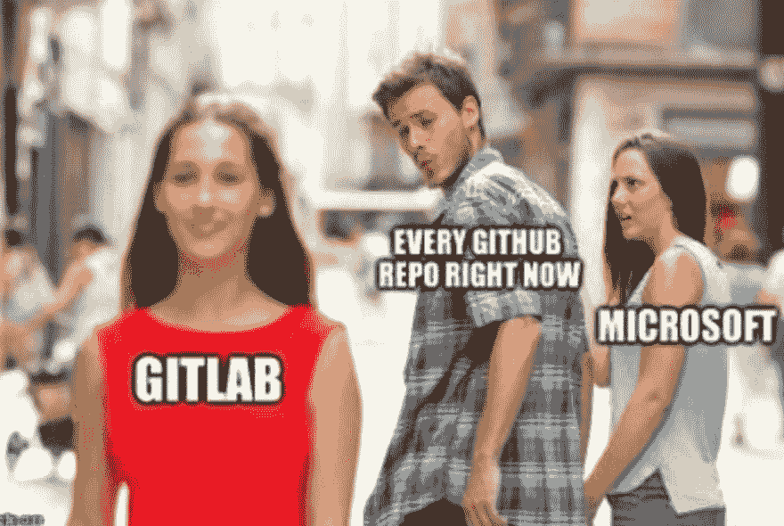
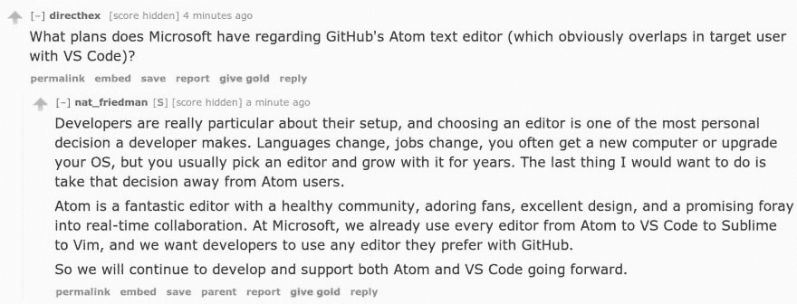

# 我认为微软收购 GitHub 的坏处是

> 原文：<https://dev.to/maxart2501/what-i-think-is-bad-about-microsoft-acquiring-github-gme>

我想我需要这一整天来消化关于 GitHub 被微软收购的重大新闻。我和同事讨论过这个问题，在 Slack 社区中，我听取内部人士的意见，阅读帖子、公告、推文和评论。

让我们首先总结一下为什么这笔交易应该是一件好事情:

1.  GitHub 曾陷入财务困境，现在已经没事了，这要感谢微软的雄厚财力；
2.  GitHub 将在微软的生态系统中保持其自主性:事实上，我并不希望如此；
3.  **微软最近对 OSS 真的很好**它的 CEO 塞特亚·纳德拉对它的态度很好；
4.  GitHub 的功能库停滞不前，可能是因为它微薄的预算仅够支付服务器的费用:有了微软庞大的开发者大军，我们最终会看到一些新的东西。

> 我是开发者@ iamdevloper微软现在是第一家在 GitHub 上真正付费的公司。2018 年 06 月 04 日下午 13:1213774660

最后，我不认为我们会很快看到这些:

1.  仅使用 Microsoft 帐户登录；
2.  微软心血来潮删除了存储库；
3.  只能通过 Edge 访问的 web 界面；
4.  公司账户被强制支付；
5.  GitHub 的 Clippy
6.  简而言之，我们所知道的 GitHub 的终结。

就我个人而言，我信任塞特亚·纳德拉。当微软的开发者说他们非常关心 OSS 时，我相信他们。我跟踪了一些微软最有发言权和代表性的 OSS 开发者，他们都是有价值的灵感。所以，我认为在可预见的未来，OSS 的情况或多或少会保持不变。

尽管如此，我还是很生气。

## 那么，怎么了？

我很喜欢 GitHub 的一点是，虽然它托管着小公司、大公司甚至大公司的大小项目，如脸书、IBM、亚马逊、阿帕奇、谷歌，当然还有微软，但它仍然是一家独立的公司，其核心业务是为风险投资提供一个可靠的平台。

因此，GitHub，Inc .不得不继续为每个人提供可靠、开放和知名的服务，否则这将是它的末日。

这使得它成为开源项目的完美候选。可靠的替代品有 Sourceforce(迅速失宠)、Bitbucket(独立，直到 2010 年被 Atlassian 收购)和 Google Code(根本不独立):只是没那么好。

## 而微软...

微软大概不会从 GitHub 身上赚一毛钱。不是直接的。将 GitHub 的存储库放在 Azure 而不是 AWS 上会节省一些，但仅此而已。这并不是什么问题，因为 GitHub 的运营成本与微软的巨额收入相比可能只是九牛一毛。

如果微软允许所有的免费私有存储库，我不会感到惊讶。

但这就是问题所在:如果 GitHub 没有货币价值，*微软可以让它沉没*如果他们愿意的话。当然，他们不想那样。这将意味着来自开发社区的巨大反弹，其中包括来自微软的许多开发者。

## 关于微软对开源的承诺

雷德蒙近年来对 OSS 很好。塞特亚·纳德拉[已经证实](https://blogs.microsoft.com/blog/2018/06/04/microsoft-github-empowering-developers/)“微软全力支持开源”。此刻我没有理由不相信他。

[T2】](https://res.cloudinary.com/practicaldev/image/fetch/s--9O80vean--/c_limit%2Cf_auto%2Cfl_progressive%2Cq_auto%2Cw_880/https://thepracticaldev.s3.amazonaws.com/i/ne0jlgaa5kvmqtnk0w3y.jpg)

所以，微软致力于开源。我们都知道它并不总是这样:它曾经鄙视开源，认为它不安全、不可靠、不专业。甚至*的这种态度也对其业务产生了巨大的影响*，因为自 80 年代末以来，微软一直是一个 IT 巨头。

现在情况变了。这很好。但是微软并不是一家以开源为目标的公司。这不像 Mozilla 或者 Apache。它是，而且一直是，一家以*盈利为首要目标的公司。在股票交易市场上市的公司，拥有股份和股东。*

当然，这没什么不对。但如果事情发生了变化，那是因为纳德拉和微软内部其他思想开放的开发人员和经理的愿景没有被股东拒绝。只要股东们认为这是件好事，他们就会一直改变。

简而言之，用另一个鲍尔默取代纳德拉几乎不费吹灰之力。

微软对开源的承诺是一个意图，而不是 T2 的使命。没有它，微软不会停止存在。

## 如果不是微软，还有谁？

据报道，GitHub 的另一个买家是谷歌。当然，基于上述原因，谷歌对我来说也不会有什么不同。It *的确*有一个更长的开源承诺的故事，但另一方面，它在长期保持对*自己的项目*的承诺方面有问题！

无论如何，如果谷歌对开源社区没问题，我们早就应该使用谷歌代码而不是 GitHub 了。

如果是脸书，我也不会好的。或者苹果。或者 IBM。或者亚马逊。或者——但愿不会！-甲骨文😱。

不。像 GitHub 这样一个对 OSS 如此重要的平台，不应该掌握在任何一家公司的手中。在我看来，GitHub 应该由一个由公司组成的**开放联盟来投资和管理，无论这些公司是大是小，他们的业务都依赖于 OSS。**

通过这种方式，所有这些公司都可以利用 OSS，而且他们保证在他们不知道的情况下不会有任何事情搞砸。

Bit GitHub 的问题其实很普遍。如今，这个行业的大部分依赖于私有的软件仓库，尽管这些软件仓库很受欢迎，但却是由小型的、经常陷入财务困境的公司维护的。首先，NPM——所有中最大的[包存储库。或者 PHP 的打包师/作曲家。](http://www.modulecounts.com/)

同时，Apache 软件基金会支持 Maven，Python 基金会支持 PyPI。所以这个*是*一个可行的选项。

## 我认为接下来会发生什么

微软可能会将 GitHub 整合到其庞大的服务中。想想部署到 Azure，CI/CD 与门户，与团队协作，与 VS/VS 代码集成。甚至可能将 LinkedIn 连接到 GitHub。

> 我是招聘人员@ iam recruiter我想把你加到我在 GitHub 上的职业关系网中。09:26AM-04 Jun 201810473634

那会很好。好的方面是，GitHub 现在是微软的事情，我们可能会看到 AWS、Google Cloud 或 Digital Ocean 也是如此，T2 不会。(不过，我可能是错的。如果会发生，我会感到惊喜。

这将是长期独立的第一个迹象。

从长远来看，GitHub 将服务于微软的目的，将开发社区聚集到它的法庭上。

[T2】](https://i.giphy.com/media/enTimXqzmVXR6/giphy.gif)

## GitHub 上的其他 OS 项目

其他大公司，如谷歌或脸书，将他们的项目放在微软的服务上会有点尴尬，但可能不会移动任何东西，因为许多用户依赖于他们在 GitHub 上的事实。

但是另一方面，我认为更多致力于自由软件基金会的人将会离开它，因为他们的工作流程必须停留在独立的平台上，而不是如果和没有但是。他们不会接受他们的项目所在的空间是像微软这样的公司的一种让步。

那么其他次要的 OSS 贡献者呢？

[T2】](https://res.cloudinary.com/practicaldev/image/fetch/s--uA5agyj3--/c_limit%2Cf_auto%2Cfl_progressive%2Cq_auto%2Cw_880/https://pbs.twimg.com/media/De2XSYEXcAAhJSh.jpg)

大多数人可能会留下来。在我写这篇文章的时候，有些人正在迁移到 GitLab 或 Bitbucket。就我个人而言，我不会移动任何东西——反正会很麻烦——但我可能会考虑在我的下一个项目中使用替代方案，也许只是为了探索新的解决方案。

但是如果你，开源贡献者，决定转移到其他平台，请不要一蹴而就:

> git lab@ git lab我们看到的是 10 倍于正常日存储量的存储库[# movingtogitlab](https://twitter.com/hashtag/movingtogitlab)[dropbox.com/s/uzg9vc5oljr8…](https://t.co/7AWH7BmMvM)我们正在扩展我们的车队，试图跟上时代的步伐。关注[monitor.gitlab.net/dashboard/db/g…](https://t.co/hN0ce379SC)和[@ movingtogitlab](https://twitter.com/movingtogitlab)2018 年 6 月 03 日下午 22:55352481

## GitHub 的*其他*项目怎么样？

GitHub，Inc .不仅仅是风险投资托管服务 GitHub。GitHub 还创建了软件项目，如 Electron 和 Atom，以及平台，如 Gitter。

电子是广受欢迎的编辑器 VS 代码的基础，所以它会一直存在。相反，它可能会受到微软的巨大推动。这将是一件好事。

另一方面，我看不到 Atom 有什么有意义的未来。曾经是编辑的一个很好的选择，现在它达不到提到的 VS 代码的标准，即使它也是基于电子构建的。尽管如此，竞争总是好的。但我看不到微软再投资 Atom 了。

**更新**:正如 Nat Friedman(GitHub 新任首席执行官)在收购后在他的 [Reddit AMA 上所说，微软“将继续开发和支持 Atom 和 VS 代码”。所以事情暂时不会改变，我仍然怀疑长期的支持。](https://www.reddit.com/r/AMA/comments/8pc8mf/im_nat_friedman_future_ceo_of_github_ama/e0a235q/)

[T2】](https://res.cloudinary.com/practicaldev/image/fetch/s--Nqdncon5--/c_limit%2Cf_auto%2Cfl_progressive%2Cq_auto%2Cw_880/https://thepracticaldev.s3.amazonaws.com/i/9fn64nrjez7jkfrxmoic.jpg)

Gitter 或多或少也是如此，因为已经有这样的团队了。可能需要更长时间，但我想不会停留太久。 *Gitter 其实是 2017 年 3 月被 GitLab 收购的[——感谢@mnivoliez 的提醒。](http://blog.gitter.im/2017/03/15/gitter-gitlab-acquisition/)*

## 未来

是的，微软致力于开源。我已经读过无数遍了。但是我仍然没有准备好任何东西来让我相信它会永远那样。

因为这根本没什么，真的。没有人知道未来会给我们留下什么。而这也是为什么我不能对微软收购 GitHub 感到高兴的原因。

我并没有生气。也许我甚至有点松了口气。但不是真的开心。