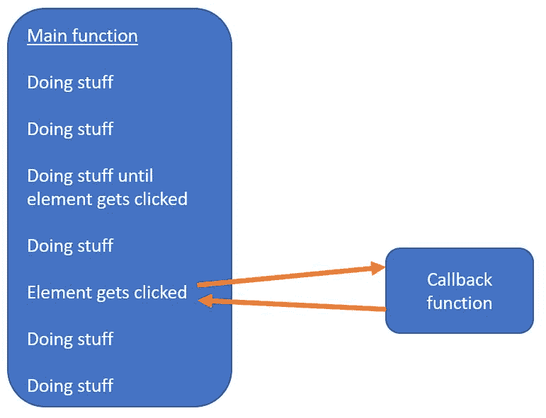

# 什么是回调函数？

> 原文：<https://dev.to/flippedcoding/what-is-a-callback-function-3g5j>

仍然有许多不同类型的函数存在。你已经知道了[箭头函数](https://flippedcoding.com/2018/11/06/what-are-arrow-functions)，但是回调函数呢？你知道它们是什么吗？

回调函数说的很多，但是到底什么是回调函数呢？简而言之，回调函数基本上是一个在事情发生时被调用的函数。例如，当有人在您的网站上提交表单时，您需要运行验证，这意味着有些功能需要在后台运行。

所以当用户提交表单时，这个动作触发了回调函数，开始所有的验证。如果你没有使用回调函数，你的代码就会被验证挂起，直到有人提交表单。这绝对不是你希望你的网站的行为方式。

回调函数让你运行你的代码，直到一个事件触发它。然后回调运行，然后你回到你原来的函数。下面是一个回调函数的示例:

[T2】](https://res.cloudinary.com/practicaldev/image/fetch/s--OZ_ZE2xf--/c_limit%2Cf_auto%2Cfl_progressive%2Cq_auto%2Cw_880/https://flippedcoding.com/wp-content/uploads/2018/11/callback.jpg)

你可以看到回调在做任何事情之前一直在等待，一旦回调函数返回，代码就开始做事情。这就是回调函数的全部内容。是的，确实如此。

希望这有助于澄清开发人员和程序员通常使用的一些术语。请记住，大多数这些令人费解的术语实际上只是简单的东西，只是被打扮得看起来更花哨。

* * *

嘿！你应该在推特上关注我，因为原因:[https://twitter.com/FlippedCoding](https://twitter.com/FlippedCoding)