# 代码分割如何帮助你的网站更有效率

> 原文：<https://dev.to/napoleon039/what-is-code-splitting-22ni>

你做了一个很棒的网站。它看起来不错——有很好的颜色对比，微妙的动画很好互动，网站整体感觉很好。

但是你仍然想知道，为什么初始加载需要这么长时间？网站的代码似乎没有任何问题。那为什么加载很慢？

这可能是因为在开始时加载了多个页面(或者组件，如果您使用框架的话)，而实际上只需要加载一个页面。

Webpack 为这个问题提供了一个解决方案:**代码拆分**。因为它是由 Webpack 提供的，而不是由一个特定的框架提供的，所以你可以使用 Webpack 让它在任何地方工作。

## 简介

这篇文章是关于 Vue 中的代码分割的。更具体地说，它是关于通过*路由*对 Vue 中的组件进行代码拆分。这是一个重要的话题，因为代码分割将帮助你更快地运行你的网站。这是因为只加载了必要的组件，如果需要，还可以加载其他组件。在处理有多个组件和路线的大型项目时，您很可能会用到它。代码分割提高了代码的性能，并缩短了加载时间。

为了最大限度地利用这篇文章，最好有一个安装了 Vue 路由器的 Vue 项目。你需要路由器，因为我们将对我们的*路线*应用代码分割。当然，就像我前面提到的，你甚至可以用其他框架来做这件事，这里没有特定于框架的东西。总共有 3 种方法来实现代码分割。我们将使用其中一个叫做**的动态导入**，你可以在[的 Webpack 文档](https://webpack.js.org/guides/code-splitting/)中找到更多关于它们的信息。

## 概念类比

想象一下想用容器喝果汁。你不会把整个容器都倒空，想喝多少就喝多少，然后再把它放回容器。我们所做的，就是拿出一些放在杯子里喝。如果我们想要更多，我们就往杯子里倒更多的果汁。代码分割做了类似的事情。这看起来像是一个很大的设置，但它相当快。所以让我们开始吧！

## 项目设置

您必须使用 Vue 路由器设置一个 Vue 项目。如果没有，就做一个简单的。要使代码拆分的结果显而易见，必须有多个组件。如果组件中只有一个`<h1>`并不重要，重要的是你实际应用它来更好地理解它。如果你还没有建立一个项目，那就开始吧。这里有一个例子:

[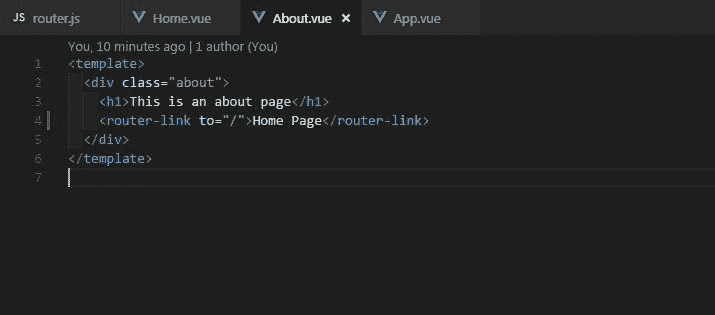T2】](https://res.cloudinary.com/practicaldev/image/fetch/s--x2q4paEw--/c_limit%2Cf_auto%2Cfl_progressive%2Cq_auto%2Cw_880/https://thepracticaldev.s3.amazonaws.com/i/oeju9iujk964vxc9yonv.JPG)

[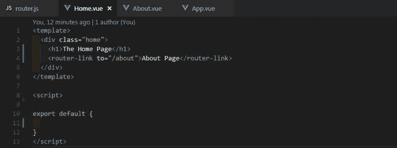T2】](https://res.cloudinary.com/practicaldev/image/fetch/s--D5W0KqoU--/c_limit%2Cf_auto%2Cfl_progressive%2Cq_auto%2Cw_880/https://thepracticaldev.s3.amazonaws.com/i/pp3mmean39j46y2rnsgq.JPG)

现在首先，你必须安装 Babel 的动态导入插件。

[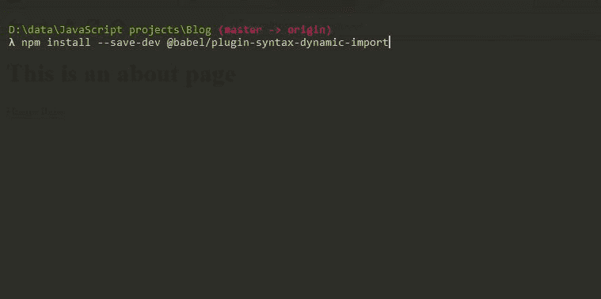T2】](https://res.cloudinary.com/practicaldev/image/fetch/s--bnggvRDh--/c_limit%2Cf_auto%2Cfl_progressive%2Cq_auto%2Cw_880/https://thepracticaldev.s3.amazonaws.com/i/psn6hgri0oksjzx08j7b.JPG)

Babel 需要这个插件的原因是，虽然 Webpack 理解动态导入(这是我们正在使用的)并相应地捆绑，但在服务器端，我们需要 Babel 理解并传输它。Satyajit Sahoo 在 babeljs slack 中对此做了很好的解释:

[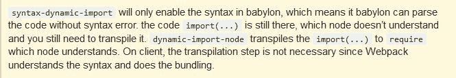T2】](https://res.cloudinary.com/practicaldev/image/fetch/s--tugFUHhX--/c_limit%2Cf_auto%2Cfl_progressive%2Cq_auto%2Cw_880/https://thepracticaldev.s3.amazonaws.com/i/2o2ef21v8grbjs3sr91z.JPG)

接下来，我们在 Babel 配置文件中包含新安装的插件。

[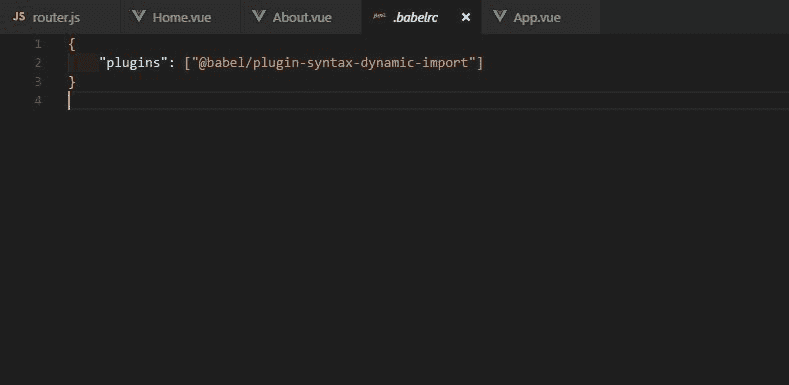T2】](https://res.cloudinary.com/practicaldev/image/fetch/s--6mApHNLn--/c_limit%2Cf_auto%2Cfl_progressive%2Cq_auto%2Cw_880/https://thepracticaldev.s3.amazonaws.com/i/bqs0b0o511mm1fv66wzr.JPG)

就这么定了！让我们现在开始主要的事情。

## 实现代码拆分

导入组件到`router.js`文件的常用方法如下:

[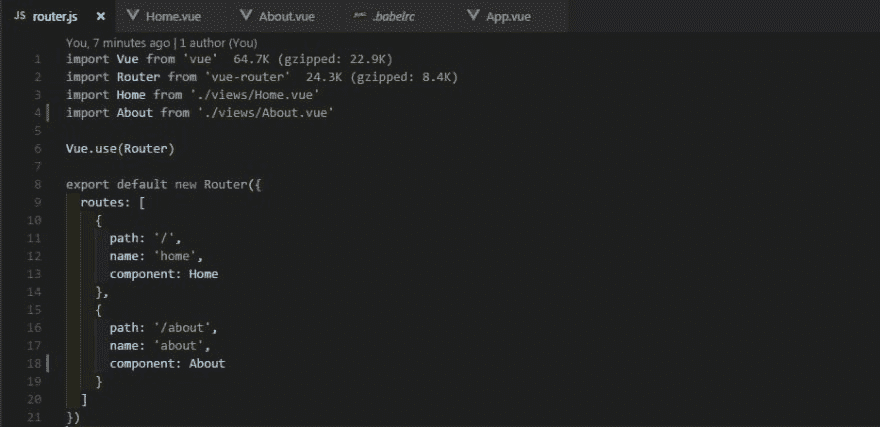T2】](https://res.cloudinary.com/practicaldev/image/fetch/s--o3SLRQas--/c_limit%2Cf_auto%2Cfl_progressive%2Cq_auto%2Cw_880/https://thepracticaldev.s3.amazonaws.com/i/61m91bga6swb7hhv614m.JPG)

保存当前代码，并在开发模式下启动它。

```
#Run development server
npm run dev #for Vue v2.x

npm run serve #for Vue v3.x 
```

Enter fullscreen mode Exit fullscreen mode

在 Chrome 或 Firefox 或任何你选择的浏览器中访问这个。现在从开发者工具[键盘上的 F12 转到控制台。访问网络选项卡。现在重新加载页面。您将看到两个组件都在加载。从过滤器中选择 js 后(它在实际结果窗口上方一点，参考下面的截图)你会看到 app.js，看看它的大小。

[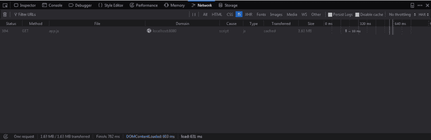T2】](https://res.cloudinary.com/practicaldev/image/fetch/s--X0TkyFQC--/c_limit%2Cf_auto%2Cfl_progressive%2Cq_auto%2Cw_880/https://thepracticaldev.s3.amazonaws.com/i/5gphrhv4q5z8kjw3b0ei.JPG)

没有代码分割，在初始加载时，About 组件与 Home 组件和 loading 捆绑在一起，即使我们还不需要它。是时候改变这一切了。还有另一种基于承诺的导入方式，所以请确保为不支持承诺的旧浏览器提供一个 *polyfill* 。

[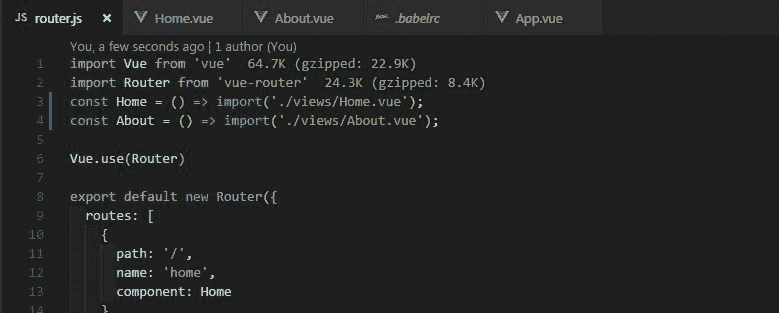T2】](https://res.cloudinary.com/practicaldev/image/fetch/s--mcxlBD_Q--/c_limit%2Cf_auto%2Cfl_progressive%2Cq_auto%2Cw_880/https://thepracticaldev.s3.amazonaws.com/i/yvm5sd4s9oont5oelc58.JPG)

我们结束了。真快！我们所做的是创建一个返回导入的函数。这是动态导入语法。每当 webpack 看到这样的导入，它就会生成一个**块**，也称为响应承诺的代码分割。现在保存代码，重新加载页面并再次检查 Network 选项卡，组件不会一次全部加载。开始逐个访问您的路径，您将看到组件在访问路径时出现在结果窗口中。以下是我一个接一个地访问两条路线时的网络选项卡图像:

[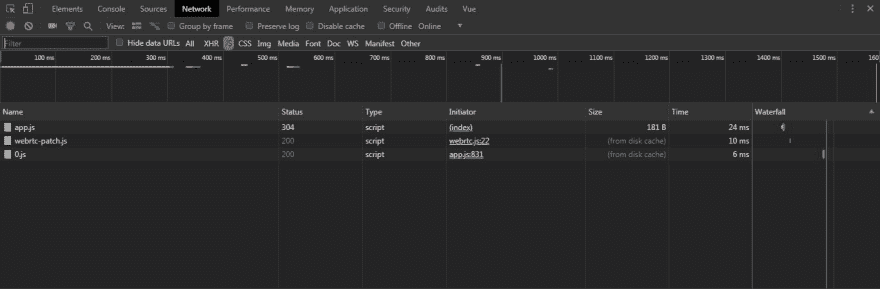T2】](https://res.cloudinary.com/practicaldev/image/fetch/s--MSv0WeFx--/c_limit%2Cf_auto%2Cfl_progressive%2Cq_auto%2Cw_880/https://thepracticaldev.s3.amazonaws.com/i/shw5iz8tzl0e9p2eleot.JPG)

[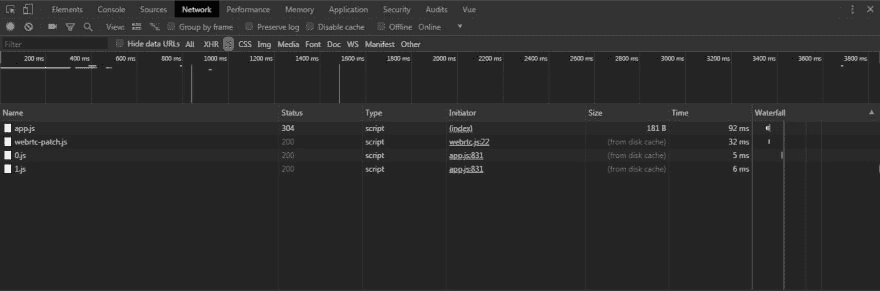T2】](https://res.cloudinary.com/practicaldev/image/fetch/s--sNjFjIkL--/c_limit%2Cf_auto%2Cfl_progressive%2Cq_auto%2Cw_880/https://thepracticaldev.s3.amazonaws.com/i/diqovhgdfz8356mssns0.JPG)

你做到了！！喝点以前的果汁。但是记住不要一口气吞下去；)

但是等等，这是什么；网络选项卡中的所有组件都用数字表示。太不直观了。让我们来解决这个问题:将这个评论添加到您的导入中。

[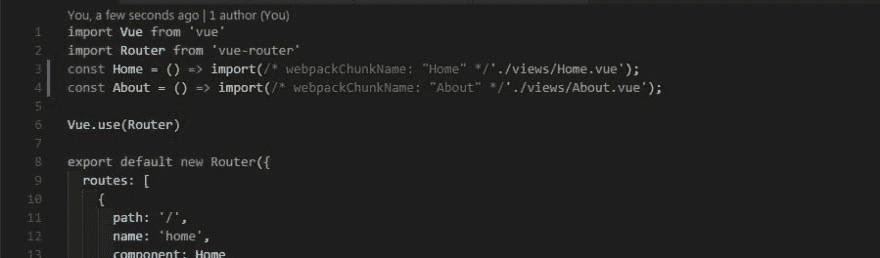T2】](https://res.cloudinary.com/practicaldev/image/fetch/s--ZqFDj5R6--/c_limit%2Cf_auto%2Cfl_progressive%2Cq_auto%2Cw_880/https://thepracticaldev.s3.amazonaws.com/i/tscfo1rq3asfn5nqs6hy.JPG)

Webpack 按照字面意思解释这些评论，**块名**。作为值提供给 *webpackChunkName* 的名称将用于表示网络选项卡中的特定组件，而不是数字。现在，您可以从开发人员工具中知道您正在查看哪个文件。您可能会看到 About 组件在初始加载时仍然存在。但是，快速查看一下文件的大小就会发现，这并不是实际的组件加载，因为文件大小为 0 字节。很可能是 Vue 在幕后工作。实际的组件只有在我们访问它的路径时才会加载。

## 一个更真实的世界例子

我举了一个果汁容器的例子。但是这和现实中的我们有什么关系呢？

让我们来看看这在一个真实的应用程序中是如何工作的。例如，我们有一个网站，它有一条以图片为主的路线和一条回家的路线，还有一些其他的路线。如果我们加载网站，home 组件会像预期的那样首先加载。现在，这个 home 组件可能会有一些动画或图像来吸引用户的注意。但是这个页面会渲染得很慢，因为另一个路由(组件)有很多图像。也可能有一些动画的另一个组件。所有这些组件都将拖动主页。人们会理解为什么一个图片过多的页面在看到它的内容后会呈现/加载缓慢。但是任何网站的主页都应该加载得很快。基于组件的路由对组件进行代码拆分是一个理想的解决方案。我们可能面临这种问题的一个实际例子是 Instagram 或 Pinterest 克隆。

既然您已经看到了代码分割可以为您做什么，为什么不访问 Webpack 文档并检查其他两种方法呢？也许你会发现自己处于这样一种情况，其中一种方法不起作用，但另一种方法对你来说是完美的。我第一次遇到代码分割是在这个 Egghead.io 社区资源上。也来看看。

暂时就这样了。请在下面的评论中告诉我你对这篇文章的想法，以及它是否对你有所帮助。如果你有任何问题或建议，我很高兴收到你的来信。