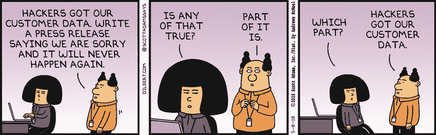
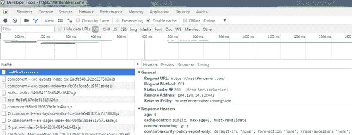

# CSP 是什么？为什么&如何把它添加到你的网站。

> 原文：<https://dev.to/mattferderer/what-is-csp-why--how-to-add-it-to-your-website-28df>

跨站点脚本(XSS)烂透了！XSS 是指有人通过评论、表格、广告或作为 JavaScript 构建一部分的 NPM 包，将 JavaScript 或 CSS 偷偷带入你的网站。现在他们拥有每个访问你网站的用户的账户。XSS 是如此常见的攻击， [OWASP 声称每三个网站&应用](https://www.owasp.org/index.php/Category:OWASP_Top_Ten_Project)中就有两个发生这种情况。

使用 CSP(内容安全策略)可以消除大多数 XSS 攻击。CSP 允许您列出外部和内部脚本、样式、图像和其他允许的内容源。它甚至兼容所有主流浏览器。

由于 CSP 可以阻止已知的最常见的攻击之一，您认为每个人都会使用它，对吗？没有。在访问量排名前 100 万的网站中，只有不到 2.5%的网站使用它。

[T2】](http://dilbert.com/strip/2018-05-08)

对于大多数网站来说，安全是事后才想到的，直到有人窃取了他们所有的数据。然后公众在社交媒体上愤怒。典型的公司反应是解雇某人&承诺把安全放在第一位，同时在背后交叉手指。

让我们来看看如何才能避免这样的混乱。

## 如何添加 CSP 策略

第一步是向您的服务器配置添加一个[头。建议从最严格的 CSP 规则开始，但将其设置为“仅报告”模式。这将创建一个报告，报告如果我们封锁一切可能会发生什么。一旦你有了你的报告，你就可以开始挑选哪些项目你想允许(又名白名单)，哪些项目创建替代修复和哪些项目阻止。](https://mattferderer.com/how-to-add-a-header)

这里有一个推荐的头文件:

```
Content-Security-Policy-Report-Only: default-src 'none'; form-action 'none'; frame-ancestors 'none'; 
```

Enter fullscreen mode Exit fullscreen mode

[](https://res.cloudinary.com/practicaldev/image/fetch/s---qiupeWV--/c_limit%2Cf_auto%2Cfl_progressive%2Cq_auto%2Cw_880/https://thepracticaldev.s3.amazonaws.com/i/lrxxzeaxqb2mzlswuvmz.png) 在浏览器的开发者工具中查看你的页面时，你的 CSP 应该和你的其他页眉一起出现。

如果我们没有将其设置为报告模式，您将会看到*“CSP 的全部功能！”*换句话说，CSP 会屏蔽你网站的大部分内容。

> 请记住，内容安全策略(CSP)的作用是阻止您不允许的所有内容。

如果您在浏览器开发工具(F12)中打开控制台，通常会看到许多错误。第一个错误可能会抱怨缺少 report-uri，但我们稍后会谈到这一点。其余的错误应该都以[仅报告]开始。这是 CSP 报告模式，让您知道什么内容将被阻止，以及如何允许它。

CSS 样式表通常是最先出现的错误之一。它看起来会像这样:

```
[Report Only] Refused to load the stylesheet 'https://example.com/style.css' because it violates the following Content Security Policy directive: "default-src 'none'". Note that 'style-src' was not explicitly set, so 'default-src' is used as a fallback. 
```

Enter fullscreen mode Exit fullscreen mode

为了解决这个问题，我们通过添加一个允许“self”的 style-src 指令来调整我们的策略。添加“self”允许我们包含与页面位于同一 URL 和端口号上的任何 CSS 样式表。如果不这样做，style-src 默认为 default-src 指令，我们已经将其设置为 none。

```
Content-Security-Policy-Report-Only: default-src 'none'; form-action 'none'; frame-ancestors 'none'; style-src 'self'; 
```

Enter fullscreen mode Exit fullscreen mode

很有可能你也想在图片和脚本中加入“自我”。这将导致再次调整我们的 CSP。

```
Content-Security-Policy-Report-Only: default-src 'none'; form-action 'none'; frame-ancestors 'none'; style-src 'self'; script-src 'self'; img-src 'self'; 
```

Enter fullscreen mode Exit fullscreen mode

一个典型的网站也需要外部脚本。我们可以通过修改 script-src 指令来允许来自域[cdnjs.com](https://cdnjs.com/)的 JavaScript。

```
Content-Security-Policy-Report-Only: default-src 'none'; form-action 'none'; frame-ancestors 'none'; style-src 'self'; script-src 'self' cdnjs.com; img-src 'self'; 
```

Enter fullscreen mode Exit fullscreen mode

对于我们当前的规则，你可能会有这样的想法:为什么我们要明确地声明形式-动作&框架-祖先的指令？它们是不使用默认 src 回退的特殊情况。

您可以在 [MDN](https://developer.mozilla.org/en-US/docs/Web/HTTP/Headers/Content-Security-Policy#Directives) 上找到完整的指令列表。

## 内联脚本是我的中间名

内联 JavaScript 和 CSS 经常在网站上使用，但它们也很危险。它们是黑客制造 XSS 攻击最简单的方法。因此，要允许它们，您必须将`'unsafe-inline'`添加到您想要允许它们的指令中。这是为了确保你明白你正在做的事情是不被推荐的。

一个常见的 CSS 模式是内联你最重要的 CSS，用`<style>`标签呈现你的“文件夹上的内容”。这有助于减少感知的渲染时间。对于 HTTP/2 T2，我经常反对这样做，因为 T3 会慢一些 T4。如果您选择使用内联脚本，您有三种选择。

1.  获得脚本的阿沙-256 哈希，并将其添加到我们的 CSP。Chrome 的开发工具甚至会在控制台显示 CSP 错误时为你生成阿沙-256。将它添加到我们当前的 CSP 示例中会是这样的:

```
Content-Security-Policy-Report-Only: default-src 'none'; form-action 'none'; frame-ancestors 'none'; style-src 'self'; script-src 'self' cdnjs.com sha256-c2u0cNUv1GcIb92+ybgJ4yMPatX/k+xxHHbugKVGUU8=; img-src 'self'; 
```

Enter fullscreen mode Exit fullscreen mode

1.  由服务器为每个内联脚本生成一个唯一的 nonce。这意味着每个服务器请求都必须生成一个新的随机数。你可以像阿沙-256 一样将其添加到你的 CSP 中。还需要添加到脚本标签:`<script nonce="47c2gtf3a1">`。很少看到使用 nonces，因为它们实现起来相当不方便。

2.  通过将`'unsafe-inline'`添加到您的策略中来允许内联脚本&羞愧地低下头。这允许内嵌脚本，从而削弱你的 CSP &允许 XSS 攻击。这样做应该会让你感到一些悲伤。

## 振作起来！不安全的内联不是世界末日！只有你的公司。(开玩笑，算是吧...)

当第一次实现 CSP 时，很可能需要在 style-src 或 script-src 指令中使用 unsafe-inline。您甚至可能需要允许 JavaScript 的 eval 函数使用 unsafe-eval。*喘息！*

> 请记住，CSP 应该是您安全武器库中的众多武器之一。它不应该是你唯一的武器。

拥有一个包含一些不安全规则的 CSP 仍然比完全没有 CSP 要好。根本不实施 CSP 就等同于设置每个指令来允许所有不安全的 CSP 规则。

例如，使用 CSS 窃取登录的一种常见方式是向一个邪恶的 URL(如`http://evilexamplesite.com?password=a`)发送一个背景图像或字体请求，其中`a`是您在密码登录字段中键入的字母。当你键入密码的下一个字母时，邪恶的 CSS 脚本会发送另一个请求，但用那个字母代替`a`。邪恶网站然后记录这些请求，以确定您的用户名&密码。通过允许我们的 style-src 使用 unsafe-inline，有人可能会注入这种邪恶的代码。幸运的是，他们的代码不会工作，因为我们的 CSP 不允许来自邪恶的例子网站的 img-src & font-src。

通过这样做，你也不会成为坏人。很多网站，包括 GitHub 的安全专家 T2 的特洛伊·亨特的博客 T3 都使用了不安全内嵌。脸书使用 unsafe-eval &甚至要求他们的一些 SDK 使用它。任何使用谷歌标签管理器进行分析的人也将不得不降低他们的 CSP 安全性。我也必须承认。我用 [GatsbyJS](https://gatsbyjs.org/) 写我的个人博客&在我移除不安全的内嵌之前，有一些问题需要解决。

如果你仍然为不得不屈服于执行一个指令的不安全规则而感到挫败，你可以尝试在你的网站的每个页面上应用不同的 CSP 标题。如果您有允许或显示来自用户或外部资源的输入的区域，您可以尝试在这些页面上添加更严格的 CSP。

## 生成剩余的 CSP

传统的方法是浏览你网站的每一页，检查这些错误并修复它们。如果你有空闲时间这样做，太好了！你甚至可能会喜欢这个漂亮的 Chrome 扩展或 [Fiddler 扩展](https://github.com/david-risney/CSP-Fiddler-Extension)。他们让你浏览你的网站&会为你生成一个合适的 CSP。

一年多前，当我第一次了解 CSP 时，这个任务似乎让我望而生畏。就在那时，我了解了 CSP 的`report-uri`特性。您可以在 CSP 的末尾添加一个`report-uri`,并附上一个发送报告的 URL。浏览器会将任何 CSP 违规发送到您指定的 URL。现在你的访问者可以通过使用你的网站为你做所有的工作。

下面是一个浏览器会发送的错误的例子:

```
{  "csp-report":  {  "document-uri":  "https://mattferderer.com/",  "referrer":  "",  "violated-directive":  "script-src",  "effective-directive":  "script-src",  "original-policy":  "default-src 'none'; form-action 'none'; frame-ancestors 'none'; report-uri https://mattferderer.report-uri.com/r/d/csp/wizard",  "disposition":  "report",  "blocked-uri":  "inline",  "line-number":  4,  "source-file":  "https://mattferderer.com/",  "status-code":  0,  "script-sample":  ""  }  } 
```

Enter fullscreen mode Exit fullscreen mode

这份报告让你知道发生了什么&在哪里。

如果你已经有一个错误记录服务，你可以使用它。如果你正在寻找一个自由简单的方法开始，我推荐[报告 URI](https://report-uri.com/) 。

Tala Security 的优秀员工也经营着类似的服务，他们不久前向我指出，CSP 不是一个“设置 it(T2)忘记它”的工具。当你更新你的站点或者你所依赖的服务时，你的 CSP 可能需要调整。这使得报告服务更有价值。

拥有一个报告服务还将向您显示来自运行不同浏览器、浏览器扩展等的用户的真实数据。

我建议在只报告模式下运行 CSP &将你的报告发送给一个服务，直到你确信你没有阻止任何来自用户的有价值的内容。完成后，您可以将您的 CSP 从`Content-Security-Policy-Report-Only`更改为`Content-Security-Policy`。这将开始执行您的 CSP。您仍然可以将 report-uri 作为 CSP 的一部分，以继续收集错误。

## 快速入门指南

下面是如何开始的快速回顾，以及使用[报告 URI](https://report-uri.com/) 的附加说明。

1.  给你的站点添加一个严格的 CSP 头。我建议`Content-Security-Policy-Report-Only: default-src 'none'; form-action 'none'; frame-ancestors 'none';`

2.  在 [Report URI](https://report-uri.com/) 注册一个免费账户。*确保核实你的电子邮件。*除非你这样做，否则服务不会起作用。

3.  使用 URI 报告，转到设置并创建 CSP 报告地址。将该报告地址添加到您的 CSP: `Content-Security-Policy-Report-Only: default-src 'none'; form-action 'none'; frame-ancestors 'none'; report-uri https://yoursite.report-uri.com/r/d/csp/reportOnly`

4.  使用 URI 报告，转到 CSP >我的策略。添加新策略。

5.  使用 URI 报告，转到 CSP >向导。看着你的数据滚滚而来。*您可以在此处允许或阻止每个指令的站点。这将为您生成您的策略。您可以返回“我的政策”进行查看。

6.  使用 URI 报告生成的新策略更新您的 CSP。

7.  一旦您在仅报告模式下运行了 CSP，并且对 URI 报告中没有显示新条目感到满意，请将您的 CSP 从`Content-Security-Policy-Report-Only`调整到`Content-Security-Policy`以开始实施您的 CSP。

* *根据您的报告服务，违反 CSP 策略的内联脚本可能不会显示。*

## 附加注释

Twitter 为 Ruby on Rails 开发者提供了一个很棒的包来设置[安全默认头文件](https://github.com/twitter/secure_headers)。他们还列出了其他流行框架的类似库。

[GitHub 的 CSP 之旅](https://githubengineering.com/githubs-csp-journey/)是一篇关于他们在实施 CSP 时所面临的问题的精彩文章。

这份 [CSP 快速参考指南](https://content-security-policy.com/) & Scott Helme 的 [CSP 备忘单](https://scotthelme.co.uk/csp-cheat-sheet/)是实施 CSP 时可以浏览的绝佳资源。

如果您需要对特定页面采取额外的预防措施，请查看[沙盒模式](https://html.spec.whatwg.org/dev/origin.html#sandboxing)。

*最初发布于[mattferderer.com](https://mattferderer.com/what-is-csp-and-how-to-add-it-to-your-website)。*