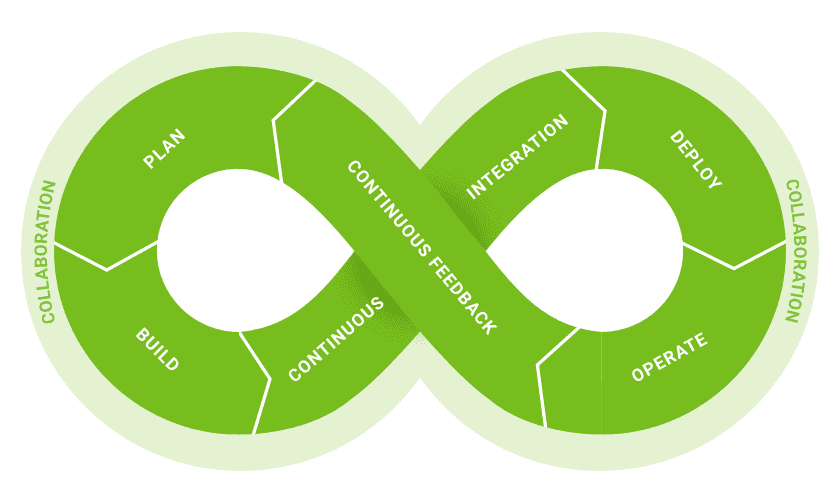
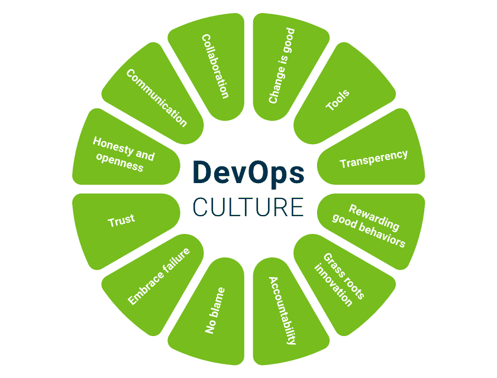
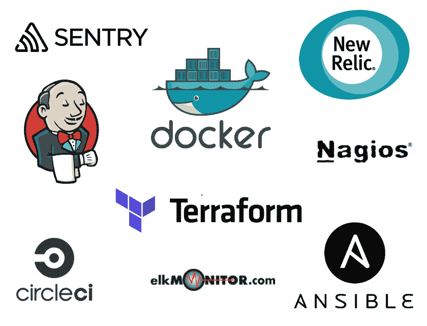

# DevOps:它是什么，为什么你应该拥有它

> 原文：<https://dev.to/django_stars/what-is-devops-and-why-you-should-have-it-5b87>

到本文结束时，您将对 DevOps 方法有一个大致的了解。我将描述 DevOps 在我们公司是如何实现的，以及坚持 DevOps 实践来开发软件为什么如此重要。

## DevOps 是什么？

把事情说清楚——devo PS 是一种方法论。DevOps 方法的思想是创建一种新的思维模式，当开发人员和 IT 运营人员共同努力实现一个共同的目标时。

[T2】](https://res.cloudinary.com/practicaldev/image/fetch/s--ERY699Ae--/c_limit%2Cf_auto%2Cfl_progressive%2Cq_auto%2Cw_880/https://djangostars.com/blog/conteimg/2017/05/infinity.png)

有时它会被错误地与工具或角色混淆。它不是工具，尽管它使用工具链来自动化软件交付和部署。这也不是一个职位，尽管运营和开发人员都应该扩大他们的责任。

## 缺乏合作和交流导致软件交付速度缓慢

传统上，或者说 10 年前，开发团队可以大致分为开发人员——知道如何编写代码的人，和操作人员。对于那些仍然想知道这些操作究竟是谁的人来说:
他们是管理员——系统管理员、网络管理员、数据库管理员和所有其他了解基础设施的人。

因此...运营部门对保持事物稳定感兴趣，以最小化软件冲突的机会。而开发人员最关心的是新特性、新版本，当然还有错误修复。开发人员和运营人员相互隔离。由于这种隔离，缺乏合作和交流。结果，软件不能以期望的速度交付。

## DevOps 方法允许频繁地交付软件，引入小的可迭代的改进

现在，把开发人员和运营人员合并成一个团队，用相互支持的理念来驱动他们。你得到了 DevOps。

**好处:**

*   用户经常收到新功能和更新。一个副作用是，你的公司变得更有竞争力。
*   尽量减少暴行的机会。即使发生了令人发指的事情，一切都可以在几分钟内修复(有时只需刷新一次)，这样用户甚至不会注意到有什么地方出了问题。

## 此外

除了文化部分，DevOps 方法之所以成为可能，要归功于以下方法:

*   **代码为**的基础设施是一种可以自动配置服务器的方法。这里的想法是将您的服务器基础设施更像一个抽象的概念。这很简单，因为今天的许多服务器都是基于云的。下一步是在配置文件中简单描述服务器的配置。好处如下:你可以快速配置任意数量的服务器，所有的配置都用相同的代码记录。
*   微服务架构是软件开发中的一种方法，将应用程序分成松散耦合的部分。想象一下，你有一个现代社交媒体消息应用程序，包含聊天、故事、语音通话、机器人等等。所有这些都可以像独立的迷你应用程序一样开发。这种方法使得维护、测试和重用部分应用程序变得更加容易。另一方面，开发过程变得更加复杂，因为代码由更多的部分组成。开发人员应该考虑应用程序中服务之间的通信。
*   DevOps 爱**自动化**。现代飞速发展的软件开发行业需要自动化。几十个持续集成的构建排队等待部署...每天。您无法手动测试它们。这同样适用于服务器配置。您无法手动设置 20 台、50 台甚至 100 台服务器。
*   开发人员利用**工具库**。如果没有像 Jenkins、Ansible、Docker 或 Puppet 这样的工具，DevOps 的大多数方面都是不可能的。尽管如此，工具只是促进了过程，并允许实现目标。知道如何创建 Docker 容器并不意味着你是 DevOps 俱乐部的一员。

[T2】](https://res.cloudinary.com/practicaldev/image/fetch/s--kVDsbohe--/c_limit%2Cf_auto%2Cfl_progressive%2Cq_auto%2Cw_880/https://djangostars.com/blog/conteimg/2017/05/Culture_v1.png)

## 为什么需要 DevOps？

这完全取决于项目的规模。如果你的目标是发布一个最小可行产品(MVP)来测试你的想法，很有可能你可以不用 DevOps 实践。如果你的软件已经发布了几个版本，是时候开始考虑规模和竞争力了——想想 DevOps。

从头开始设置 DevOps 环境需要更多的时间。在早期阶段，人们会感到困惑，为什么要花费额外的时间和金钱来设置 Docker 和 Ansible。答案很简单——现在需要多花一点时间，因此，从长远的角度来看，要节省时间。

## 我们如何实现 DevOps

在 Django Stars 中，实施在很大程度上取决于我们打交道的客户。以下是最常见的请求“类型”列表:

*   想要构建 MVP 的客户

这是最常提出的要求，原因很简单，因为有一天，任何公司都过了 MVP 的初级阶段。对于这样的小项目来说，增加一个发布工程师或系统管理员将会是一种矫枉过正和浪费客户金钱的行为。这些项目通常由开发人员自己部署。

我们试图说服客户，最好在这个早期阶段播种 DevOps 方法的种子，并坚持 DevOps 的常见实践，如使用微服务构建应用程序。在大多数情况下，开发人员还将部署和维护产品。它允许最小化花费。产品本身是根据客户偏好构建的，但即使客户更喜欢 monolith 类型的应用程序，而不是微服务，我们仍然为未来实施微服务奠定了良好的基础。

*   已经拥有由他人开发的项目的一部分的客户

很多时候是最难的情况。我们喜欢避开那些已经被别人启动，并且由于某种原因而被放弃的项目。尽管如此，当项目有足够的前景去冒险时，还是有一些罕见的例外。案例完全取决于客户。有时，我们开发的应用程序考虑到了最佳 DevOps 实践，并要求将应用程序从 Python 2 升级到 Python 3。而另一个则需要从头开始完全重写。

*   拥有成熟应用程序的长期客户和合作伙伴

这个案例与一个“完美的 DevOps 世界”最为相关。我们的软件工程师与客户的运营或开发工程师紧密合作。
每当我们收到实施新功能的请求时，我们的开发人员都会向客户的运营团队提供以下信息:

*   必需的依赖关系
*   预期负载功能可以处理
*   受即将推出的功能影响的服务

运营团队根据开发人员的要求安装服务器。这反过来又使我们的开发人员今后的生活更加轻松。

## 我们的工具链

以下是我们日常使用的 DevOps 工具:

[T2】](https://res.cloudinary.com/practicaldev/image/fetch/s--6MJBd53M--/c_limit%2Cf_auto%2Cfl_progressive%2Cq_auto%2Cw_880/https://djangostars.com/blog/conteimg/2017/05/list.png)

*   集装箱化码头工人
*   [詹金斯](https://jenkins.io/)和[圈 CI](https://circleci.com/) 进行持续整合和持续交付
*   [哨兵](https://sentry.io)进行实时误差跟踪
*   [ELK](http://www.elkmonitor.com/) 用于度量和日志记录
*   [Terraform](https://www.terraform.io) 和 [Ansible](https://www.ansible.com) 用于服务器供应和基础设施
*   [Nagios](https://www.nagios.org) 和[新遗迹](https://www.newrelic.com)进行监控

你可以在我们的博客上查看我们的 [CI 对比](http://djangostars.com/blog/continuous-integration-circleci-vs-travisci-vs-jenkins/)和 [Docker 教程](http://djangostars.com/blog/what-is-docker-and-how-to-use-it-with-python/)

## 结论

DevOps 是一种比传统的孤岛方法更有效地开发和交付软件的方法。它不仅仅局限于开发人员和 It 运营人员。在大多数情况下，这种方法也在 QAs、PMs 和安全专家中传播。在早期阶段实施开发运维的公司为可扩展的增长创造了基础。

这篇文章是沃洛季米尔·德米特里耶夫写的。
这篇关于[谁是 devops](https://djangostars.com/blog/what-is-devops/) 的文章最初发布在 Django Stars 博客上。您还可以访问我们的内容平台[产品部落](http://producttribe.com/)，它是由专业人士为那些参与产品开发和成长过程的人创建的。

我们随时欢迎您提出问题，分享您想阅读的话题！