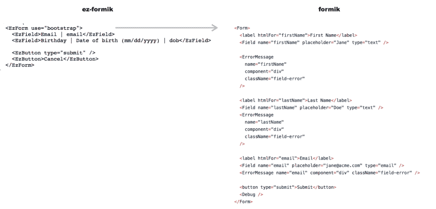

# 什么比 Formik 容易？

> 原文：<https://dev.to/ngduc/what-is-easier-than-formik-2amb>

Formik 是一个 React 表单包，可以让您轻松地处理表单。它的口号是“在反应中建立形式，没有眼泪”。

根据经验，表单在 React 中非常冗长。更糟糕的是，大多数表单帮助程序确实太神奇了，并且经常伴随着巨大的性能损失。Formik 是一个小程序库，可以帮助你处理 3 个最烦人的部分:

*   在表单状态内外设置和获取值
*   验证和错误消息
*   处理表单提交

通过将上述所有内容集中在一个地方，Formik 将使事情井井有条——使对表单的测试、重构和推理变得轻而易举。

用 Formik 构建一个表单，有一个例子是这样的:

```
<Formik
      initialValues={{
        firstName: '',
        lastName: '',
        email: '',
      }}
      onSubmit={(values: Values, { setSubmitting }: FormikActions<Values>) => {
        setTimeout(() => {
          alert(JSON.stringify(values, null, 2));
          setSubmitting(false);
        }, 500);
      }}
      render={this.renderForm}
    /> 
```

“renderForm”是一个典型的函数，可以呈现你在 HTML、React 等中随处可见的表单。像这样:

```
 <Form>
          <label htmlFor="firstName">First Name</label>
          <Field name="firstName" placeholder="Jane" type="text" />

          <ErrorMessage
            name="firstName"
            component="div"
            className="field-error"
          />

          <label htmlFor="lastName">Last Name</label>
          <Field name="lastName" placeholder="Doe" type="text" />
          <ErrorMessage
            name="lastName"
            component="div"
            className="field-error"
          />

          <label htmlFor="email">Email</label>
          <Field name="email" placeholder="jane@acme.com" type="email" />
          <ErrorMessage name="email" component="div" className="field-error" />

          <button type="submit">Submit</button>
          <Debug />
        </Form> 
```

让我们回到这个问题:什么比 Formik 更容易？我认为描述一种形式的最简单的方法是...英语。通常我们会这样说:“我需要一个表单，其中一个字段有这个标签&一个提交按钮”，我们在 JSX 不这么说:)因此，考虑到这一点，我创建了 [ui-form-field](https://github.com/ngduc/ui-form-field) 来帮助我轻松地构建一个表单，就像:

[T2】](https://res.cloudinary.com/practicaldev/image/fetch/s--DFOYQ_cT--/c_limit%2Cf_auto%2Cfl_progressive%2Cq_auto%2Cw_880/https://rawcdn.githack.com/ngduc/ez-formik/0158b434e381a938868e342d8c7a1d2a0fceb57d/screenshot-compare.png)

不仅仅是更短的语法，它还提供:

`Easy Flexible Consistent Fast Layouts Themes More Types`

*   Formik 很简单，ez-react-form (ui-form-field)很简单...更容易，咄 _(ツ)_/
*   简化的 Formik，但不会妨碍你。你可以随时跟随福米克。
*   一致的渲染和样式(适用于大型项目)

还有更多:

*   布局(垂直、水平)
*   使用不同的 CSS 框架/表单布局(tentcss(默认)、bootstrap、spectre 等)。)
*   使用快速场来避免过多的重新渲染。
*   更多类型的字段。

所以，检查一下 [ui-form-field](https://github.com/ngduc/ui-form-field) ，如果你有任何想法或反馈，请帮我一把。谢谢！