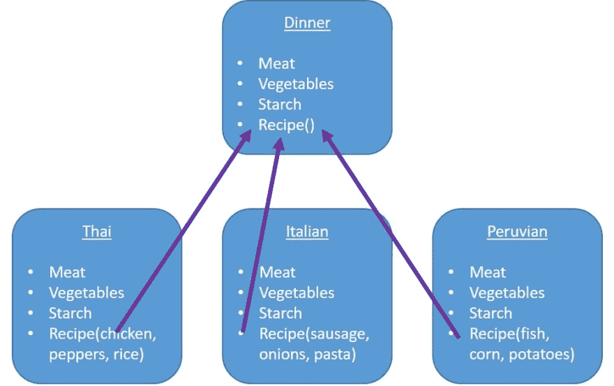

# 什么是多态性？

> 原文：<https://dev.to/flippedcoding/what-is-polymorphism-2j6e>

这是另一个开发人员经常使用的晦涩术语。与继承类似，这是一个既容易理解又很难简明解释的概念。

如果你一直在试图寻找一个有意义的多态定义，我希望这能帮助你。

总而言之，多态性意味着您可以对不同的底层数据类型使用相同的接口。多态性的一个简单例子是基础数学。你可以把一个整数和一个浮点数加在一起，你不会因为不匹配的数据类型而有任何问题。

你可能会在类中看到多态性的最显著的方式。这个概念可以追溯到继承，因为您处理的是可以覆盖超类的属性和方法的派生类。当派生类覆盖了超类方法或属性时，代码将引用该方法或属性的派生类。

这是一张看起来像什么的图表:

[T2】](https://res.cloudinary.com/practicaldev/image/fetch/s--PihcaK8t--/c_limit%2Cf_auto%2Cfl_progressive%2Cq_auto%2Cw_880/https://thepracticaldev.s3.amazonaws.com/i/4ut8wqsjbls1e72x3efo.JPG)

在这种情况下，晚餐是超类，泰国菜、意大利菜和秘鲁菜是派生类。如您所见，派生类中的每个方法都是不同的。例如，当您使用 Dinner 类声明一个对象并创建一个秘鲁对象的新实例时，您可以使用 Recipe()方法，而不必担心将执行什么代码。它将自动遵从秘鲁类中定义的 Recipe()方法的代码。

这就是多态性。派生类的方法可以重写超类的方法。所以你可以用超类定义一个对象，然后用派生类实例化它。然后，当您访问该方法时，每次都会运行正确的代码块。

* * *

嘿！你应该在推特上关注我，因为原因:[https://twitter.com/FlippedCoding](https://twitter.com/FlippedCoding)