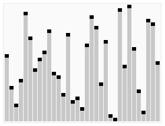
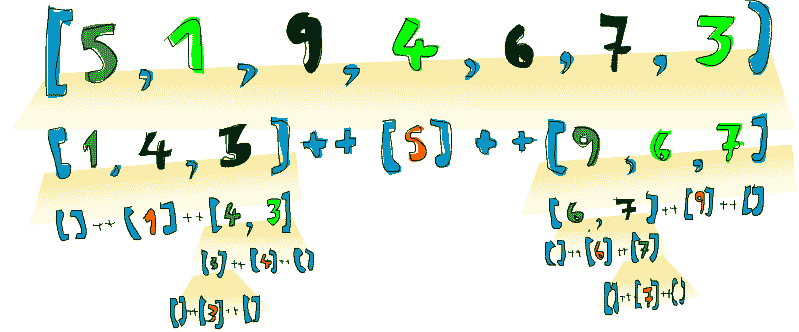

# 什么是快速排序

> 原文：<https://dev.to/lyfolos/what-is-quicksort-50i>

快速排序是一种流行和常见的排序算法，被认为是真正有效的。它创建于 1959 年，由[东尼·霍尔](https://en.wikipedia.org/wiki/Tony_Hoare)于 1961 年发表(他因空引用、进程和结构化编程等而闻名。也是)。

然后，我们进入算法。如果我们需要可视化算法，我们可以这样来可视化:

[T2】](https://res.cloudinary.com/practicaldev/image/fetch/s--XTaAZbqp--/c_limit%2Cf_auto%2Cfl_progressive%2Cq_66%2Cw_880/https://upload.wikimedia.org/wikipedia/commons/6/6a/Sorting_quicksort_anim.gif)

算法如何工作:

*   检查列表是否为空，反之亦然
    如果列表是一个元素，返回该元素，
    否则，继续该函数。

*   选择一个 pivot
    Pivot 通常是列表的第一个元素。但是 pivot 也可以是列表中的任何元素。
    比如:

```
[b, a, d, e, c], Our pivot is b 
```

*   过滤比 pivot ( `a`)更小/更大的数字基本上，你应该迭代 list 的元素，得到比 pivot ( `a`)更大的数字。然后，你也应该对较小的数字做同样的事情。例如:

```
bigger = Filter numbers in [b, a, d, e, c] bigger than a
smaller = Filter numbers in [b, a, d, e, c] smaller than or equal to a 
```

*   对过滤后的`bigger`和`smaller`数字进行排序，并隐藏它们。现在，我们将对`bigger`和`smaller`数字进行排序(使用相同的算法，以获得它们的顺序，并用枢纽(`a`)隐藏它们)

```
quicksort(smaller) + [a] + quicksort(bigger) 
```

然后我们完成了我们的算法！现在，让我们用 Python & OCaml 来实现它。

我试着对 Python 做了很多注释，以帮助初学者理解代码。

```
def quicksort(array):
  if not array: # If list is empty
    return []
  pivot = array[0] # Pivot is the first element of list
  smaller = [n for n in array if n < pivot] # Filter the smaller numbers
  bigger = [n for n in array if n > pivot] # Filter the bigger numbers
  return quicksort(smaller) + [pivot] + quicksort(bigger) # Concenate sorted smaller and sorted bigger with pivot 
```

现在，让我们用 OCaml 来实现它！

```
let rec quicksort list =
    match list with
    | [] -> []
    | pivot :: _ ->
      let smaller = List.filter (fun n -> n < pivot) list in
      let bigger = List.filter (fun n -> n > pivot) list in
      quicksort(smaller) @ [pivot] @ quicksort(bigger) 
```

让我们试着在 repl
中运行它

```
# quicksort [5, 1, 9, 4, 6, 7, 3];;
- : (int * int * int * int * int * int * int) list = [(5, 1, 9, 4, 6, 7, 3)] 
```

有用！(18 次尝试后)

最后，[快速排序](https://dev.to/midnio/what-is-quicksort-50i/)的表现是:

*   最差表现:`O(n2)`
*   平均表现:`O(n log n)`
*   最佳性能:`O(n log n)`

*平均和最佳表现是一样的。*

如果我们需要可视化排序列表:

[T2】](https://res.cloudinary.com/practicaldev/image/fetch/s--Zebw7gOM--/c_limit%2Cf_auto%2Cfl_progressive%2Cq_auto%2Cw_880/http://s3.amazonaws.com/lyah/quicksort.png)

###### (特别感谢[学你个 Haskell 为大善！](http://learnyouahaskell.com/)供图。它有非常好的 Haskell 章节！)

在接下来的帖子中，我将分享由开发 Quicksort ( [东尼·霍尔](https://en.wikipedia.org/wiki/Tony_Hoare))的同一个人开发的 Quickselect 算法！再见！