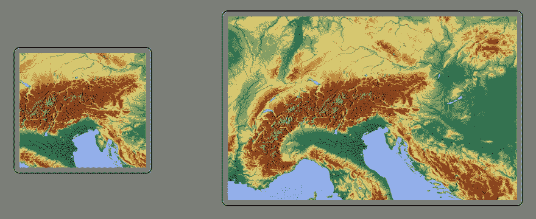

# 什么是响应式布局？

> 原文：<https://dev.to/mortoray/what-is-responsive-layout-5791>

一个好的 UI 设计必须适应用户拥有的各种设备格式和分辨率。元素位置不能是绝对的，而是受可用空间的约束和扩展。动态调整的布局被称为响应性布局，是现代界面设计的重要组成部分。

> 这篇文章是关于编写 UI 引擎的系列文章的一部分。

## 依赖大小

[尺寸相关的元素](https://mortoray.com/2018/03/15/ui-layout-natural-versus-dependent-size/)可能是第一线响应特征。考虑这个基本的标题栏:

```
Panel {Padding=5,2,5,4}
    Icon {Alignment=Left Type=Menu}
    Icon {Alignment=Right Type=Share}
    Text {Alignment=Center Value="News Browser"}
    Rectangle {Alignment=Bottom Color=Black Height="2"} 
```

Enter fullscreen mode Exit fullscreen mode

[T2】](https://res.cloudinary.com/practicaldev/image/fetch/s--xTZPULIA--/c_limit%2Cf_auto%2Cfl_progressive%2Cq_auto%2Cw_880/https://mortoray.files.wordpress.com/2018/03/screen-shot-2018-03-26-at-09-50-30.png)

图标可能有一个固定的大小，但是它们的位置，在左边和右边，并不代表标题栏的总宽度。用矩形绘制的分隔线不知道元素有多高，也不知道它的实际宽度；我们添加了两点填充，让它在底部有空间。不管元素大小如何，文本都是居中的，但是文本的大小会影响元素的整体大小。

我们已经创建了一个响应标题栏。无论设备大小和方向如何，这将占据整个宽度，图标位于两侧，并有一条分割线。图标和字体的大小也可能来自用户设置，或者 OS 值:我们不需要固定大小。

约束和相关尺寸提供了响应式布局所需的功能，但还需要更多功能。扩展的标题栏并不总是最好的利用空间，尤其是在小设备的横向模式下。

## 列而行云流水

我们可以不展开单个元素，而是将更多的元素放入显示中。在手机上，在纵向布局中，我们可能有几个项目是垂直排列的。平板电脑上的用户有更多的空间，因此我们可以使用多列来显示更多的项目。

[T2】](https://res.cloudinary.com/practicaldev/image/fetch/s--4pgInX7E--/c_limit%2Cf_auto%2Cfl_progressive%2Cq_auto%2Cw_880/https://mortoray.files.wordpress.com/2018/03/screen-shot-2018-03-26-at-09-26-522.png)

一种方法是将一个屏幕逻辑上分成一些列，比如 12 列。放置图元时，需要指定它在逻辑上覆盖多少列。项目流入列:它们从左到右填充列，如果它们到达行的末尾，就换到下一行。较小的设备将适应具有较少的列:缠绕将更快发生。

这种流动的方法，有时称为列或网格，仍然需要与相关的大小调整相结合:不仅是数量，而且产生的列大小也会改变以填充可用空间。

## 扩大覆盖面

类似于查看更多项目，我们可以扩展可视化以覆盖更大的范围或区域。例如，条形图可以显示横向模式比纵向模式更长的时间跨度。地图的可视区域将覆盖它所拥有的任何可用空间。注释框可以显示更多的文本。

[T2】](https://res.cloudinary.com/practicaldev/image/fetch/s--Jq_3llOI--/c_limit%2Cf_auto%2Cfl_progressive%2Cq_auto%2Cw_880/https://mortoray.files.wordpress.com/2018/03/screen-shot-2018-03-26-at-09-44-02.png)

这些类型的控件展示了内部和外部布局之间的差异。布局引擎关心的是如何放置控件本身，而不是它显示的内容。除了扩展以适应某个区域之外，布局引擎几乎不支持这种类型的控件。每个控件本身都必须处理如何呈现数据和管理其内部布局。

## 折叠和隐藏

性能的另一个选择和重大挑战是隐藏和显示元素的能力。紧凑的用户简档可能只显示图像和名称，而较大的用户简档可能会介绍位置和标签。不是显示更多的时间，而是一个图表可能会变得更大，显示更多的数字和关键数字。

[T2】](https://res.cloudinary.com/practicaldev/image/fetch/s--r7g1RHgW--/c_limit%2Cf_auto%2Cfl_progressive%2Cq_auto%2Cw_880/https://mortoray.files.wordpress.com/2018/03/screen-shot-2018-03-26-at-09-40-09.png)

小块信息不会改变应用程序的整体布局；他们适合它。布局引擎需要一种方法来编码和响应不断变化的约束。当达到某个尺寸时，或者基于方向，可以显示一小块。

除了静态约束之外，面板还可以隐藏在用户操作之后。按下动作按钮时，该按钮可能会扩展为一个大控件。信息框可以保持折叠状态，直到用户点击它。对于一个有机的展示，用户会期望这些变化以某种方式被动画化，这给布局引擎带来了巨大的压力来有效地处理这个问题。我们将在后面的文章中深入探讨性能。

## 倒换

对于给定的程序来说，一种布局适合所有情况的设计不一定是最好的。针对手机的应用程序可以在任何地方工作，这很好，但也许平板电脑应该有一个明显不同的布局。用于大型显示器的工具可能必须进行相当大的修整和修改，以在小型显示器上提供任何用途。

支持这些显著的布局差异是布局引擎和支持框架的一个特性。在简单的一端，我们可以对多种布局进行编程，并以不同的分辨率进行切换——尽管对于用户来说，如果他有一个略大的手机，其布局与较小的设备完全不同，这可能会是一种不和谐的体验。在复杂的一端，大的和小的 ui 被统一成一个高度响应的约束系统。

> 并非所有软件都必须针对所有设备进行优化。对开发商来说，了解他们的目标市场并据此进行设计是至关重要的。使用多种布局可能不像使用统一的布局那样时髦，但它可以更便宜，更容易实现。成本将是一个重要因素。

## 共

一个现代的 UI 将结合所有这些技术来创建一个响应式的设计。它必须将图形和 UI 设计与布局编码结合起来；为了有效地使用这个系统，工具承受了很大的压力。

对于 UI 引擎来说，提供这些特性、易于使用并保持高效是一个障碍。我们会优先考虑易用性——不可用和不必要的复杂功能不会被使用。我们必须尽最大努力，基于可访问功能的即席和看似混乱的组合来提高性能。

响应式设计也没有确定的方法:在一个视图中有效的可能在另一个视图中无效。UI 引擎应该是开放和灵活的。