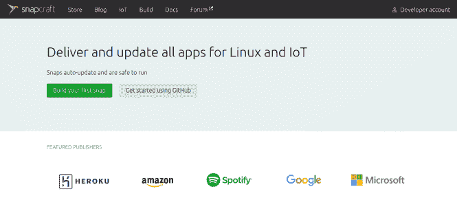
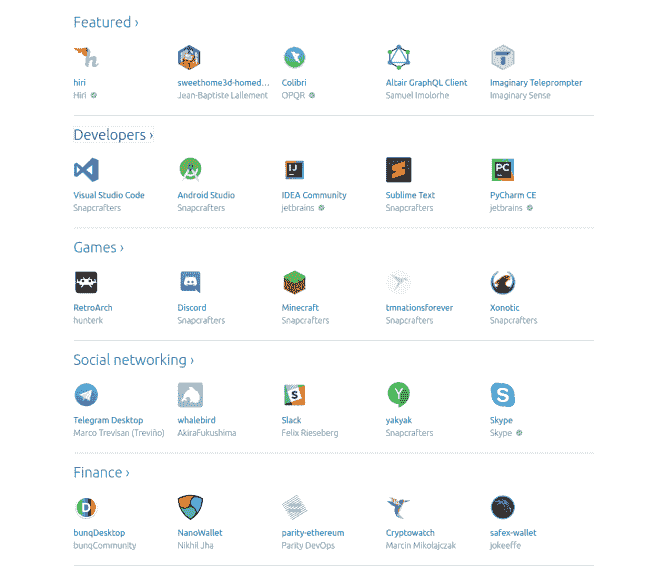

# 什么是 Snap:Linux 中软件发布的新方式？

> 原文：<https://dev.to/xeroxism/what-is-snap-the-raving-new-way-software-is-distributed-in-linux-650>

[T2】](https://i1.wp.com/fossnaija.com/wp-content/uploads/2018/08/snapcraft_home_page.png?ssl=1)

如果你是 ubuntu 用户已经有一段时间了，你可能最近听说过 snap 或 Snap 应用程序(snaps)。但是你一直想知道它们是什么，为什么它们会成为在 Linux 中安装软件(和应用程序)的标准，有多少 snap 应用程序可用，以及如何使用它们。这就是我们这篇文章的目的。所以让我们开始吧。

# **什么是快照？**

Snaps 是一种容器形式的打包应用程序，跨桌面、移动、云和物联网设备等广泛的硬件平台。

Snap 是..

易于打包，利用您现有的工具

每个人的自动更新

覆盖数千万个 Linux 系统

轻松回滚版本

与构建和 CI 基础架构轻松集成

开放和封闭源码项目免费

snap 软件包分发系统是由 canonical(开发 ubuntu Linux 分发版的公司)开发的，它已经成为一些流行的桌面应用程序安装在 ubuntu 上的主要方式。许多其他 Linux 发行版现在也支持 snap 包。

[T2】](https://i1.wp.com/fossnaija.com/wp-content/uploads/2018/08/snap-distros.png?ssl=1)

它是一个允许软件包与运行应用程序所需的运行时库(依赖项)捆绑在一起的系统。所有这些都不会影响系统其余部分的应用配置。这是因为快照受到操作系统的限制；虽然他们可以和系统交流，也可以互相交流。

发展的语言不是障碍。因为它支持许多主要的编程语言和框架，如 C/C++、Java、Python、Go、Node。JS，电子，红宝石等。

Snaps 为使用该平台的开发人员提供了高效的自动更新和安全功能，确保他们能够使用最新版本的开发应用。

# **一些 snap 应用:**

应用程序用户可以从丰富而强大的应用程序中受益，只需从 snap store 中点击一个按钮，即可安装。从开发者工具(如 [Visual Studio Code](https://snapcraft.io/vscode) 、 [Android Studio](https://snapcraft.io/android-studio) 、 [Sublime Text](https://snapcraft.io/sublime-text) 、 [Atom](https://snapcraft.io/atom) 、 [node](https://snapcraft.io/node) 、 [Kotlin](https://snapcraft.io/kotlin) 、 [Eclipse](https://snapcraft.io/eclipse) 、 [powershell](https://snapcraft.io/powershell) )到实用程序(如 [Telegram Desktop](https://snapcraft.io/telegram-desktop) 、<u>、、、 VLC</u>

[T2】](https://i0.wp.com/fossnaija.com/wp-content/uploads/2018/08/snap_apps.png?ssl=1)

按照这个速度，真正的通用 Linux 包系统就要实现了。这对于提高桌面世界中 Linux 体验的进步和统一有很大的帮助。

快乐的 Linux！

什么是 Snap:在 Linux 中发布的疯狂的新软件？最早出现在[福斯奈亚](https://fossnaija.com)上。