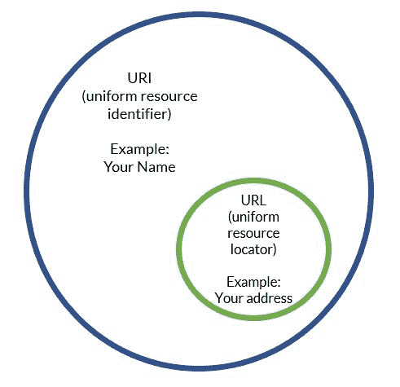

# URL vs URI URI 和 URL 有什么区别？

> 原文：<https://dev.to/flippedcoding/what-is-the-difference-between-a-uri-and-a-url-4455>

作为一名 web 开发人员，尽可能多地了解互联网的工作方式是有好处的。这也意味着你会听到很多不经常被正确使用的首字母缩写词。

你会听到的一些首字母缩写的例子是 URIs 和网址。虽然它们可以互换使用，但还是有一些细微的区别。首先，URI 代表统一资源标识符，URL 代表统一资源定位符。

大多数与这两者的混淆是因为它们是相关的。你看，URI 可以是在线资源的名称和/或定位器，而 URL 只是定位器。URL 是 URIs 的一个子集。这意味着所有的网址都是 URIs。不过，它的工作方式并不相反。

并非所有的 URIs 都是 URL，因为 URI 可能是一个名称而不是定位器。下面是两者区别的一个例子:

[T2】](https://res.cloudinary.com/practicaldev/image/fetch/s--lrbx3qNQ--/c_limit%2Cf_auto%2Cfl_progressive%2Cq_auto%2Cw_880/https://thepracticaldev.s3.amazonaws.com/i/j4bka41nypm4do1f3e5b.JPG)

你的名字可以是一个 URI，因为它可以识别你，但它不能是一个网址，因为它不能帮助任何人找到你的位置。另一方面，你的地址既是一个 URI 又是一个 URL，因为它既能识别你的身份*又能为你提供一个位置。*

在 web dev 世界中，您可能试图通过名称获取不同的资源，因此您将拥有具有不同 URL 的不同 URIs。混乱就是这样开始的。现在你知道了其中的区别，希望当人们开始谈论资源的时候，你不会很难弄清楚你需要什么以及在哪里可以找到它。

记住，URL 是资源的定位器。URI 是资源的标识符，它可能恰好是一个定位器。我希望这有助于澄清我们使用的一些术语！

我总是喜欢听到你们的声音，所以在评论中告诉我一些好的东西吧！

* * *

嘿！你应该在推特上关注我，因为原因:[https://twitter.com/FlippedCoding](https://twitter.com/FlippedCoding)