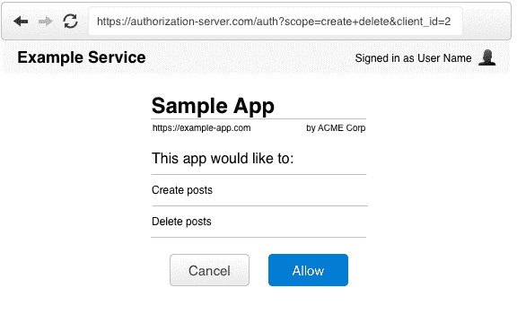

# 什么是 OAuth 2.0 隐式授权类型？

> 原文：<https://dev.to/oktadev/what-is-the-oauth-20-implicit-grant-type-586m>

隐式授权类型是单页 JavaScript 应用程序获取访问令牌的一种方式，无需中间代码交换步骤。它最初是为 JavaScript 应用程序(没有安全存储秘密的方法)创建的，但通常不再推荐使用。

本文是我们探索常用 OAuth 2.0 授权类型系列的第二篇。之前，我们讨论了授权码的授权类型。如果你想在我们开始之前回顾一下并了解更多关于 OAuth 2.0 的知识，请查看[OAuth 到底是什么？](https://developer.okta.com/blog/2017/06/21/what-the-heck-is-oauth)，也在 Okta 开发者博客上。

## 什么是 OAuth 2.0 授权类型？

在 OAuth 2.0 中，术语“授权类型”指的是应用程序获取访问令牌的方式。OAuth 2.0 定义了几种授权类型，包括授权代码流。OAuth 2.0 扩展还可以定义新的授权类型。

每种授权类型都针对特定的使用情形进行了优化，无论是 web 应用、本地应用、无法启动 web 浏览器的设备，还是服务器到服务器的应用。

## 隐含授予

像[授权码授权类型](https://developer.okta.com/blog/2018/04/10/oauth-authorization-code-grant-type)一样，隐式授权开始于构建一个链接并将用户的浏览器定向到该 URL。概括地说，该流程具有以下步骤:

*   应用程序打开浏览器，将用户发送到 OAuth 服务器
*   用户会看到授权提示并批准应用程序的请求
*   用户通过 URL 片段中的访问令牌被重定向回应用程序

### 获得用户的权限

OAuth 就是让用户能够授予对应用程序的有限访问权。应用程序首先需要决定它正在请求哪些权限，然后将用户发送到浏览器以获得他们的权限。为了开始隐式流，应用程序构建如下所示的 URL，并将浏览器定向到该 URL。

```
https://authorization-server.com/auth
 ?response_type=token
 &client_id=29352910282374239857
 &redirect_uri=https%3A%2F%2Fexample-app.com%2Fcallback
 &scope=create+delete
 &state=xcoiv98y3md22vwsuye3kch 
```

Enter fullscreen mode Exit fullscreen mode

下面是对每个查询参数的解释:

*   **`response_type=token`**——这告诉授权服务器应用程序正在启动隐式流。请注意与授权代码流的区别，在授权代码流中，该值被设置为`code`。
*   `client_id` -应用程序的公共标识符，在开发者第一次注册应用程序时获得。
*   `redirect_uri` -告知授权服务器在批准请求后将用户发送回何处。
*   `scope` -一个或多个空格分隔的字符串，指示应用程序正在请求哪些权限。您使用的特定 OAuth API 将定义它支持的范围。
*   `state` -应用程序生成一个随机字符串，并将其包含在请求中。然后，它应该检查在用户授权应用程序后是否返回相同的值。这是用来防止 CSRF 袭击的。

当用户访问这个 URL 时，授权服务器将提示他们是否愿意授权这个应用程序的请求。

[T2】](https://res.cloudinary.com/practicaldev/image/fetch/s--1Rgoy89J--/c_limit%2Cf_auto%2Cfl_progressive%2Cq_auto%2Cw_880/https://developer.okta.com/assets/blog/oauth-authorization-code-grant-type/oauth-prompt-6489c6516fda5e0deea637d96f8398683fea6ade6054ee779e306e0b8ac5dcb8.png)

## 重定向回应用程序

如果用户批准了请求，授权服务器会将浏览器重定向回应用程序指定的`redirect_uri`，在 URL 的片段部分添加一个`token`和`state`。

例如，用户将被重定向回一个 URL，如

```
https://example-app.com/redirect
  #access_token=g0ZGZmNj4mOWIjNTk2Pw1Tk4ZTYyZGI3
  &token_type=Bearer
  &expires_in=600
  &state=xcoVv98y2kd44vuqwye3kcq 
```

Enter fullscreen mode Exit fullscreen mode

请注意这与授权代码流之间的两个主要区别:访问令牌被返回而不是临时代码，并且两个值都在 URL 片段中(在`#`之后)而不是在查询字符串中返回。通过这样做，服务器确保应用程序能够从 URL 访问该值，但浏览器不会将 HTTP 请求中的访问令牌发送回服务器。

状态值将与应用程序最初在请求中设置的值相同。应用程序应该检查重定向中的状态是否与其最初设置的状态相匹配。这可以抵御 CSRF 和其他相关攻击。

服务器还将在访问令牌到期之前指示其生命周期。这通常是很短的时间，大约 5 到 10 分钟，因为在 URL 本身中返回令牌会有额外的风险。

这个令牌已经准备好了！在应用程序可以开始使用它之前，没有额外的步骤！

## 何时使用隐式授予类型

一般来说，在极其有限的情况下，使用隐式授权类型是有意义的。隐式授权类型是为 JavaScript 应用程序创建的，同时也试图比授权代码授权更易于使用。在实践中，从最初的简单性中获得的任何好处都消失在确保该流程安全所需的其他因素中。相反，JavaScript 应用程序应该使用没有客户端秘密的授权码授权。

隐式授权类型的主要缺点是访问令牌直接在 URL 中返回，而不是像在[授权代码](https://developer.okta.com/blog/2018/04/10/oauth-authorization-code-grant-type)流中那样通过可信的返回通道返回。访问令牌本身将被记录在浏览器的历史记录中，因此大多数服务器会发布短期访问令牌来降低访问令牌被泄露的风险。因为没有 backchannel，隐式流也不返回刷新令牌。为了让应用程序在短期访问令牌过期时获得新的访问令牌，应用程序必须通过 OAuth 流再次发送用户，或者使用隐藏 iframes 之类的技巧，重新增加流程最初创建时要避免的复杂性。

隐式流使用 URL 片段的历史原因之一是浏览器可以操纵 URL 的片段部分，而不会触发页面重载。然而，[历史 API](https://developer.mozilla.org/en-US/docs/Web/API/History_API) 现在意味着浏览器可以更新 URL 的完整路径和查询字符串，而无需页面重载，因此这不再是隐式流的优势。

使用隐式流的另一个原因是授权服务器不支持跨来源请求(CORS)。授权代码授权要求 JavaScript 应用程序向授权服务器发出 POST 请求，因此授权服务器需要支持适当的 CORS 头，以便允许浏览器发出请求。如果您正在构建自己的授权服务器，这是一个相对容易的改变，但是如果您正在使用现有的服务器，那么您可能会陷入使用隐式授权来绕过 CORS 限制的困境。

有关这些限制的更多细节和其他研究和文档的链接，请查看 oauth.net 上的[隐式授权类型](https://oauth.net/2/grant-types/implicit/)。

### 隐式授予类型和 OpenID 连接

虽然我们还没有在本系列中讨论 OpenID Connect，但是关于隐式授权如何与 OpenID Connect 相关联，有必要指出重要的一点。(有关 OpenID Connect 的更多背景信息，请参见 Okta 开发者博客上的 OpenID Connect 初级读本。)

在 OpenID Connect 中，除了 URL 片段中的`access_token`之外，服务器还返回一个`id_token`。这被认为是传输数据的不安全通道，因为它很容易被篡改。因为 OpenID Connect ID 令牌包含诸如用户身份之类的声明，所以这个令牌的签名**在可信之前必须经过**验证。否则，用户可能会更改令牌中的数据，并有可能在 JavaScript 应用程序中冒充其他用户。相比之下，当应用程序使用授权码授权来获得`id_token`时，令牌通过安全的 HTTPS 连接发送，即使令牌签名没有通过验证，这也提供了基本的安全级别。

## 了解更多关于 OAuth 和 Okta

在 [OAuth 操场](https://www.oauth.com/playground/implicit.html)上尝试隐式授权类型的现场演示

您可以在[OAuth.net](https://oauth.net/2/grant-types/implicit/)上了解更多关于 OAuth 2.0 的信息，或者查阅这些资源来开始构建！

*   [开始使用 Spring Boot、OAuth 2.0 和 Okta](https://developer.okta.com/blog/2017/03/21/spring-boot-oauth)
*   [ASP.NET 核心 2.0 中的令牌认证-完整指南](https://developer.okta.com/blog/2018/03/23/token-authentication-aspnetcore-complete-guide)
*   [通过 Spring Boot 和欧文斯酒店保护您的水疗中心](https://developer.okta.com/blog/2017/10/27/secure-spa-spring-boot-oauth)

或者点击 Okta 的 OIDC/OAuth 2.0 API 了解我们如何支持 OAuth 的具体信息。一如既往，在 Twitter [@oktadev](https://twitter.com/oktadev) 上关注我们，获取更多精彩内容。