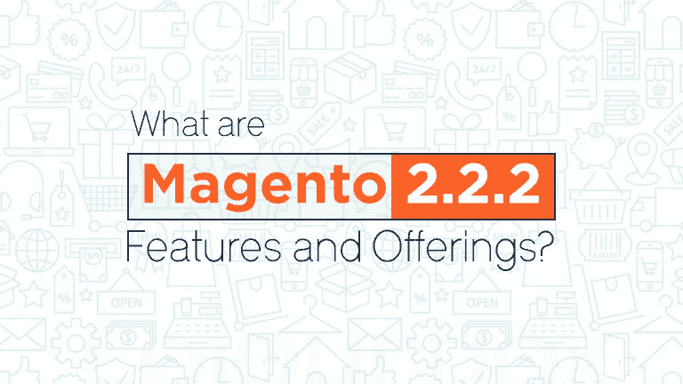

# Magento 2.2.2 最近的功能更新是什么？

> 原文：<https://dev.to/praveenraja7/what-is-the-recent-magento-222-features-update-i3j>

# Magento 2.2.2 功能更新

 
Magento 更新是在 Magento 2.2 之后仅仅发布了几次。它将加速销售增长，提高运营效率。它将使 **[Magento](https://www.webnexs.com/magento-development.php?utm_source=devto&utm_medium=article&utm_term=Ecommerce&utm_campaign=praveen)** 的操作更加精简。合并了对核心功能的重要修复。让我们来看看它的一些增强功能

## 1。Magento 商业智能支持的高级报告

这项新功能允许从 Magento 2.2 Admin 访问订单、产品和客户报告。这些有助于做出数据驱动的决策，以设计新的愿景。该报告功能通过与 Magento Business Intelligence(MBI)的集成来实现。MBI 通过从 Magento 收集数据来生成分析。为此，最低要求如下

Magento 商店网站的真实域名。持有有效证件的 HTTPS。
·订阅高级报告。

**Magento 管理→商店→设置→配置→常规→高级报告**

您还可以选择设置数据收集的最佳时间，以避免增加系统加载时间。它让您可以访问 20 份报告和 3 个仪表板，以提高您的商店绩效。

## 2。Magento 航运公司

Magento Shipping 是一个端到端的解决方案，提供更先进的运输和履行。它有效地减少了购物车废弃，提高了业务效率，从而实现了更快的增长。它使商家能够与全球运营商建立联系。Magento 2 shipping 承诺满足所有商家的需求。

## 3。简化的即时购买结账

为您提供了即时购买选项，以绕过结账过程中的步骤。它使用先前存储的支付凭证和运输信息。基本上，它加快了结帐过程。它利用产品页面上“添加到购物车”按钮下方的“即时购买”按钮。

但是它需要满足一些要求。前提条件是客户应该登录帐户。此外，该帐户拥有默认的帐单和送货地址等。它为顾客提供了许多安全的支付方式。

要配置即时购买，请导航至

**管理侧边栏→商店→设置→配置**

现在，在此配置付款方式 vault 并启用即时购买。

## 4。集成的网络邮件营销自动化软件

Magento 新版本包括 dotmailer 营销自动化。它成为第一批 **[电子商务解决方案](https://www.webnexs.com/magento-development.php?utm_source=devto&utm_medium=article&utm_term=Ecommerce&utm_campaign=praveen)** 之一，将营销自动化软件引入其核心产品。它通过使用来自 Magento 商店的数据来产生电子邮件通信。

## 5。Magento 功能测试框架

Magento 功能测试框架(MTFT)是新的开源、跨平台测试解决方案。它有助于功能测试。随时都可以进行。减少回归测试的工作量。它将有助于提高可追溯性、模块化、可定制性、可维护性和可读性。

**结论**
这些是 Magento 发布的新更新。这将有助于 Magento 网店店主提高他们店铺的转化率。您可以将 Magento 商店更新到最新版本，以便在他们的在线商店上获得这些功能。

有关 Magento 在线商店的更多信息，请联系 **[Webnexs Magento 解决方案](https://www.webnexs.com/magento-development.php?utm_source=devto&utm_medium=article&utm_term=Ecommerce&utm_campaign=praveen)** 。