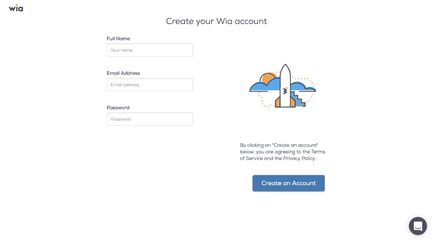
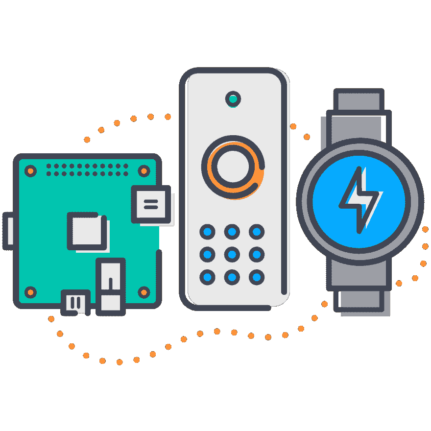
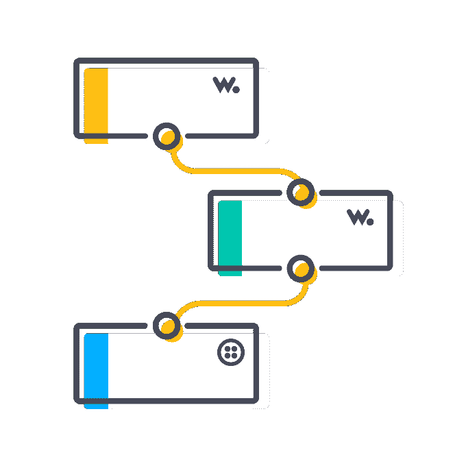
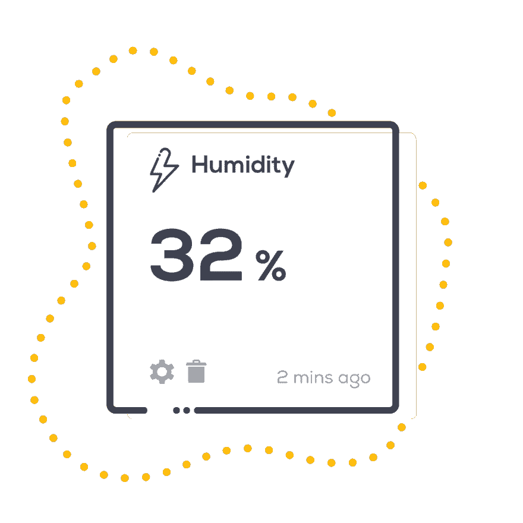

# 什么是 Wia，我如何使用它

> 原文：<https://dev.to/wiaio/what-is-wia-and-how-i-can-use-it-4h55>

问完你想听什么后，我有很多教程正在制作中，所以谢谢你的反馈！与此同时，我意识到我应该告诉你什么是 Wia，以及如何进行设置。

### 从基础开始，什么是 Wia？

Wia 是一个物联网(IoT)云平台，它提供了一种简单的方式，让人和物能够通过几行代码相互交流，鼓励开发人员构建任何物联网应用。本质上提供了在几分钟内将任何哑设备变成智能连接设备的能力。

任何人都可以学习如何将他们喜爱的开发板连接到 Wia，并与第三方服务集成。

对于更高级的开发者，你也可以通过点击[这里](https://developers.wia.io/reference)来使用我们的 REST、MQTT 和 CoAP API 参考。

### 创建 Wia 账户

您可以通过访问[注册](https://www.wia.io/signup)页面创建 Wia 帐户。Wia 一次可免费提供多达 10 个设备，因此您可以不断测试不同的设备和原型。[今天创建一个 Wia 帐户](https://www.wia.io/signup)。

[T2】](https://res.cloudinary.com/practicaldev/image/fetch/s--lvMQUjT7--/c_limit%2Cf_auto%2Cfl_progressive%2Cq_auto%2Cw_880/https://files.readme.io/f32b552-Create_a_Wia_Account.png)

### 接下来，创建你的空间

共享空间是您的设备所在的安全、可靠的地方。您可以创建任意多的共享空间，添加您的设备以便随时随地与任何人进行监控和共享。[学习如何创建空间](https://developers.wia.io/docs/getting-started-create-a-space)。

[T2】](https://res.cloudinary.com/practicaldev/image/fetch/s--Ws5Kd0Sq--/c_limit%2Cf_auto%2Cfl_progressive%2Cq_auto%2Cw_880/https://files.readme.io/63b66f1-Dashboard_Illustrations_1024px_ViewSpace_FA.png)

### 让我们添加您的设备

利用您所拥有的物联网设备的全部能力和潜力。如果它连接到互联网，它就连接到 Wia。我们让连接变得简单，并在几分钟内将您的设备转变为智能应用。[了解如何添加设备](https://developers.wia.io/docs/getting-started-add-a-device)。

[T2】](https://res.cloudinary.com/practicaldev/image/fetch/s--Nvn6aEBi--/c_limit%2Cf_auto%2Cfl_progressive%2Cq_auto%2Cw_880/https://files.readme.io/184cb97-Dashboard_Illustrations_1024px_AddDevice_FA.png)

### 现在发布活动就像 1、2、3 一样简单

一旦添加了您的设备，您就可以将事件发布到 Wia，并实时观察它们。您还可以添加一个小部件，以您喜欢的格式查看您的设备数据(我将在下面详细介绍)。[了解如何发布事件](https://developers.wia.io/docs/getting-started-publish-an-event)。

[T2】](https://res.cloudinary.com/practicaldev/image/fetch/s--X43rWeIT--/c_limit%2Cf_auto%2Cfl_progressive%2Cq_auto%2Cw_880/https://files.readme.io/a8e2b3a-Dashboard_Events_1024px_FA.png)

### 更进一步

Flow Studio 是将您的物联网设备连接到您喜爱的服务的最简单方式。我们集成了 Slack 和 Twilio 等应用程序，帮助您以最方便的方式获取所有数据，为您量身定制。[学习如何创建你的 a 流](https://developers.wia.io/docs/getting-started-build-a-flow)。

[T2】](https://res.cloudinary.com/practicaldev/image/fetch/s--7frI0YPD--/c_limit%2Cf_auto%2Cfl_progressive%2Cq_auto%2Cw_880/https://files.readme.io/c51f273-flows.png)

### 最后一步

是时候添加小部件或命令了。我们的新小工具为您提供了从您的设备收集的数据的概览。微件通过文本、图像、地图和命令显示数据。[了解如何添加小工具](https://developers.wia.io/docs/add-a-widget)。

命令允许你用几行简单的代码从近处和远处控制你的设备。[了解如何添加命令](https://developers.wia.io/v1.0/docs/add-a-command)

[T2】](https://res.cloudinary.com/practicaldev/image/fetch/s--cxU5N612--/c_limit%2Cf_auto%2Cfl_progressive%2Cq_auto%2Cw_880/https://files.readme.io/f27d7b1-Dashboard_Illustrations_Widgets_1024px_FA.png)

如果你有任何关于它如何工作的问题，请询问，在此期间，更多的教程来了！希望这有助于解释 Wia 多一点，并有助于澄清我张贴的一些教程。