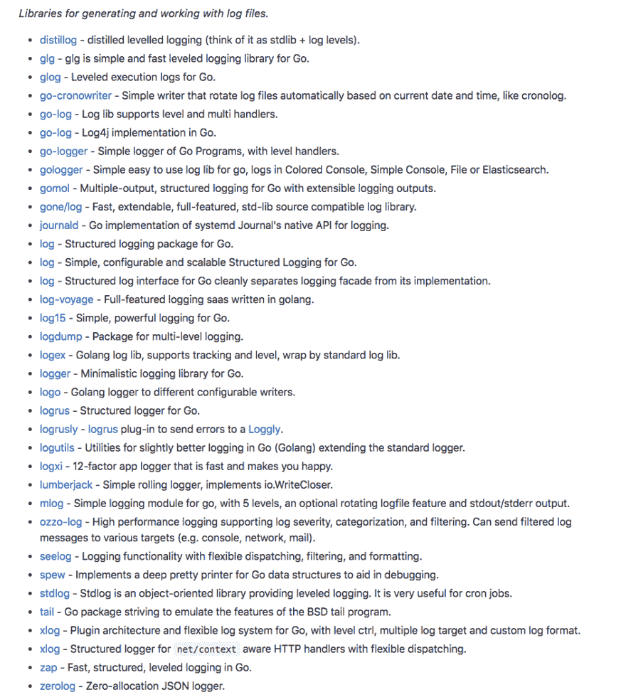

# 七天的旅程

> 原文：<https://dev.to/rhymes/what-ive-learned-in-7-days-of-go-5e3>

以下是我用 7 天时间，用 Go，写一个 app 的 mvp，到目前为止学到的所有东西的大脑转储。

我之前唯一一次使用 Go 的经历是去年“复制粘贴”这篇文章的一部分。

## 什么和为什么

一个客户要求我写一个 API 服务器。MVP 的截止日期是“昨天”,所以我决定在 7 天内用 Go 来写它，而不是舒适地使用 Python(坦率地说，花费的时间更少)。

我知道，这听起来很荒谬，但我有(模糊的)要求，如:

*   低响应时间和低延迟
*   有可能被数百万设备使用(他们的主要移动应用程序有超过 1000 万次安装)
*   必须作为数据源在 web 上和内部公开

所以我的第一个想法是:微服务，随机流行语，容器，graphql，编排，另一个随机流行语等等。

第二个想法是:呼吸。

声明:我在 R&D，所以并不是我写的所有东西都会成为生产应用程序。

此外，不要在家里尝试:P

## 第一步:hello world

我首先要弄清楚的是怎么做。所以我读了一堆教程和指南，然后从最简单的网络应用开始:

```
package main

import (
    "fmt"
    "log"
    "net/http"
)

func handler(w http.ResponseWriter, r *http.Request) {
    fmt.Fprintf(w, "Hello, world!")
}

func main() {
    http.HandleFunc("/", handler)
    log.Fatal(http.ListenAndServe(":8080", nil))
} 
```

Enter fullscreen mode Exit fullscreen mode

这是所有的标准库，[它的生产准备就绪](https://blog.cloudflare.com/exposing-go-on-the-internet/)。

## 第二步:数据

我列出了我需要的所有东西，并根据公司项目经理的输入勾画了数据实体和端点、数据流等等。

我知道我可以用一个“经典的”关系数据库安全地建模所有东西，所以我这样做了。Github 上的 README 列出了以下两个需求:

*   PostgreSQL 10
*   去 1.10

尽管我确信它可以在 PostgreSQL 9.6 上运行，而且由于我对 Go 知之甚少，很可能在更早的版本上也能运行。

我还希望将依赖性保持在最低限度(稍后会详细介绍)。

实际上，我手工编写了实体的 SQL。我试了几次，因为我总是忘记`CREATE TABLE`语句中的一些东西(记得让孩子们把`NOT NULL`放在你的外键中，否则会慢慢死去)。我还花了 10 分钟在谷歌上搜索 Visual Studio 代码的最佳 SQL 扩展，但我没有找到。他们都很烂。

尽管数据模型非常简单。三个实体:A、B 和 C。C 属于 B，A 属于 B。A 是无所不知的。

无论如何，我已经被 SQLAlchemy 这样的数据映射器或 ActiveRecord 这样的 ORM 宠坏了，无法生成初始模式。伙计，输入没有代码完成的 SQL 是复古的。

实际上，我尝试过使用 gorm，顾名思义，这是一个 Go ORM，但是在第二天我就放弃了。我对它没有信心，自动迁移功能吓了我一跳(在应用程序启动时自动迁移！？！？！)并且我遇到了一些问题(后来我也发现它有性能问题，但是我还不知道)。

这是来自 git 日志的实际提交消息:

```
0cb0ff3 [6 days ago] (rhymes) Bye gorm 
```

Enter fullscreen mode Exit fullscreen mode

我最终使用了 [go-pg](https://github.com/go-pg/pg) ,这是一个 ORM(咳咳),也是一个 PostgreSQL 客户端。

## 脑残

以下是我在这七天的旅程中的一瞥，以及我的决定的部分疯狂(我不会引用罗伯特·弗罗斯特的《未选之路》，我保证)，以及我喜欢或不喜欢的围棋的某些方面。

*   Go 可能不是谷歌搜索的最佳名称。有时你输入“go something”，然后你必须重新输入“golang something”，因为结果毫无意义。好笑是因为谷歌发明了围棋。这也让我想起咕咕娃娃，不是我最喜欢的乐队。

*   HTTP 支持很神奇。标准库很好的支持 HTTP 1.1 和 2(甚至[服务器推送！！](https://golang.org/pkg/net/http/#Pusher))、SSL/TLS、请求解析、报头等等。Python 的`http.server`只是一个玩具，但是 Go 团队在标准库中实现了一个生产就绪的 HTTP 服务器。我并不感到惊讶，因为 Go 背后是一些网络服务器的谷歌暴露在公众面前，就像六年前从 C++移植而来的[dl.google.com](https://news.ycombinator.com/item?id=4701454)。它使用 goroutines(把它们想象成映射在系统线程上的并发例程)来服务流量。

*   包装系统需要改进。包装系统也是为人类服务的，而不仅仅是为机器服务的。我讨厌在 git 库中出售依赖项，所以我选择了 [dep](https://github.com/golang/dep) ,这是谷歌的另一个简单名称，而且“dep”和“godep”不是同一个工具。我开始觉得他们在引诱新来的人。卸载全局依赖也是不可能的。他们实际上告诉你手动找到`GOPATH`中的文件并删除它们。你在开玩笑吗？这是 90 年代吗？

*   不要反抗。跟我重复:不要打围棋。我的第一反应是像编程 Python 一样编程 Go，但这不是个好主意。无论如何，这在大多数语言中是个坏主意，所以不要这样做。

*   当你停止 figthing Go 的时候，你会发现它的核心很容易学。我通过[按例走](https://gobyexample.com/)我的头没有爆炸。

*   如果你习惯于高级动态语言，类型安全是痛苦的，在高级动态语言中，变量只是内存块的标签。头两天全是打字错误和死机。他们可能很残忍，但不要反抗他们。

*   类型安全太棒了。Go 的 Visual Studio 代码扩展很神奇。它告诉我这个变量包含的类型或者方法返回的类型，我也可以点击并读取方法的实现(它适用于你导入的任何库和标准库)。我通过这种方式学到了很多。

*   错误处理很奇怪。如果你看任何一个标准的 Go 代码，你会经常看到这种模式:

```
 if err != nil {
    // do something with the error
  } 
```

Enter fullscreen mode Exit fullscreen mode

事情是，许多方法返回一个值和一个错误，所以你不得不每隔一行处理错误。我确实有这样的方法:

```
 this, err := Service.LoadThisFromTheDB(id)
  if err != nil {
    // send HTTP error code to the client
  }

  that, err := Service.LoadThatFromTheDB(id)
  if err != nil {
    // send HTTP error code to the client
  }

  // do something with this and that 
```

Enter fullscreen mode Exit fullscreen mode

有时候真的会变得很奇怪。

*   错误处理非常棒。忘记我刚才说的这很奇怪(确实如此)，但是你编程越多，你就越能理解他们为什么选择避免异常。异常，例如在 Ruby 中，是非常昂贵的，它们也可以用作控制流机制。Go 认为处理一个错误的最好地方就是当你得到它的时候。显然，如果你开始将功能封装在函数中，你也可以将错误返回给调用者，这样它们仍然是一个控制流机制...

*   没有内置的方法来生成加密安全的字符串(在我的例子中是 API 标记)。我不得不从网上复制粘贴。正如你所见，它只有几行代码，但我觉得很奇怪，尤其是因为他们有库中所有的成分。老实说，Python 最近得到了它的[秘密](https://docs.python.org/3/library/secrets.html)模块。

*   [结构](https://gobyexample.com/structs)、[方法](https://gobyexample.com/methods)、[接口](https://gobyexample.com/interfaces)牛逼。结构是你对数据建模的地方，模型是你对这些数据附加行为的地方，但是接口是 OOP 的魔力发生的地方。Python 和 Ruby 有 duck typing(它们“发送”一个方法给接收者，希望它响应)，Go 有接口让它检查接收者是否实现了这个或那个方法。或者类似的东西，我没时间深入。

*   结构真的很棒。我有这样的数据:

```
 type Model struct {
    ID        uint64    `sql:"-,notnull" json:"-"`
    CreatedAt time.Time `sql:"-,notnull" json:"createdAt"`
    UpdatedAt time.Time `sql:"-,notnull" json:"updatedAt"`
  } 
```

Enter fullscreen mode Exit fullscreen mode

这意味着:ID 是一个整数，在数据库中有一个非空列，JSON serialiser 应该忽略它(因为我们从不将 DB 数字主键返回给 API 客户机，对吗？).它还显示了`CreatedAt`和`UpdatedAt`以及带有各自序列化名称的时间戳。

之所以大写是因为在 Go 中，以大写字母开头的名字是公开的，而以小写字母开头的名字是私有的。就这么简单。

那么，我该如何处理这个“基础”模型结构呢？我将它嵌入到实际的模型结构中:

```
 type A struct {
    Model // hello, I'm embedding myself into A

    Name string `sql:",notnull" json:"name"`
  } 
```

Enter fullscreen mode Exit fullscreen mode

这里有很多东西需要解开:我不知道如何解开，但是你会神奇地在你的模型结构中找到`ID`、`CreatedAt`和`UpdatedAt`，以及特定于该模型/表的其余字段，在本例中是`Name`。

*   构建一个项目既不困难也不容易。我 100%确定这与我知识的缺乏有关，但是我现在的代码库有点像拼图游戏。

*   编写测试既不困难也不容易。测试本身没问题。Go 配备了自己的测试包，但我还没有弄清楚功能测试的夹具。不过最棒的是，使用 Visual Studio 代码，您可以告诉它为您正在编写的文件生成一个测试，并且由于 type system，单元测试已经准备好了 90%。只需要填写哪些输入和输出。太棒了。

*   伐木是疯狂的。事实上是的。标准库不支持级别。围绕日志的第三方生态系统让我想起了 NPM 仓库。这是来自 [awesome-go#logging](https://github.com/avelino/awesome-go#logging) 的截图:

[T2】](https://res.cloudinary.com/practicaldev/image/fetch/s--YM5QRqAR--/c_limit%2Cf_auto%2Cfl_progressive%2Cq_auto%2Cw_880/https://thepracticaldev.s3.amazonaws.com/i/ogkyrq8jp615lqr095ej.png)

看到了吗？你在开玩笑吗？我最后也是一个都没有。我使用的是 [go-kit 的日志](https://github.com/go-kit/kit/tree/master/log)，只有日志模块，因为 go 很棒也很奇怪，你可以直接导入而不用导入包的其他部分。魔法。

*   模式迁移非常容易，但是它可能会伤害到你。我从正在工作的 [goose](https://github.com/pressly/goose) 开始，但是我不得不切换到 [migrate](https://github.com/mattes/migrate) (开发者和命名项目是怎么回事？！)因为 Heroku 除了在其 Go buildpack 中的特定版本中进行迁移之外，不支持任何其他功能。

*   用 go-pg 从数据库查询也很容易(如果你阅读维基而不是像我一样阅读自动生成的文档...):

```
 func (s *AService) LoadA(name string) (*A, error) {
    var a A
    err := s.DB.Model(&a).
      Column("*").
      Where("name = ?", name).
      Select()
    if err != nil {
      return nil, err
    }
    return &a, nil
  } 
```

Enter fullscreen mode Exit fullscreen mode

在这里，我们告诉 DB，模型是我们的`A`结构，我们需要所有的列，在过滤中使用哪些标准，并发出`SELECT`。
奇怪的签名`func (s *AService) LoadA(name string) (*A, error)`意思是“这是一个叫做`LoadA`的`AService`的方法，它接受一个字符串并返回一个指向`A`和错误的指针。是的，有点拗口，但是你很快就习惯了。

*   插入数据甚至更容易:

```
 func (s *AService) CreateA(a *A) error {
    _, err := s.DB.Model(a).Returning("*").Insert()
    return err
  } 
```

Enter fullscreen mode Exit fullscreen mode

如果你像我一样喜欢 PostgreSQL，你会喜欢 go-pg，但是请从维基开始，为你自己节省一些时间，:D

*   显然，我必须重复我用[砂箱](https://dev.to/rhymes/logging-flask-requests-with-colors-and-structure--7g1)和[轨道](https://dev.to/rhymes/logging-rails-requests-with-structure-and-colors--ing)做的测井实验:

```
 start := time.Now()

  // ...some other go code...

  // serve the request
  handler.ServeHTTP(lrw, r)

  // extract entries
  method := r.Method
  path := r.URL.Path
  proto := r.Proto
  status := lrw.statusCode
  duration := time.Since(start)
  host := r.Host
  ip := r.RemoteAddr
  if remoteIP := r.Header.Get("x-forwarded-for"); len(remoteIP) > 0 {
    ip = remoteIP
  }
  params := r.URL.Query()

  logger.Info(
    "method", method,
    "path", path,
    "proto", proto,
    "status", strconv.Itoa(status),
    "duration", duration.String(),
    "host", host,
    "ip", ip,
    "params", params.Encode(),
  ) 
```

Enter fullscreen mode Exit fullscreen mode

颜色由 go-kit/log 着色模块按级别设置。

*   去 fmt。这就像 JavaScript 更漂亮，但更好，因为没有选项，你看到的所有代码都是以同样的方式编写的。节省大量时间。

*   Go 和 PostgreSQL 都相当快。我甚至看到反应需要**微秒**！！。但是在本地，由于明显的往返延迟，网络请求会变慢。但是不要着急！我们说的是几毫秒。

这是 SQL Select(带有预热的缓存)的响应时间，加上本地主机上的 JSON 序列化:

```
sql="SELECT EXISTS(SELECT 1 FROM as WHERE api_key = 'super secret') FROM \"as\" AS \"a\"" duration=701.774µs
sql="SELECT * FROM \"as\" AS \"as\" WHERE (api_key = 'super secret')" duration=843.299µs
method=GET path=/api/v1/a proto=HTTP/1.1 status=200 duration=1.7544ms host=localhost:8080 ip=[::1]:54198 params= 
```

Enter fullscreen mode Exit fullscreen mode

如果我使用了错误的 api 密钥，这是同一个服务器回复 401 未授权:

```
method=GET path=/api/v1/a proto=HTTP/1.1 status=401 duration=591.115µs host=localhost:8080 ip=[::1]:54198 params= 
```

Enter fullscreen mode Exit fullscreen mode

不错吧？

*   围棋相当流畅。你写的所有东西都被打包成一个二进制文件，就像过去的 T1 一样，就是这样。这是构建这个应用程序所需的成本:

```
 ➜ git:(development) ✗ time go build
  go build  0.31s user 0.30s system 138% cpu 0.441 total 
```

Enter fullscreen mode Exit fullscreen mode

这是你在 Heroku 的`Procfile` :
里写的

```
 web: name-of-your-app's-binary 
```

Enter fullscreen mode Exit fullscreen mode

真的是这样。这对你的发展反馈周期有影响。“正在编译”不是 Go 的借口:-D

*   Makefiles 正在卷土重来。由于 Go 中的工具在某些领域并不“领先”,而且因为 Go 有时会让你感觉回到了 90 年代，所以迟早你会以 Makefile 告终。我*肯定*必须谷歌如何建立一个。现在我的 Makefile 构建、安装、启动、清理、链接和测试(有覆盖)。基本上我必须用青铜时代的工具重建一个 Bimby 机器人。

*   Go 在 RAM 的使用上是适度的。这款应用在 7 美元的 Heroku dyno 上使用了 1700 万字节。我今天在读写端点上做了一些不科学的负载测试，内存使用量飙升至...18 兆字节，峰值为 20。我应该研究容器，并在一个 dyno :-D 中放入多个应用程序

*   很多 Go devs 都说“远离框架”(HTTP 框架)。所以我做了，我没有错过任何。如果我写的是 web 应用而不是 API，我肯定会有不同的看法，但我不可能在 Go 中写“前端”web 应用。不会吧。我的依赖项无法加载。env 文件、用于路由的 gorilla mux、用于 PostgreSQL 的 go-pg、用于日志记录的 go-kit/log、用于验证 JSON 请求的 govalidator、NewRelic 和 Sentry 的 go 代理。

## 结论

我目前在围棋方面的经验是“复制粘贴”“stackoverflow 编程”“WTF”“wow”“OMG 这东西太神奇了”“我不敢相信打包系统烂透了”所以我确定我以后会改变对很多东西的看法。

如果你还在阅读，欢乐之旅到此结束。

应用程序还没有完成(意大利面条式的代码和低测试覆盖率肯定会出现)，但是 MVP 已经完成了。

我真的没有结论，但我会给你留下一些资源:

*   [举个例子](https://gobyexample.com/):一切开始的地方
*   [我是如何用 Mux、Go、PostgreSQL 和 GORM](https://dev.to/aspittel/how-i-built-an-api-with-mux-go-postgresql-and-gorm-5ah8) 构建 API 的:非常感谢 [@aspittel](https://dev.to/aspittel) ，她的文章帮了大忙！对不起，如果我抛弃了戈姆:D！
*   我不喜欢 Golang 的十个原因:阅读那些没有喝 kool aid 的人的意见总是有用的
*   [为什么 Timehop 选择 Go 取代我们的 Rails 应用](https://medium.com/timehop/why-timehop-chose-go-to-replace-our-rails-app-2855ea1912d):优点是部署、工具链(什么？！)，标准库(肯定是)；缺点是依赖管理系统(而且这篇文章是 2015 年的！！)
*   [在 Go 中测试](https://blog.alexellis.io/golang-writing-unit-tests/)
*   [标准包装布局](https://medium.com/@benbjohnson/standard-package-layout-7cdbc8391fc1):很有帮助，说真的！