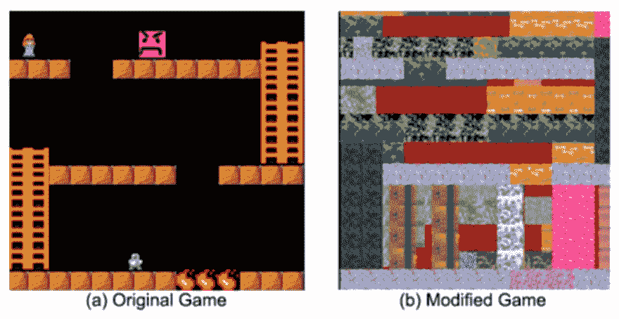

# 什么使得代码不可读

> 原文：<https://dev.to/taowen/what-makes-code-unreadable-6j9>

“任何傻瓜都能写出计算机能理解的代码。优秀的程序员会写出人类能理解的代码。”

可读代码是关于我们的大脑如何解释源代码，什么影响它的性能。导致代码不可读的主要原因有四个:

*   太多或太长:当你的大脑需要跟踪变量的数量，逻辑的行数
*   非局部逻辑:我们更喜欢连续的、线性的和孤立的逻辑。有三个原因使逻辑非局部化
    *   编码风格:全局变量、simd intrinsics v.s. spmd 风格 gpu 计算、回调 v.s .协程
    *   概括:为了重用代码，我们需要将多条执行路径合并成一条
    *   非功能性需求:它与功能性逻辑在时间和空间上处于同一位置(在源代码和运行时)
*   你所看到的并不是你所得到的:当代码与源代码的形式有很大不同时，我们被迫去想象代码在运行时是如何工作的。例如元编程、共享内存的多线程。
*   不熟悉的概念:我们使用名称和引用将一个概念与另一个概念联系起来。当链接不牢固时，我们会遇到麻烦，说它没有“意义”

下面就一个一个说吧。示例取自

*   [代码可读性心理学](https://medium.com/@egonelbre/psychology-of-code-readability-d23b1ff1258a)
*   [为什么全局变量是邪恶的](https://www.learncpp.com/cpp-tutorial/4-2a-why-global-variables-are-evil/)
*   [异步 JavaScript:从回调地狱到异步等待](https://blog.hellojs.org/asynchronous-javascript-from-callback-hell-to-async-and-await-9b9ceb63c8e8)

# 太多或太长

我们在工作记忆中保存变量的能力有限。跟踪头部的变化每走一步都会消耗指数级的能量。

```
// more variable
sum1 = v.x
sum2 := sum1 + v.y
sum3 := sum2 + v.z
sum4 := sum3 + v.w 
```

Enter fullscreen mode Exit fullscreen mode

```
// less variable
sum = sum + v.x
sum = sum + v.y
sum = sum + v.z
sum = sum + v.w 
```

Enter fullscreen mode Exit fullscreen mode

每个变量都有可能被改变。如果`sum1`、`sum2`、`sum3`、`sum4`不变，则压力较小。

```
// longer execution path to track
public void SomeFunction(int age)
{
    if (age >= 0) {
        // Do Something
    } else {
        System.out.println("invalid age");
    }
} 
```

Enter fullscreen mode Exit fullscreen mode

```
// shorter execution path to track
public void SomeFunction(int age)
{
    if (age < 0){
        System.out.println("invalid age");
        return;
    }

    // Do Something
} 
```

Enter fullscreen mode Exit fullscreen mode

提前返回减少了我们需要在头部跟踪的执行路径。得出结论的路径越短越好。

# 非局部逻辑

我们更喜欢连续的、线性的和孤立的逻辑。让我解释一下我的意思

*   连续:第 2 行应该与第 1 行相关，它们放在一起表示紧密的因果关系
*   线性:你从上到下阅读代码，代码从上到下执行
*   孤立:所有你需要关心的都在一个地方

```
// continuous, linear, isolated
private static boolean search(int[] x, int srchint) {
  for (int i = 0; i < x.length; i++)
     if (srchint == x[i])
        return true;
  return false;
} 
```

Enter fullscreen mode Exit fullscreen mode

逻辑局部性是最常见的问题，而且是主观的。你所关心的定义了“本地”对你意味着什么。重构就是重新分解，就是把逻辑打乱，以某种方式重新组织，使其可读。

有三个原因使逻辑非本地。

*   编码风格:全局变量、simd intrinsics v.s. spmd 风格 gpu 计算、回调 v.s .协程
*   概括:为了重用代码，我们需要将多条执行路径合并成一条
*   非功能性需求:它在时间和空间上处于同一位置(在源代码和运行时)

# 非局部逻辑:编码风格

通过全局变量进行通信将使因果关系变得隐含，从而使所需的逻辑片段更难重新组合在一起。

```
// declare global variable
int g_mode;

void doSomething()
{
    g_mode = 2; // set the global g_mode variable to 2
}

int main()
{
    g_mode = 1; // note: this sets the global g_mode variable to 1\.  It does not declare a local g_mode variable!

    doSomething();

    // Programmer still expects g_mode to be 1
    // But doSomething changed it to 2!

    if (g_mode == 1)
        std::cout << "No threat detected.\n";
    else
        std::cout << "Launching nuclear missiles...\n";

    return 0;
} 
```

Enter fullscreen mode Exit fullscreen mode

将相同的逻辑从使用全局变量转换为通过参数显式传递上下文是微不足道的。正是我们选择的编码风格使得代码不可读。

第二个例子是关于 SIMD 编程。编写驱动 SIMD 执行器的代码时，我们需要同时照顾多个“数据通道”。注意`%ymm0`是 256 位寄存器，8 个数据通道为 32 位:

```
LBB0_3:
    vpaddd    %ymm5, %ymm1, %ymm8
    vblendvps %ymm7, %ymm8, %ymm1, %ymm1
    vmulps    %ymm0, %ymm3, %ymm7
    vblendvps %ymm6, %ymm7, %ymm3, %ymm3
    vpcmpeqd  %ymm4, %ymm1, %ymm8
    vmovaps   %ymm6, %ymm7
    vpandn    %ymm6, %ymm8, %ymm6
    vpand     %ymm2, %ymm6, %ymm8
    vmovmskps %ymm8, %eax
    testl     %eax, %eax
    jne       LBB0_3 
```

Enter fullscreen mode Exit fullscreen mode

与指定如何在多个数据通道上应用相同的操作不同，编写处理一个“数据通道”的代码要简单得多:

```
float powi(float a, int b) {
    float r = 1;
    while (b--)
        r *= a;
    return r;
} 
```

Enter fullscreen mode Exit fullscreen mode

把代码从 SPMD 风格编译成 SIMD 风格需要[https://ispc.github.io/ispc.html](https://ispc.github.io/ispc.html)，它们是等价的。

第三个例子是关于回调 v.s .协同例程

```
const verifyUser = function(username, password, callback){
   dataBase.verifyUser(username, password, (error, userInfo) => {
       if (error) {
           callback(error)
       }else{
           dataBase.getRoles(username, (error, roles) => {
               if (error){
                   callback(error)
               }else {
                   dataBase.logAccess(username, (error) => {
                       if (error){
                           callback(error);
                       }else{
                           callback(null, userInfo, roles);
                       }
                   })
               }
           })
       }
   })
}; 
```

Enter fullscreen mode Exit fullscreen mode

与
相比

```
const verifyUser = async function(username, password){
   try {
       const userInfo = await dataBase.verifyUser(username, password);
       const rolesInfo = await dataBase.getRoles(userInfo);
       const logStatus = await dataBase.logAccess(userInfo);
       return userInfo;
   }catch (e){
       //handle errors as needed
   }
}; 
```

Enter fullscreen mode Exit fullscreen mode

协同例程使逻辑从上到下呈线性。以回调方式编写的代码，从左到右。但它们是等价的。如果编程语言允许的话，我们可以选择编码风格来提高代码的可读性。

# 非局部逻辑:泛化

一概而论，就得专精。如果您需要为 10 个共享大部分公共代码的产品支持专用代码。你多久需要对 10 个产品逻辑进行一次推理？很多时候，你在思考一个特定的产品类型是如何工作的。但是阅读一般化的代码，你被迫跳过其他 9 种代码。跳跃造成了真正的认知负荷。

这里有一个简单的例子

```
public double PrintBill()
{
    double sum = 0;
    foreach (Drink i in drinks)
    {
        sum += i.price;
    }
    drinks.Clear();
    return sum;
} 
```

Enter fullscreen mode Exit fullscreen mode

我们认为`PrintBill`太有用了，我们必须重用它。但是为了快乐时光，我们需要在一些饮料上打折。代码变成

```
interface BillingStrategy
{
    double GetActPrice(double rawPrice);
}

// Normal billing strategy (unchanged price)
class NormalStrategy : BillingStrategy
{
    public double GetActPrice(Drink drink)
    {
        return drink.price;
    }
}

// Strategy for Happy hour (50% discount)
class HappyHourStrategy : BillingStrategy
{
    public double GetActPrice(Drink drink)
    {
        return drink.price * 0.5;
    }
}

public double PrintBill(BillingStrategy billingStrategy)
{
    double sum = 0;
    foreach (Drink i in drinks)
    {
        sum += billingStrategy.GetActPrice(i);
    }
    drinks.Clear();
    return sum;
} 
```

Enter fullscreen mode Exit fullscreen mode

为了将`PrintBill`推广到快乐时间和正常时间，我们必须专注于计费策略。要阅读一般化的代码，它肯定比原始版本可读性差。

此外，为了支持各种情况，代码不能只针对一种情况。这样就会产生很多“变异点”。很有可能，在某些情况下，这种变化只是一个填补漏洞的空 impl。例如，如果我们需要正常时间的额外服务费。代码看起来像

```
interface BillingStrategy
{
    double GetActPrice(double rawPrice);
}

// Normal billing strategy (unchanged price)
class NormalStrategy : BillingStrategy
{
    public double GetActPrice(Drink drink)
    {
        return drink.price;
    }
    public double GetExtraCharge()
    {
        return 1;
    }
}

// Strategy for Happy hour (50% discount)
class HappyHourStrategy : BillingStrategy
{
    public double GetActPrice(Drink drink)
    {
        return drink.price * 0.5;
    }
    public double GetExtraCharge()
    {
        return 0;
    }
}

public double PrintBill(BillingStrategy billingStrategy)
{
    double sum = 0;
    foreach (Drink i in drinks)
    {
        sum += billingStrategy.GetActPrice(i);
    }
    sum += billingStrategy.GetExtraCharge();
    drinks.Clear();
    return sum;
} 
```

Enter fullscreen mode Exit fullscreen mode

如果你在维护快乐时光的逻辑，这条线`sum += billingStrategy.GetExtraCharge();`与你完全无关。但你无论如何都是被迫读的。

还有很多方法可以编写“分支”代码。函数重载、类模板、对象多态、函数对象、跳转表、普通 if/else。为什么一个简单的“如果”，我们需要那么多方式去表达？这是荒谬的。

# 非本地逻辑:非功能需求

功能性和非功能性代码纠缠在一起，使代码难以被人理解。源代码的主要目标应该是描述一切事物的因果链。当某个 x 发生了，但 y 没有跟着发生，我们就把它感知为一个 bug，这就是我所说的因果链。要让这个因果链在物理硬件上执行，还有很多细节要规定。例如:

*   该值在堆栈或堆上分配
*   参数作为副本或指针传递
*   如何记录执行，以便我们可以在调试时进行回溯
*   如何在单线程、多线程、多台机器上，在多天内执行并发的“业务”流程

这里有一个错误处理的例子

```
err := json.Unmarshal(input, &gameScores)
if ShouldLog(LevelTrace) {
  fmt.Println("json.Unmarshal", string(input))
}
metrics.Send("unmarshal.stats", err)
if err != nil {
   fmt.Println("json.Unmarshal failed", err, string(input))
   return fmt.Errorf("failed to read game scores: %v", err.Error())
} 
```

Enter fullscreen mode Exit fullscreen mode

功能代码只是`json.Unmarshal(input, &gameScores)`，和`if err != nil return`。我们添加了许多非功能性代码来处理错误。跳过这些代码是很重要的。

# 所见并非所得

我们被迫想象当代码与源代码形式有很大不同时，它在运行时是如何工作的。例如:

```
public class DataRace extends Thread {
  private static volatile int count = 0; // shared memory
  public void run() {
    int x = count;
    count = x + 1;
  }

  public static void main(String args[]) {
    Thread t1 = new DataRace();
    Thread t2 = new DataRace();
    t1.start();
    t2.start();
  }
} 
```

Enter fullscreen mode Exit fullscreen mode

Count 并不总是`x+1`，假设有其他线程在并行做同样的事情，他们可能会用他们的`x+1`覆盖你的`x+1`。

元编程也需要大量的想象力。与函数调用不同，您不能跳转到您调用的函数来检验您正在构建的内容。例如

```
int main() {
    for(int i = 0; i < 10; i++) {
        char *echo = (char*)malloc(6 * sizeof(char));
        sprintf(echo, "echo %d", i);
        system(echo);
    }
    return 0;
} 
```

Enter fullscreen mode Exit fullscreen mode

代码是动态生成的。没有简单的方法来检查生成的源代码以推断其正确性。

# 陌生的概念

我们用名称和指称把一个概念和另一个概念联系起来。当链接不牢固时，我们会遇到麻烦，说它没有“意义”

[T2】](https://res.cloudinary.com/practicaldev/image/fetch/s--YqXgGHcZ--/c_limit%2Cf_auto%2Cfl_progressive%2Cq_auto%2Cw_880/https://user-images.githubusercontent.com/40541/46205981-27131a80-c355-11e8-8a87-c73d29df5e43.png)

我们认为左边的游戏比右边的游戏容易得多。为什么？因为`ladder`和`fire`是映射到你现实生活中的熟悉概念。我们在现有经验的基础上建立新的经验。如果代码脱离了需求，脱离了现实生活的概念，它将很难理解。

```
func getThem(theList [][]int) [][]int {
    var list1 [][]int
    for _, x := range theList {
        if x[0] == 4 {
            list1 = append(list1, x)
        }
    }
    return list1
} 
```

Enter fullscreen mode Exit fullscreen mode

可读性不如

```
func getFlaggedCells(gameBoard []Cell) []Cell {
    var flaggedCells []Cell
    for _, cell := range gameBoard {
        if cell.isFlagged() {
            flaggedCells = append(flaggedCells, cell)
        }
    }
    return flaggedCells
}

type Cell []int

func (cell Cell) isFlagged() bool {
    return cell[0] == 4
} 
```

Enter fullscreen mode Exit fullscreen mode

因为`[][]int`是陌生的，而`[]Cell`映射到了人生经历。

[T2】](https://res.cloudinary.com/practicaldev/image/fetch/s--bQHHGjzo--/c_limit%2Cf_auto%2Cfl_progressive%2Cq_auto%2Cw_880/https://user-images.githubusercontent.com/40541/46206140-a99bda00-c355-11e8-9a06-30bf7a8c324b.png)

从代码到生活经验的概念链接是通过“名称”完成的，它只是一个字符串。代码模块之间的链接概念可以依赖于“引用”。你定义函数，并引用函数。定义类型，并引用该类型。在 IDE 中，您可以单击引用以转到其定义。当链接强而清晰时，我们可以更快地阅读代码。

概念来源于分解。每次分解时，我们给它一个名字。有三种分解方式:

*   空间分解
*   时间分解
*   层分解

当我们觉得问题很大的时候，我们总是可以通过这三种方法来分解它，只要记住适当地命名分解的概念就行了。