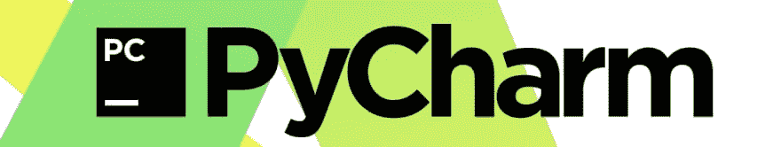

# PyCharm 用什么插件？

> 原文：<https://dev.to/eddinn/what-plugins-do-you-use-for-pycharm-245f>

[T2】](https://res.cloudinary.com/practicaldev/image/fetch/s--VQP0YFXK--/c_limit%2Cf_auto%2Cfl_progressive%2Cq_auto%2Cw_880/https://thepracticaldev.s3.amazonaws.com/i/c10y0mi7c90a7tt8qh9e.jpg)

在测试了 Atom 和 Sublime 之后，我一直在围绕 PyCharm 进行 python/flask/django 开发冒险，我总是发现自己在安装、测试和删除插件，以获得我所说的“终极 IDE 环境”。

所以我很好奇，因此问你这个问题:你认为你的“终极 IDE 环境”需要哪些插件？

谢谢，

-E