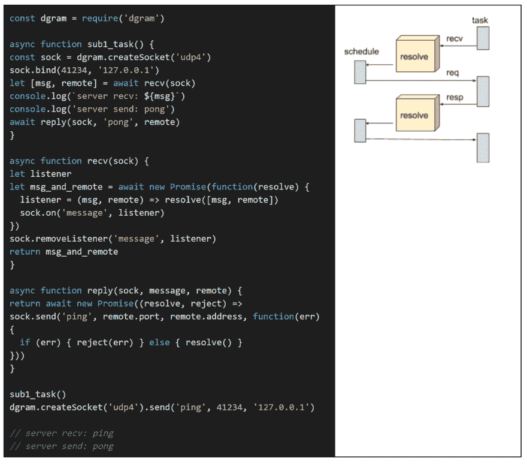

# 什么代表过去、现在和未来:未来(2)

> 原文：<https://dev.to/taowen/what-represents-the-past-present-and-future-the-future2-2omm>

[T2】](https://res.cloudinary.com/practicaldev/image/fetch/s--PR1zWfFS--/c_limit%2Cf_auto%2Cfl_progressive%2Cq_auto%2Cw_880/https://user-images.githubusercontent.com/40541/47513241-68dda500-d8b0-11e8-937c-f272f883dffb.png)

## 活动流程

在前面的简单过程中，协程是被动的。它等待未来的指令，只是做被告知的事情。这与需求文档相矛盾，需求文档通常将任务描述为活的。它知道自己在做什么，也知道下一步该做什么。在这一章中，我们将探索使未来表征更加活跃的方法。

### 时间调度器

第一个例子是关于睡眠。

lua 版本:[https://tio.run/](https://tio.run/##rVFBboMwEDyXV6xywZYIChB64y0RNZtgFWxkr6VWVd9ObYNI4dBT92TP7szO2INr5/nulCCpFVjRY@cGZNTad56Ar761t1EbzGC0jwxa87DQgNBGO5IKc4PWjb8J8g5MadqIHKhHFVuhDJIzyxVVtzG8ODQNpHZAnNIDR9scP1A4QnaKA3CCPI9ecotCq87yneIhR4CTZ0j3VtxCgy2kyUhFzO8g6YPwzJsgnIp06T6TfkocOrY6zOBr3dyU33/plP@kU6VrjuB89wPCYOtfZovFk0P88xn86OQonIr6eikur9e6eIkxd1gVsXKH1RGr5vkH)

[T2】](https://res.cloudinary.com/practicaldev/image/fetch/s--nQ_DJrMZ--/c_limit%2Cf_auto%2Cfl_progressive%2Cq_auto%2Cw_880/https://user-images.githubusercontent.com/40541/47488756-935f3c00-d877-11e8-9216-23e25dfba377.png)

es2017 版本:[https://tio.run/](https://tio.run/##rZDBboMwDIbvPIVvJBVD0N0qsdMeYTeEpgxcxpYmCCfdJsSzM6dA1e02aT5YSvz7s3@/qbOieuh6d2dsg/N89KZ2nTVA9Ss2XqNwit4ljBFwaHRwVhoKCL@pwU8n5LUyNtbgAUJOgszzozxRm4AaWqq4q6wmzly69HRHEEG80UMM6PxgLs/pKmIGFEUBMWnEPr7VE7qn7oTWOyEkFA@/9l5Gp4S1NQ3BDvIsy@SKn6Jos7sD8i/5c@gRG55byGpMtW2FwQ94VA6FTNtlomB2TA77PF54Xx3qBsp1xwTGdehhP1V/4e3/mXfPPHYarPHtb2xGP081z98)

[T2】](https://res.cloudinary.com/practicaldev/image/fetch/s--wrIIXakf--/c_limit%2Cf_auto%2Cfl_progressive%2Cq_auto%2Cw_880/https://user-images.githubusercontent.com/40541/47488248-94439e00-d876-11e8-9fe2-cad2aed794f8.png)

### 谓同续

`coroutine.yield('sleep', {seconds=2})`尴尬。为什么 sub1_task 不能直接让自己进入睡眠模式？因为它没有对自身的引用。一些语言提供了“带延续的调用”,这实质上允许协程以延续的方式获取其剩余的计算，并将其作为回调传递给另一个函数。我们可以在 lua 中模拟

lua 版本:[https://tio.run/](https://tio.run/##nVHLboMwEDyXr1jlgpEICtAop3wLcswmWHFs5IfUKsq3U9uhAVTUSvXF9uzOemYsHB0GoRgVYARi35yddRrhCJKLJDk7ySxXEgzrsHUCSZaAX/wMRCq74GRgO5SxHJZGDz6vKNu4W2quOVB9MX6@pSeBhZM9ZVeymBN7lSnwA5mzSDaxChsoikguDDIlW/NsXJEd4I6a5qY05nAzl9ejTGnlLJdYaDTuhiRIWlr6Jv5tZ5ZJgGZhBUlkcrsq9D7VH7E@afvkKNqfU92pbAJpJrrXXFris7Lcm8lySI3FvkxnL4467mNox@rxG7X6P7VOR8WBtciaaaT@H18GsmT1H3J4Fme5Jtst@Mbe2XAq9@@7sjocqt1btLnA6ohVC2wfsXoYvgA)

[T2】](https://res.cloudinary.com/practicaldev/image/fetch/s--jhqx6Yk2--/c_limit%2Cf_auto%2Cfl_progressive%2Cq_auto%2Cw_880/https://user-images.githubusercontent.com/40541/47488455-fe5c4300-d876-11e8-847a-ae0dea76d2f6.png)

引入了“未来”的概念，它将任务的延续与其需求包装在一起。当需求满足时，任务执行将被恢复。

### 异步等待

请注意，在上面的示例中，我们没有给出 es2017 版本。因为 es2017 有自己版本的“未来”内置。

es2017 版本:[https://tio.run/](https://tio.run/##pVC9bsMgEN55itsClZuASSNLUTr1ATp0r7B9TWgxWAZiRVWf3cVpUJOxKtOJ776/e1dH5ZtB9@Heuhan6S3aJmhnwRvEnnpsnG09g08C6a1WMKB35oigPeTdDI0HtNAoY7CF@gQew4vu0MVQQDggBOU/YNTGQI2zTOywPVMHDHGwYHGE58F12iPNLrvHK5n8W8AlFtyB4JwztiVfhCh/sg38Foi1eJ09aU6fOImPS@P2dDZ7UgEpW@5/DCgrYOED9mLBzutqVDpc7lCyvyiU/1aQSSFVuupASLpwOkIfwzyJhzUXUkheVpLn3DfAupKbHOcG2FSyyi7T9A0)

[T2】](https://res.cloudinary.com/practicaldev/image/fetch/s--UqqmyswX--/c_limit%2Cf_auto%2Cfl_progressive%2Cq_auto%2Cw_880/https://user-images.githubusercontent.com/40541/47488534-29df2d80-d877-11e8-9e2d-6206468f1794.png)

虽然代码看起来很不一样。底层机制其实很像。es2017 的编译器/解释器会把“await”变成传递给许诺给定的延续。

我们可以修改 lua 代码，使其像 javascript promise 那样工作。它只是返回一个名为“resolve”的函数来捕获任务的继续，并将其注册到某个地方，然后执行。

[T2】](https://res.cloudinary.com/practicaldev/image/fetch/s--uLX0NAJj--/c_limit%2Cf_auto%2Cfl_progressive%2Cq_auto%2Cw_880/https://user-images.githubusercontent.com/40541/47488621-51ce9100-d877-11e8-86d5-fb58e0415cfd.png)

### 网络客户端

时间安排很简单。它不需要将值返回到任务中。如果协程需要扮演网络客户端的角色。它需要一个返回结果的方法。

lua 版本:[https://tio.run/](https://tio.run/##bVDbasMwDH33V@gtMayB9j3fUrJEoaau7dlyyhj79ky2u7QxNRiEpHPR0XFYV23HQcOoFRo6z5GiR@jBKC3EHM1IyhoIaKazx3FpaQjXD/D4JQXwK@AN9ZPG/bbT8//NezV9KcrIehtJGey@FeqpLcQeecE89jqPwQn28Gopfh7PSSlbkgAZ5rwy1DaB0B0b@dKqL2iCvSHMwxWT0YiBGilrihNTZNWEYddPq6PHgbDdTEjxnLHZeMOHThkeDkyLxFxwR7gMC6ZICeiyyYuiuwuqyzm/AfMhuCicdgQ1NDi2vLszOGsCNu@9SpGUuO8ipSpnmIs6qbpZaP8xp3X9Aw)

[T2】](https://res.cloudinary.com/practicaldev/image/fetch/s--HzaShwCl--/c_limit%2Cf_auto%2Cfl_progressive%2Cq_auto%2Cw_880/https://user-images.githubusercontent.com/40541/47488934-f6e96980-d877-11e8-845e-5d4e409ddcbb.png)

事实证明，返回值并不是一件难事。调用者和被调用者共享一个“未来”对象，这样他们就可以通过这个对象发送请求和响应。有了 es2017 await 语法，将值返回到协程就简单多了。

es2017 版本:[https://repl.it/@taowen/es2017-client](https://repl.it/@taowen/es2017-client)

[T2】](https://res.cloudinary.com/practicaldev/image/fetch/s--Ah66vcfm--/c_limit%2Cf_auto%2Cfl_progressive%2Cq_auto%2Cw_880/https://user-images.githubusercontent.com/40541/47498718-ab8f8500-d890-11e8-9229-fd8ed3a07d02.png)

### 网络服务器

至此，我们已经看到了 coroutine 如何计算、睡眠和调用外部服务。现在，我们需要让协程成为一个服务器。我们在这里只展示 es2017 版本，lua 代码将与“网络客户端示例”非常相似。

es2017 版本:[https://repl.it/@taowen/es2017-server](https://repl.it/@taowen/es2017-server)

[T2】](https://res.cloudinary.com/practicaldev/image/fetch/s--TfCur9iA--/c_limit%2Cf_auto%2Cfl_progressive%2Cq_auto%2Cw_880/https://user-images.githubusercontent.com/40541/47498748-bc3ffb00-d890-11e8-9a91-f8d473a1bc56.png)

客户机和服务器的区别在于，对于服务器来说，它需要两个 await，而对于客户机来说，它只需要一个 await。一个用于从调度程序中检索请求，一个用于发回响应。对于 TCP 套接字，当缓冲区已满时，内核会阻止写入。所以发送回响应也是一个异步操作。

### 被动过程 vs .主动过程

我们已经检查了活动过程的几个例子。它可以做以下事情:

*   睡眠
*   作为客户端调用另一个服务
*   作为由另一个服务调用的服务器

与第一章的被动过程相比，主动过程确实非常主动。它掌握着自己的命运。为了直接比较，假设我们有两个步骤，中间有一个睡眠。

被动版:[https://tio.run/](https://tio.run/##lZBBDoMgEEX3nmLiRtyQ6L5naSz8pqQUDDBJe3qq0qjRVVny/3sDY3nI@c5OJeMdRQuMIkJ5p2Nb0XR8lHhDcYKol5hqkpLWDpyuqk3At@6ahvgUhR6DcUk0MWHsmnKlfPCcjIP8GFh9LvbNyTrjYtYeFQGRX/hFZ6j/G1IPaLYQLS3Q3KHLjlUBw7SK9Z/FfXxg2WO3hf1@2jYk5y8)

活动版本:[https://tio.run/](https://tio.run/##hVHLqsMgEN37FUM3UQhC7r7fEqyZNFKjwQf0UvrtudGkNaGFOwvFOTPnzBx1FPOsrRQavEac2j6G6JCQPhoZlDVrmgbhbzUId/UMliDp2DfAGR6l5plxaZ2NQRnkvwp1lzkYQdPt2eOlaROwoalvcsoEWvmAU1OxIrUN8fAoren8uXl@1P9UHwJywC5qpGut6oEaGw6zMwgDmgyncLgk12eiSnfZbNkziItGHs0k5I0eeHKt9RzvKGNAesoonIDz3My3ydk3@4zSOT0I347WYQ2jv75Fi5cOfRxxZ9drpVfj/@vsPMlmJa6DhnQolvnfn8PIV/0aVrDwzfMf)

[T2】](https://res.cloudinary.com/practicaldev/image/fetch/s--D5Z-2CKg--/c_limit%2Cf_auto%2Cfl_progressive%2Cq_auto%2Cw_880/https://user-images.githubusercontent.com/40541/47514486-15208b00-d8b3-11e8-81da-3dda31daf99c.png)

真的和“被动”vs .“主动”意义上没什么区别。从 sub1_task 的角度来看，被动版本使用“coroutine.yield”直接等待调度程序将其唤醒，主动版本使用“sleep”依次使用“coroutine.yield”等待调度程序。这两个版本本质上做同样的事情，它们调用“yield”来停放自己。

区别在于预定义的协议。活动版本在调度程序和任务之间有一个协议。如果任务自己停留在“sleep_future”，调度器有责任在指定的时间唤醒它。就像你使用 os . execute(“sleep 1”)一样，操作系统有责任在 1 秒后唤醒你的 OS 线程。

活动流程的好处是调度程序成为基础设施，所有不稳定的业务逻辑都被隔离在任务中。对于被动流程，如果流程需要更新，sub1_task 和 schedule 都需要修改。

调度器成为一个可扩展的平台，任务是可重用平台能力的插件。

[T2】](https://res.cloudinary.com/practicaldev/image/fetch/s--AD6X3pdS--/c_limit%2Cf_auto%2Cfl_progressive%2Cq_auto%2Cw_880/https://user-images.githubusercontent.com/40541/47509355-8870cf80-d8a8-11e8-8c92-b7b8c71e4245.png)

### 协程 UI

驻留在调度程序中的任务是匿名的。这是一个问题。如果我们不知道你在等待什么，我们怎么知道要给予什么？我们知道 sub1_task 想知道是 step1_add 还是 step2_add。这本质上是一个“用户界面问题”。

下面是我们想要描述的一个示例流程

[T2】](https://res.cloudinary.com/practicaldev/image/fetch/s--769my4m9--/c_limit%2Cf_auto%2Cfl_progressive%2Cq_auto%2Cw_880/https://user-images.githubusercontent.com/40541/47511685-4dbd6600-d8ad-11e8-9804-11ffd88d6588.png)

当任务启动时，它将向用户提供两个选项，要么添加，要么订阅。然后计算结果会显示回来。一秒钟后，UI 将变回两个选项，让用户进行第二次计算。这就形成了一个无限循环。

这个过程可以用这段代码来表示

es2017 版本:[https://jsfiddle.net/taowen/L0p516xv/56/](https://jsfiddle.net/taowen/L0p516xv/56/)

[T2】](https://res.cloudinary.com/practicaldev/image/fetch/s--sSK-BcVQ--/c_limit%2Cf_auto%2Cfl_progressive%2Cq_auto%2Cw_880/https://user-images.githubusercontent.com/40541/47512237-595d5c80-d8ae-11e8-9c49-8b692ff6b96e.png)

就像调度器可以公开 API“sleep”、“recv”、“reply”一样，它也可以提供“user_input”作为可重用的基础设施。当然，调度程序无法知道用户界面看起来会是什么样子，所以它使用参数来定义要使用的 UI 组件和呈现视图的模型。这是调度程序的源代码

[T2】](https://res.cloudinary.com/practicaldev/image/fetch/s--l3FJCqru--/c_limit%2Cf_auto%2Cfl_progressive%2Cq_auto%2Cw_880/https://user-images.githubusercontent.com/40541/47512280-7003b380-d8ae-11e8-8222-bdd34092161f.png)

user_input 通过设置三个变量来呈现视图:

*   step_ui:哪个组件呈现视图
*   step_ui_input:视图的模型
*   step_callback:当用户提交表单时做什么

正如我们已经了解的，“await”“promise”和“resolve”是如何工作的，很明显当用户提交表单时，resolve 回调将恢复 sub1_task 的执行。实际的视图呈现和表单提交实现与这里的主题无关。你可以在 https://jsfiddle.net/taowen/L0p516xv/56/玩代码

scheduler.user_input 作为一个通用工具提供。不管我们需要描述的业务逻辑是什么，都可以使用它。扩展了“主动过程”的词汇。将会有更多的“未来”可以由协程来代表。

### 协程冬眠

我们不能将协程 UI 投入生产，因为它有一个严重的缺陷。协程需要在计算机内存中一直保持活动状态。如果用户决定明天点击按钮，我们不能让这个过程持续那么久。我们需要单击“休眠”按钮，以便将状态转储到磁盘，这样我们就可以节省资源，只在需要时恢复进程。

这个例子需要一个特殊版本的 lua 解释器:[https://github.com/fnuecke/eris](https://github.com/fnuecke/eris)

[T2】](https://res.cloudinary.com/practicaldev/image/fetch/s--_M0wIn56--/c_limit%2Cf_auto%2Cfl_progressive%2Cq_auto%2Cw_880/https://user-images.githubusercontent.com/40541/47512433-c5d85b80-d8ae-11e8-9356-b92b182ac103.png)

我们进一步扩展了调度程序的功能。这一次，“休眠”功能允许任务将自己转储到磁盘中。未来的表现被完全封装在一个协程“fib”中。

### 协程数据库

休眠实现也有严重缺陷。“continuation.data”是以外来的二进制格式编写的。用“秩序”这样的对象来表示未来就没有这个问题。我们通常会创建一个名为“order”的表来保存未完成的订单流程。

[T2】](https://res.cloudinary.com/practicaldev/image/fetch/s--DHB3Ng6b--/c_limit%2Cf_auto%2Cfl_progressive%2Cq_auto%2Cw_880/https://user-images.githubusercontent.com/40541/47512477-e6a0b100-d8ae-11e8-8565-7850acd09b1f.png)

要使用协程来表示订单流程，应该是这样的:

[T2】](https://res.cloudinary.com/practicaldev/image/fetch/s--UvnoBHri--/c_limit%2Cf_auto%2Cfl_progressive%2Cq_auto%2Cw_880/https://user-images.githubusercontent.com/40541/47512544-02a45280-d8af-11e8-94d2-5556677f49ba.png)

订单表的 order_status 列是一个跟踪执行位置的游标。本质上就是“协程. yield”在协程中的位置。所以我们可以用 lua 标签来表示 order_status。当持久化协程时，可以将“程序计数器”翻译成“order_status ”,并映射到数据库列。

### 总结

现在，我们可以通过活动流程来表示计算逻辑、UI 和数据库。协程将控制权让给其调度程序，以便重用预定义和稳定的原子操作。所有这些不稳定的业务逻辑都可以封装在一个协程中。

用积极的过程来描述“长远的未来”是非传统的。寻找一个协程来“调用”一个 UI 或数据库是令人兴奋的。但这是一种看似合理的表示，有时会派上用场。