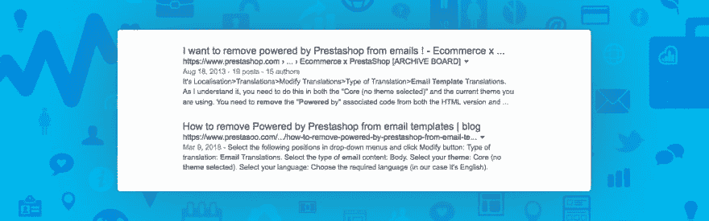

# SEO Prestashop 的标题长度应该是多少

> 原文：<https://dev.to/franken/what-should-be-the-length-of-title-on-prestashop-for-seo-24l5>

[T2】](https://res.cloudinary.com/practicaldev/image/fetch/s--ohCMAsOG--/c_limit%2Cf_auto%2Cfl_progressive%2Cq_auto%2Cw_880/https://www.prestasoo.cimg/stories/what-should-be-the-length-of-title-on-prestashop-website.jpg)

## 如何在你的 Prestashop 网站上写一个 Google 会喜欢的强势 SEO Title 标签？

在我之前的关于**[SEO Prestashop make Simple:A Step-by-Step guide](https://www.prestasoo.com/blog/prestashop-seo-made-simple-a-step-by-step-guide.html?utm_source=article&utm_medium=article&utm_campaign=titlelength)**的 Prestashop 教程中，我说过标题应该简洁在 5 到 10 个单词之间，大约 60 个字符。昨天当我在一个 **Prestashop 1.7** 网站工作时，我看到 Prestashop 建议你写一个最多 70 个字符的标题标签。

### 正确的数字是多少？

因为标题标签是必不可少的元素之一，甚至你页面的元标题的微小变化都会带来你的有机排名的显著变化，所以，我们需要找到正确的数字。

title 标签告诉搜索爬虫你的页面到底是关于什么的，它是第一个爬上你的页面的内容，所以写一个完美的 title 标签是非常重要的。

### 看一下上图。

在这里，我们搜索了“从电子邮件中删除由 Prestashop 支持的内容”。#1 标题超过 65 个字符，#2 标题有 63 个字符(是我:D -请不要告诉我排名^^:来自 Prestashop 的第一个结果。我只想说#1 标题被截了。).正如我所说，长度应该是最大 60 个字符(包括空格)，然而，它不是一个字符长度，但实际上，它是一个像素长度，这是谷歌认为(600 像素)。

因此，不同语言的字符长度可能不同。

坚持这些，你在 Prestashop 网站上的标题一般不会被截断，如果它们是相关的，并且你没有用特殊字符做任何疯狂的事情。

根据 Moz 社区的说法，最好的标题长度是 50-60 个字符，但在 Bigleap 上的一篇博客文章中，Adam Fifield 说，您可以使用 max 70 个字符。

好吧，我承认我在排名上没有比别人更好的位置:3，但至少，我的头衔没有被截断。你的选择是什么？对我来说，60 - 65 个字符是最好的选择。不会了。

感谢您花时间阅读！希望我的 [Prestashop 教程](https://www.prestasoo.com/Blog/)系列对初学者有用。