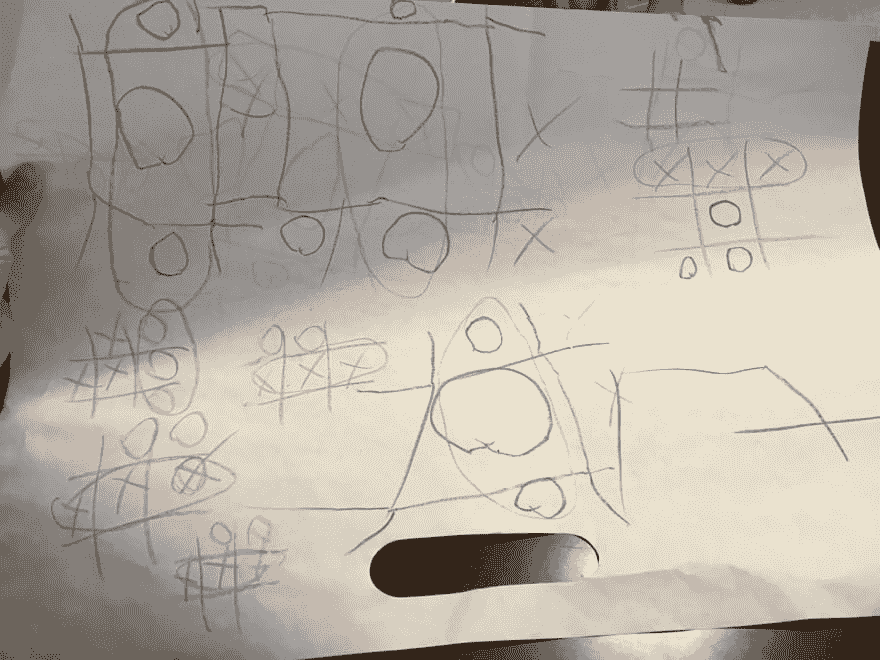

# 在教我的孩子如何玩井字游戏时，我学到了什么关于用户入门体验的知识

> 原文：<https://dev.to/michael/what-teaching-my-kids-how-to-play-tic-tac-toe-taught-me-about-user-onboarding-experience-5c24>

今天早上，当我的孩子们让我玩一个滑梯游戏时——这个游戏对他们来说有点太复杂了，我们都在游戏开始几分钟后变得沮丧——我重新教他们玩井字游戏，因为我们面前有蜡笔和纸。

我画了两个三乘三的格子。我的孩子每人一个。我告诉他们有两个玩家，一个扮演 circle (O ),另一个扮演 ex (X)。我是其中一个，孩子们是另一个，我们轮流在格子上做标记，直到有人连续三次得分。

因为这是他们第一次玩游戏，所以我把第一场游戏作为练习。让每个孩子在他们的游戏中获胜。但是在第二场比赛中，我犯了一个错误。我决定和我的儿子玩一场真正的游戏，而让我的小儿子赢。是的，我无意中对我的孩子进行了 A/B 测试。

我在我大儿子的第一次正式井字游戏中打败了他，结果他输了，而我让我小儿子赢了她的游戏。紧接着，儿子就很沮丧，不想再玩游戏了，反而在刚刚输的格子上乱涂乱画。而年轻的那个赢了之后，想再玩一局，因为好玩。

小女儿和我又玩了几次游戏，她都赢了。直到，年长的那个把他的沮丧发泄到了整张纸上。

[T2】](https://res.cloudinary.com/practicaldev/image/fetch/s--DVItmERD--/c_limit%2Cf_auto%2Cfl_progressive%2Cq_auto%2Cw_880/https://thepracticaldev.s3.amazonaws.com/i/y88o3waokhbnsfc6x90f.jpg)

我让儿子冷静下来，抓起另一张纸，意识到我不应该让他输得这么快。在这张新的单子上，我让他赢了三场比赛，然后又让他输了一场。即使他输了，他也愿意继续玩下去，因为我在让他输之前已经让他赢了一些。这导致了比我们在第一张纸上看到的更好的井字游戏体验。

[T2】](https://res.cloudinary.com/practicaldev/image/fetch/s--psxwH-pt--/c_limit%2Cf_auto%2Cfl_progressive%2Cq_auto%2Cw_880/https://thepracticaldev.s3.amazonaws.com/i/g25jlav6ttlqi0mbn212.jpg)

而我的女儿，小一点的，对失败无所谓，因为我让她赢了前几局，然后她输了。

这个井字游戏让我立刻想到了软件产品的用户体验。当介绍一个新的产品或游戏时，重要的是让用户获得一些立竿见影的胜利，并逐步引入更复杂的任务。通过这样做，它增加了用户的初始信心，并可能导致应用程序的首次使用时间延长。这也为用户留下了空间，当应用程序没有让他们获胜时，他们可以更加宽容，要么是因为不符合他们试图完成的任务的心理模型，要么是因为在游戏中继续坚持游戏。

当我想到我认为具有真正令人愉快的入职体验的应用程序时，我会想到 Basecamp 或 CodePen 这样的应用程序。第一次注册时，Basecamp 会为您创建一个测试项目，让您通过并使用该应用程序。它做一些手把手的工作，让你轻松进入一个复杂的软件。在坚持使用系统的同时，展开特性，并更深入地将其集成到您的工作流程中。

另一方面，CodePen ，虽然我第一次注册时没有入职经历。但它是一个在线文本编辑器的事实立即成为我熟悉的界面，我对此感到很舒服。它也立即给了我回报，因为所有那些我要花很多时间来设置自己去尝试的事情，只需点击几个按钮就能完成。比如包括 jQuery，动态编译 Sass。它让我专注于一个想法，而不是着手执行一个想法。

Basecamp 和 CodePen 的例子，我认为它符合我女儿玩井字游戏的经历，许多最初的胜利，鼓励了长期的使用。

虽然我想说我儿子的经历和我最初对 StackOverflow 的经历是相似的。几年前，当我第一次注册 StackOverflow 时，注册流程中的机制非常熟悉。由于 StackOverflow 有一个声誉系统，在加入后，他们会立即奖励你 100 分左右，然后是一些注册和填写您的个人资料。

除此之外，当我问第一个问题时，我觉得这种经历很快就结束了。在问我的第一个问题时，它立即被否决，然后当我评论问为什么我被否决时，有人回答说，这是一个糟糕的问题。这让我很困惑，因为我认为这是一个真正的问题，因为我有一些问题，但现在我不仅在处理我试图解决的这个问题，而且我还在处理显然无法提出正确的问题。

这无疑导致我作为 StackOverflow 用户落入了潜伏者/消费者的行列。

如果你是一个软件开发者，想想用户和他们的体验会是怎样的。在定义用户之旅时，看看你是否能在一开始就给用户很多成功的机会来取悦他们。比如让他们非常容易地开始使用你的应用程序来解决他们的问题，或者如果你有声誉的话奖励他们。

如果这款井字游戏有什么指示意义的话，它在最初赢得了很多胜利，增强了用户对软件的信心。这可能会延长使用时间，如果引入了可能会破坏用户体验的东西，也会得到用户的原谅。

* * *

最初[发布在 michaelsoolee.com](https://michaelsoolee.com/tic-tac-toe-user-onboarding/)上。

感谢您花时间阅读这篇文章！我很想保持联系，并通过我的时事通讯给你发送编程和设计的技巧，在家工作和制作副业。[点击这里报名](http://eepurl.com/bGXerj)。