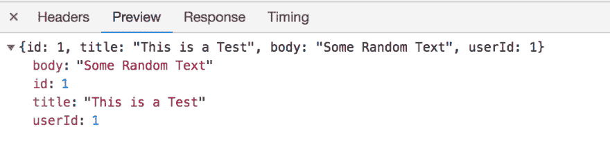

# 什么东西

> 原文：<https://dev.to/ignoreintuition/what-the-fetch-3g58>

这个获取 API 非常漂亮。如果您过去使用过 JavaScript 的 XMLHttpRequests，或者如果您不得不依赖 jQuery 或 Axios 之类的库，您将会真正体会到 fetch 所做的事情。获取是:

*   易于设置
*   基于承诺
*   可配置的

主要的缺点是在我写这篇文章的时候，它还没有得到很好的支持，所以它需要你使用 ployfills 来支持旧的浏览器。与此同时，您绝对应该尝试一下这个 API。先说一个基本的例子。使用 [JSON 占位符](https://jsonplaceholder.typicode.com/),我们将检索一个 JSON 文件，并将输入的数据添加到 DOM:

```
var url = `https://jsonplaceholder.typicode.com/photos`;

getData(url)
  .then(data => {
    data.forEach( e => {
      var div = document.createElement("div"),
          content = document.createTextNode(e.title);
      div.appendChild(content);
      document.getElementById('content')
        .insertAdjacentElement('beforeend', div);
    })
  })
  .catch(error => console.error(error));

function getData(url){
  return fetch(url, {
      method: 'GET',
    })
    .then(response => response.json())
    .catch(error => console.error(`Fetch Error =\n`, error));
}; 
```

Enter fullscreen mode Exit fullscreen mode

API 调用有两个参数。第一个是服务器 API 端点的 URL。第二个是 init 对象，我们将在其中设置任何独特的配置。在这个简单的例子中，我们只是设置 HTTP 请求方法。

如上所述，这都是基于承诺。这使我们能够在从服务器检索数据的同时，继续异步执行代码。getData 函数将向服务器发送 GET 请求。一旦数据返回，链接的 then()函数将执行，将带有 JSON 格式响应的承诺传递回原始方法。然后，该方法可以获取数据并遍历每个值，将每个值单独附加到 DOM。

在我们的示例中，我们提交了一个 GET 请求，但是您可以使用应用程序所需的任何标准方法(GET、POST、DELETE、PUT)。

```
 var url = `https://jsonplaceholder.typicode.com/posts/1`;

postData(url)
  .then(data => {
    console.log('complete')
  })
  .catch(error => console.error(error));

function postData(url) {
  return fetch(url, {
    method: 'PUT',
    body: JSON.stringify({
      id: 1,
      title: 'This is a Test',
      body: 'Some Random Text',
      userId: 1
    }),
    headers: {
      "Content-type": "application/json; charset=UTF-8"
    }
  })
.then(response => response.json())
  .catch(error => console.error(`Fetch Error =\n`, error));
}; 
```

Enter fullscreen mode Exit fullscreen mode

结果输出将是

[T2】](https://res.cloudinary.com/practicaldev/image/fetch/s--3rBBJLGp--/c_limit%2Cf_auto%2Cfl_progressive%2Cq_auto%2Cw_880/https://thepracticaldev.s3.amazonaws.com/i/db34n7rs571jeay0k58x.png)

还有其他选项可以传递给 Fetch 方法中的第二个可选参数，如访问控制(cors，同源)、缓存等。这些选项在 [MDN 页面](https://developer.mozilla.org/en-US/docs/Web/API/Fetch_API/Using_Fetch)上有详细记录。当它们适用于您的特定用例时，请随意研究其中的每一个。

如果您以前没有接触过 fetch API，这只是让您熟悉它的简短入门。希望这个 API 将消除一些与查询 API 端点相关的耻辱，这种耻辱已经成为规范太久了。一路平安。