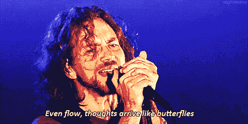

# 搞什么...发电机！

> 原文：<https://dev.to/genta/what-the-generators-4fmn>

想了解一下*发电机*？

### 首先你需要检查[迭代器](https://dev.to/genta/what-the-iterators-1lhc)

这是不能跳过的，因为生成器通过*到*迭代器工作。我们可以说*生成器*是编写我们自己的迭代器的一种更简单的方式。

这是一台*发电机* :

```
 function* breeds(){
    yield "labrador";
    return "chow-chow";
}

const iterator = breeds();

console.log(iterator.next())
//->{value: "labrador", done: false}
console.log(iterator.next())
//->{value: "chow-chow", done: true}
console.log(iterator.next())
//->{value: undefined, done: true} 
```

Enter fullscreen mode Exit fullscreen mode

让我们看看这里发生了什么。

首先，我们需要创建一个*生成器函数*，我们可以通过在*函数*和*函数名*之间使用一个 *** 来完成。
不管是不是:
`function* breeds()`
`function *breeds()`
`const breeds = function *()`
`const breeds = function*()`
反正这样就行了！。

(但是，在*功能*之后使用 *** 是*标准*...所以尽量总是使用语法`function*`。)

在这个函数中，我们使用的是*产量*...那是什么？
*屈服*听着*下一个()*的叫声真是有事。

每次我们使用*。next()* 在迭代器上，生成器将使用*下一个尚未使用的* yield。
这和*迭代器*后面的*想法*是一样的，我们正在检查，用 *done* 键迭代器返回！。

如果它的值为*假**。下一个()*将调用前一个之后的*产量*。

```
 console.log(iterator.next())
//->{value: "labrador", done: false}
console.log(iterator.next())
//->{value: "chow-chow", done: true}
console.log(iterator.next())
//->{value: undefined, done: true} 
```

Enter fullscreen mode Exit fullscreen mode

当*完成时:真的*会发生吗？当没有更多的
向*屈服的时候，灭了*那台发电机。

但是我们需要在这个问题上更加精确。

<center></center>

我们都知道，在 JS 中，一个函数总是会返回一些东西。
如果你没有定义一个*返回*，JS 会帮你定义，方法是*在它的末尾返回一个“未定义的”*。

```
 function* breeds(){
    yield "labrador";
    yield "chow-chow";
}

const iterator = breeds();

console.log(iterator.next())
//->{value: "labrador", done: false}
console.log(iterator.next())
//->{value: "chow-chow", done: false}
console.log(iterator.next())
//->{value: undefined, done: true} 
```

Enter fullscreen mode Exit fullscreen mode

通过从函数中去掉*返回*，调用*。next()* 会强制 JS 返回一个`{value: undefined, done: true}`

所以 JS 还是会返回给你，也是用*生成器*，因为，我们这里还是在说函数！

如果你想*强制返回*，你可以使用*。在*迭代器*上返回()*方法，并完成*生成器*。

```
 function* breeds(){
    yield "labrador";
    yield "chow-chow";
}

const iterator = breeds();

console.log(iterator.return("we <3 dogs"))
//->{value: "we <3 dogs", done: true}
console.log(iterator.next())
//->{value: undefined, done: true}
console.log(iterator.next())
//->{value: undefined, done: true} 
```

Enter fullscreen mode Exit fullscreen mode

正如你所看到的，我们马上*返回*并用*完成发电机。return()* 方法！。

## 发电机不是魔法！

我们真的没有通过调用*生成器*来*执行*的东西...事实上，每次我们用*调用*生成器*时，我们都在使用*迭代器*接口。下()*法。

我们可以看到*。next()* 作为遥控器启动(调用 yield)和暂停(检查*完成:*值)*发生器功能*

这就是为什么，我们需要定义:

```
 const iterator = breeds(); 
```

Enter fullscreen mode Exit fullscreen mode

并调用`iterator.next()`

(*迭代器*只是变量名，而不是*迭代器对象*本身)

## 许多事情都可以做

在现实工作中，我们可以用*发电机*做很多事情。

我们可以将*生成器*的值与变量一起使用。
我们可以*取*，*铺*用*换...*回路。

目前，我们正在使用*发电机*来调用一个单独的*产量*，我们可以说，我们正在以*同步*的方式使用它。

但是，发电机也可以以*异步*方式使用。
我现在不打算谈论它...你可以查看一下*承诺*或*异步/等待*，也许，我们改天再谈。
[承诺](https://developer.mozilla.org/en-US/docs/Web/JavaScript/Reference/Global_Objects/Promise)
[异步](https://developer.mozilla.org/en-US/docs/Web/JavaScript/Reference/Statements/async_function)

<center>HAVE FUN WITH CODE</center>

<center></center>