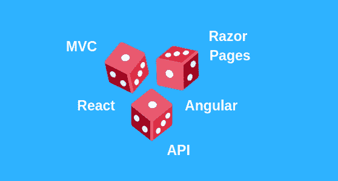
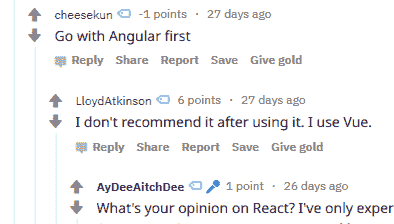
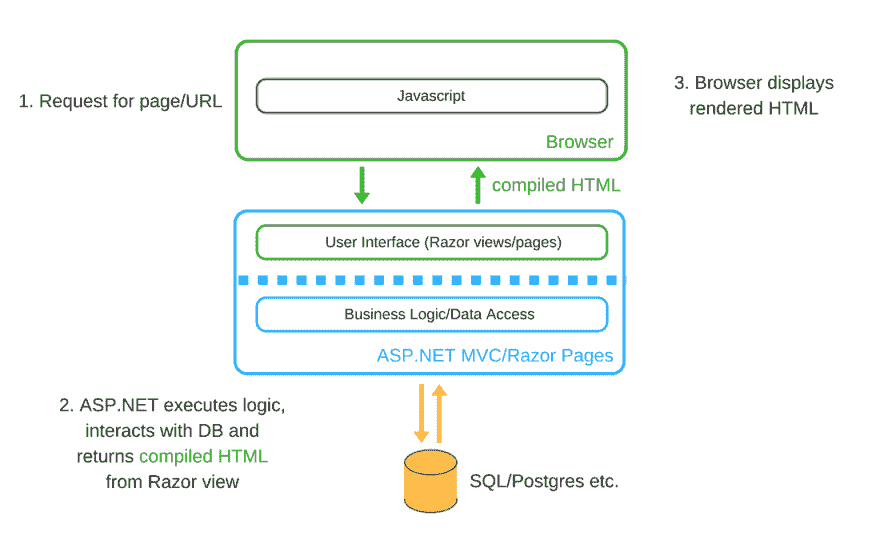
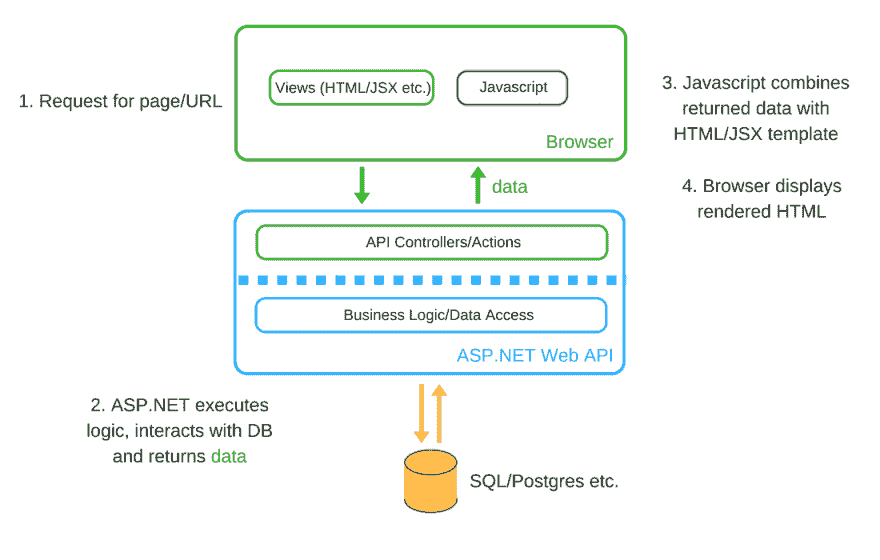
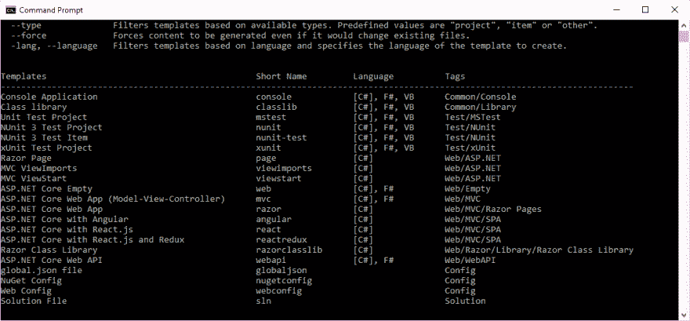

# 学习 ASP.NET 核心课程时需要关注什么？

> 原文：<https://dev.to/jonhilt/what-to-focus-on-when-learning-aspnet-core-52cm>

> “我对我应该关注的东西有点不知所措”

学习 ASP.NET 曾经相当简单。您将创建一个新的 WebForms 项目，就这样，您启动并运行了。

<center></center>

现在(坚持 ASP.NET 核心)你有选择，*这么多选择*。

*   MVC，Razor Pages 还是 API？
*   如果 API，哪个 SPA？有棱角，有反应，Vue 还是别的什么
*   类型脚本或 Javascript
*   Visual Studio 还是 Visual Studio 代码？

难怪你不能决定从哪里开始，但开始你必须开始，所以该怎么办？

嗯，你可以让别人替你决定。

只有一个问题...

[T2】](https://res.cloudinary.com/practicaldev/image/fetch/s--DKVQ2ITj--/c_limit%2Cf_auto%2Cfl_progressive%2Cq_auto%2Cw_880/https://jonhilton.net/img/2018-10-04-where-to-begin/2018-10-04-14-10-41.png)

...当人们对你的决定不感兴趣时，他们(自然地)倾向于根据自己的经验和偏好提出意见，而你真正需要的是更具体的东西。

你需要一个自己决定的方法。

好消息是。犹豫不决是这个过程中最糟糕的部分。

这是你对未来任务的艰巨性的不确定感最重的时刻。

我的一位老老板曾称这为“白纸”时刻。

一旦你迈出了第一步，其他的一切都会到位，你将能够*专注于你的特点，而不是选择学什么*。

另外，你会有动力，这是一个更好的地方！

## 以下是如何从“选择，如此多的选择”到“啊，构建这个特性很有趣”(尽可能用最少的步骤)

1.  想出一个小应用程序的想法
2.  选择一个“堆栈”开始
3.  构建第一个特征
4.  冲洗并重复

## 首先，想出一个小应用程序的想法

学习这些东西的最好方法是建造一些东西，*看着它在火焰中燃烧，然后找出你把错字放在哪里了*！

<center></center>

*图片来源:Citoy ' art*[Tempus fugit](http://www.flickr.com/photos/143910809@N02/31908797886)via[photo pin](http://photopin.com)[(许可证)](https://creativecommons.org/licenses/by-nc-nd/2.0/) *

小应用程序非常适合这一点，因为你不需要和任何人分享(除非你想),你可以自由地构建任何你喜欢的东西！

如果你没有灵感，这里有一些想法。

### 爱好/兴趣

如果你有自己感兴趣的东西(运动、爱好、惊奇宇宙等等)。)围绕它建立一些东西可能是值得的。

你将会受益于对主题的真正兴趣，并且几乎肯定能够想出许多关于特性的想法。

### 寻求灵感

如果你仍然一无所获，在谷歌上快速搜索编程方面的项目，你会发现很多想法。

codementor.io 列出了 40 个想法。

它们对于 web 应用程序来说并不都有意义，但是很多都有意义。我很喜欢 34 号的想法。午餐挑选者(决定你午餐应该吃什么，这样你就不必吃了！).

我也喜欢 Dave Ceddia 的这个列表(特别针对 React，但也适用于其他框架)。

## 然后选择一个“堆栈”开始

乍一看，这似乎是“把骰子扔向空中，看它们落在哪里”的一种变体，但请考虑一下这个问题...

看起来有很多路在你面前延伸，但是现在，*只有两条*。

*服务器端应用或 API +客户端。*

其他一切都取决于这个选择。

### 服务器端应用程序

这是一个服务器端应用程序(ASP.NET MVC 或 Razor Pages)。

<center></center>

来自浏览器的请求。

ASP.NET 处理这个请求(通过一个 [MVC 控制器或 Razor Page](https://jonhilton.net/razor-pages-or-mvc-a-quick-comparison/) )，执行一些业务逻辑(可能与数据库交互)，然后返回一个视图/页面(在服务器上被编译成 html)。

### API +客户端

现在和这个例子比较一下。

在这里，“后端”被公开为一个 API，有一个单独的前端客户端，用 Angular/React 等语言编写。

<center></center>

这一次，用户界面已经移到了客户端(在浏览器中运行)。

在服务器(ASP.NET 部分)上，我们仍然有控制器，但是它们返回数据(通常作为 JSON)而不是编译的 html(通过 Razor 视图/页面)。

### 他们是一样的！

嗯，蓝色虚线下面的那位反正是。

这对你来说很好，因为这意味着你与数据库交互和对数据执行逻辑的部分将保持不变，无论你使用 MVC、Razor Pages 还是决定建立一个 API。

事实上，在 ASP.NET 核心中，MVC/Razor 页面和 Web API 都被有效地合并，并共享相同的底层框架。

因此，无论您选择从什么开始，您都将学习 ASP.NET 核心如何工作的基础知识(包括依赖注入、启动配置、通过实体框架之类的 ORM 进行数据访问)。

### 从哪个开始？

现在，您仍然需要弄清楚是先尝试服务器端还是 API +客户端。

这些标准可以帮助你决定。

#### 1.工作可用性

如果你想最终找到一份构建 ASP.NET 应用程序的工作，对你能找到的工作做一点调查可能是值得的。

一种方法是点击在线招聘网站(事实上，Monster 等。)且看什么。您所在地区列出了净工作岗位。

这至少会给你一个风向的感觉。

#### 2.以往的经验

也许你已经有一些 html 和 javascript 的经验。

在这种情况下，您可能更愿意坚持您所知道的，并选择使用 javascript/html 客户端的 API。

也许你以前使用过服务器端框架，并且想从那里开始。

请记住，无论您选择服务器端还是客户端应用程序，您都将*编写大量看起来可疑的 html* 代码，无论是在 Razor 页面/视图中还是作为 React 组件中的 JSX。

类似地，Typescript 和 Javascript 在语法和特性上越来越接近，所以你学到的很多东西都可以移植过来。

#### 3.最简单的选择

如果你没有令人信服的理由去选择一个或另一个，你可能会发现，如果你从 ASP.NET MVC/Razor 页面开始，那么“移动部分”就少了。

最后，如果你仍然不能决定，*开始比选择“正确的”选项*更重要，所以掷骰子继续前进吧！

### 哪个 javascript 框架？

如果您选择 API +客户端堆栈，您将面临这个不可避免的难题。

最大的危险是，你最终会试图一次学到太多东西(Web API、ASP.NET、数据访问和`<insert-javascript-framework-here>`)。

那么如何才能避免自己超负荷呢？

#### 1.使用现成的客户端来测试您的 API

你可以在构建 API 的时候使用类似于[失眠症](https://insomnia.rest/)的东西来测试你的 API，而不是构建一个前端。

<center></center>

通过这种方式，您可以轻松地向 API 发起请求，而不会陷入 javascript 框架的泥沼。

#### 2.从项目模板的“简单模式”开始

如果您决定同时解决一个 JS 框架，ASP.NET 模板项目是一个不错的选择。

从 Visual Studio(通过文件>新建项目)或 CLI...

[T2】](https://res.cloudinary.com/practicaldev/image/fetch/s--Z9va8enA--/c_limit%2Cf_auto%2Cfl_progressive%2Cq_auto%2Cw_880/https://jonhilton.net/img/2018-10-04-where-to-begin/2018-10-05-09-16-35.png)

`dotnet new angular`

或者

`dotnet new react`

这将让您启动并运行一个最小的项目作为参考。

## 现在，构建您的功能

我知道，说起来容易做起来难，对吗？

这就是选择最简单的可能特性和最简单的可能方法来构建它真正值得的地方。

这是所有学习发生的地方，通过*试验和错误*，找出你不知道的和如何找到答案。

这部分流程没有真正的替代品，这就是为什么从简单的功能开始是关键。

如果你试图建立一个完整的“Twitter 克隆”，你会发现很难获得那些推动你进入下一个挑战的小胜利。

那么更好的办法是，尝试建立 Twitter 的一小部分。

也许，一个简单的页面显示一个硬编码的 tweet，除了标题和文本之外没有什么，然后从那里开始构建。

## 冲洗并重复

现在你已经有了一个小小的特性，你可以着手下一两个特性了。

专业提示:如果你*以一种能够重用你的业务逻辑的方式构建你的 MVC/API 项目，你可以让你自己的生活变得容易得多。*

您为前几个特性编写的逻辑/数据访问代码很容易成为学习“其他堆栈”的基础。

**用[这个超级快速的提示](https://jonhilton.net/devto/refactor)** 看看如何重构控制器的逻辑

例如，如果您选择首先尝试服务器端，那么您可以通过 API 公开相同的业务逻辑，并开始构建一个简单的前端客户端，看看它的比较情况。

采取此控制器操作。它返回“订单数据”(您可以通过前端应用程序(如 React)显示)。

```
public class OrderController : Controller {

    // rest of code omitted

    public IActionResult ById(string id){
        var order = _orders.Find(id);
        if(order == null){
            return NotFound();
        }
        return Ok(order);
    }
} 
```

虽然这返回了一个 MVC 视图(具有相同的订单数据)；

```
public class OrderController : Controller {

    // rest of code omitted

    public IActionResult ById(string id){
        var order =_orders.Find(id);
        return View(order);
    }
} 
```

重要的是，这些控制器动作尽可能少，并且*完全专注于暴露数据或呈现视图*。

如果您将重要的业务逻辑放入另一个类/服务/处理程序中(如本例中的`_orders`),那么改变调用该逻辑的方式就变得微不足道了。

换句话说，尽量避免这种事情！

```
public class OrderController : Controller {

    // rest of code omitted

    public IActionResult ById(string id){
        var order = _dataContext.Orders.FirstOrDefault(x=>x.Id == id);
        if(order == null) {
            order = new Order();
        }            
        return View(order);
    }
} 
```

在这里，我们把自己逼到了一个角落，因为业务逻辑在控制器动作本身中，这使得现在以不同的方式公开相同的数据变得更加困难。

## 走，走，走

你想学习 ASP.NET，世界需要你学习 ASP.NET！所以给自己减压吧。

不用担心学错东西。

你可以边做边学(做得越多，你就越有准备去学习世界上任何一种语言/框架/架构)。

## 你学习 ASP.NET 的计划

1.  选择一个有趣且“可构建”的副业项目
2.  从两种主要架构(“堆栈”)中选择一种
3.  找出一个微小的特征(简单，很少的活动部件)
4.  弄清楚如何构建这个特性([最简单的可能实现](https://jonhilton.net/2018/01/11/8-practical-tips-for-learning-asp.net-core-mvc/))
5.  确保您的控制器动作(和/或 Razor 页面代码)最少
6.  重复步骤 3-5
7.  当您想尝试不同的东西时，切换体系结构(堆栈)

试试吧，让我知道你的近况:-)。

**在你离开之前，看看如何用[这个超级快速提示](https://jonhilton.net/devto/refactor)** 重构你的控制器的逻辑