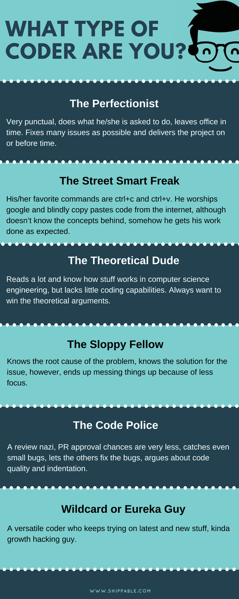

# 你是哪种类型的程序员？

> 原文：<https://dev.to/pavanbelagatti/what-type-of-coder-are-you-ik6>

顺便说一句，我知道六种类型的编码员。你是哪种类型的程序员？
在评论中分享。我们来看看什么类型的居多。

[T2】](https://res.cloudinary.com/practicaldev/image/fetch/s--tQxx_qxT--/c_limit%2Cf_auto%2Cfl_progressive%2Cq_auto%2Cw_880/https://thepracticaldev.s3.amazonaws.com/i/ouh6kjtttzx7ddjoq4i7.png)