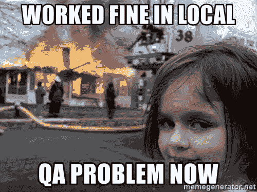

# 你作为 QA 最糟糕的经历是什么？

> 原文：<https://dev.to/jjsantos/what-was-your-worst-experience-as-qa--223a>

[T2】](https://res.cloudinary.com/practicaldev/image/fetch/s--YfMgENdH--/c_limit%2Cf_auto%2Cfl_progressive%2Cq_auto%2Cw_880/https://thepracticaldev.s3.amazonaws.com/i/wko5eod2l32et07jyuom.jpg)

我做 QA 分析师已经一年多了，但是在个人项目中使用 QA 技术已经三年多了。质量保证意味着大多数时候你应该评估另一个人已经工作过的东西；所以它有责任说某个东西是否符合公司的要求。

无论你正在开发的系统是否庞大，QA 都是一个具有挑战性的职位。如果你让错误的东西进入生产，你的头可能会被送上断头台...在我参与这项工作的这段时间里，我有好的经历，也有不好的经历。

当我开始与一个国际 QA 团队合作时，我认为这将是我职业生涯中必不可少的艰难一步，我完全没有错。和有不同文化的人一起工作有点困难；但这并不是时间不能解决的问题。

[T2】](https://res.cloudinary.com/practicaldev/image/fetch/s--HXYrWRmd--/c_limit%2Cf_auto%2Cfl_progressive%2Cq_auto%2Cw_880/https://thepracticaldev.s3.amazonaws.com/i/o1is2r9y0mte25e10y2y.jpg)

我认为迄今为止我得到的最糟糕也是最好的经历之一是当我开始对我自己的项目做 QA 的时候(耶！真是诡异 XD)。在软件质量保证领域，开发人员和质量保证人员之间存在竞争；这就像一场秘密战争，每个人脸上都带着微笑，但大多数时候他们内心在燃烧，原因有两个:

1-当 QA 打开一个新的错误报告时，Dev 变得很烦。当开发者没有修复报告的 bug 时，QA 会感到烦恼。

可能有更多的原因，但这些是我见过的最常见的原因。他们之间有一种平衡(开发人员/质量保证人员)，但是当开发人员和质量保证人员是同一个人(我)时，问题就出现了。

[T2】](https://res.cloudinary.com/practicaldev/image/fetch/s--8i7Q5Xm1--/c_limit%2Cf_auto%2Cfl_progressive%2Cq_auto%2Cw_880/https://thepracticaldev.s3.amazonaws.com/i/o0vgn8fh5a3fkrjbm2mw.jpg)

当我开始对我自己的项目做质量保证时，我开始在内部抱怨，比如:*“这个代码应该工作，因为它是我做的，我知道它的一切”*然后在质量保证过程中，我说*“哦，那不行。让我们向开发人员打开一个错误报告...*(我自己)。对我的项目做 QA 是我和我自己之间的一场内部战争，在作为 QA 的我和作为 Dev 的我之间。在这段时间里，我明白了寻找罪恶感只是浪费时间，成功的唯一途径是接受我们的错误并改正它们，这并不容易，但这是一次美妙的经历。

你呢？你作为 QA 最糟糕的经历是什么？