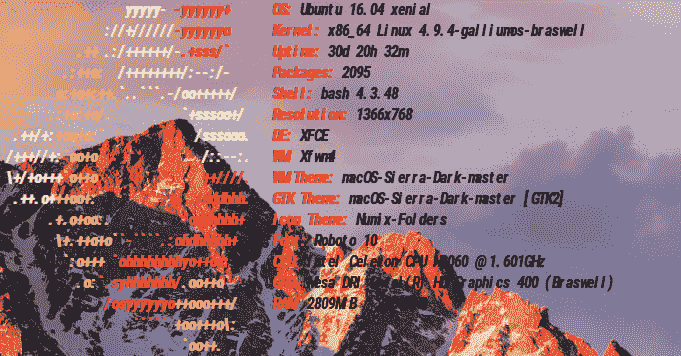
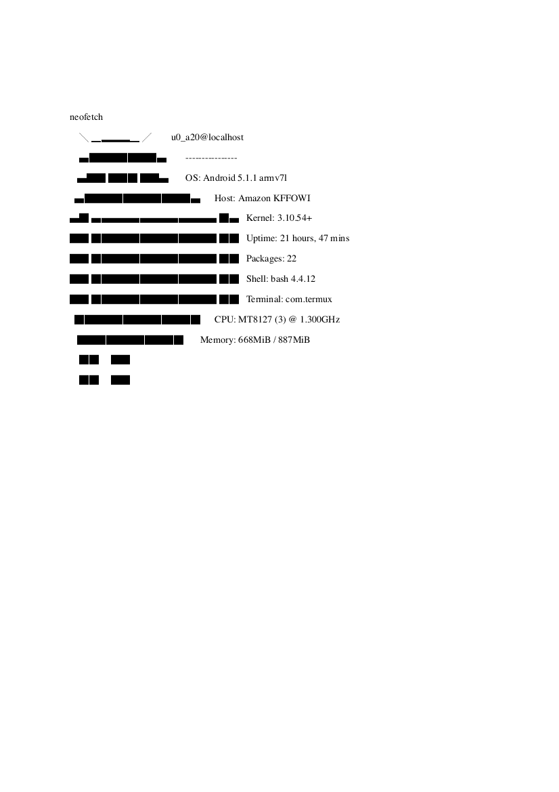
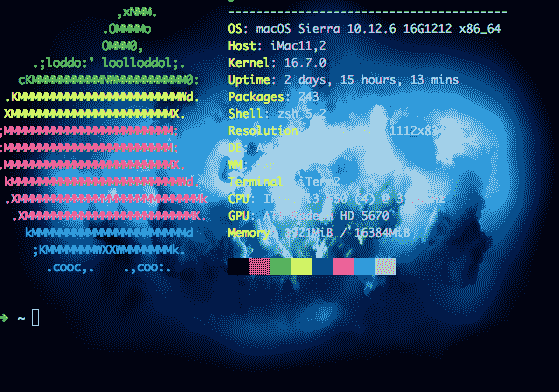
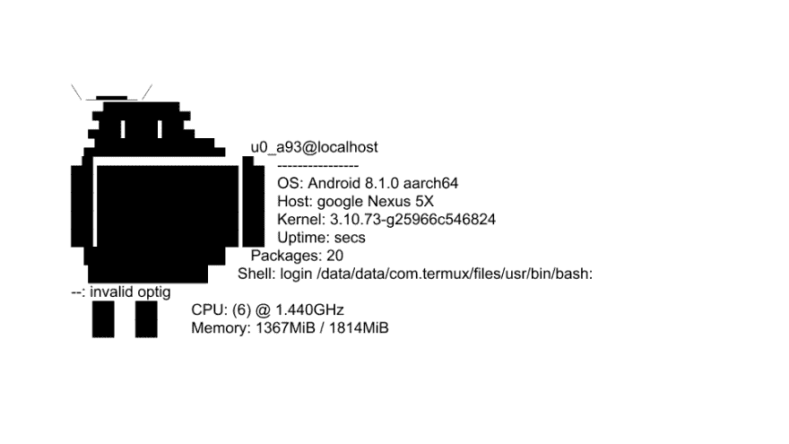
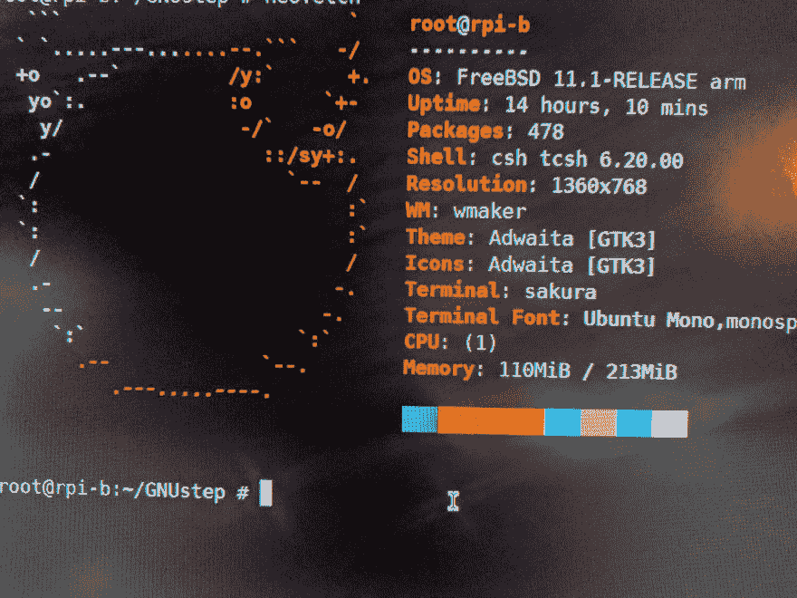

# 我的终端是什么？

> 原文：<https://dev.to/i3utm/whats-my-terminals--271l>

#### (从 2 月 28 日开始)我一直在努力把这些联系在一起。我让我的大部分计算设备运行不同版本的终端。所有人都成功地满足了我提出的要求:

*1。运行类似 Bash 的 shell。*
*2。正在安装 git。*
*3。使用 npm / node。*

#### 这里是我使用 Neofetch 或 Screenfetch 命令的五个终端。把它们放在一起是一次冒险。其中一些我不得不截屏和/或复制并粘贴在一个文本文件的输出。

*1)我的 Chromebook: HP 11 G5 EE。终端。操作系统:镓(基于 Ubuntu 16.04。)终端:蒂尔达。壳:Bash。*

[T2】](https://res.cloudinary.com/practicaldev/image/fetch/s--DXoWwe1M--/c_limit%2Cf_auto%2Cfl_progressive%2Cq_auto%2Cw_880/https://thepracticaldev.s3.amazonaws.com/i/fafconzuq6o6lylv1553.png)

*2)我的 Kindle Fire:第二代 OS: Fire OS 5.6.x(基于 Android 5.1.1。)终端:Termux。壳:Bash。*

[T2】](https://res.cloudinary.com/practicaldev/image/fetch/s--Btrx0Xwp--/c_limit%2Cf_auto%2Cfl_progressive%2Cq_auto%2Cw_880/https://thepracticaldev.s3.amazonaws.com/i/sutx5my6ojwldmv3ub2c.png)

我的 2010 款 iMac 运行自制软件。OS: 10.12.6。端子:iTerm2。壳:zsh。

[T2】](https://res.cloudinary.com/practicaldev/image/fetch/s--6EzYx45G--/c_limit%2Cf_auto%2Cfl_progressive%2Cq_auto%2Cw_880/https://thepracticaldev.s3.amazonaws.com/i/hy0459a77n8frx23jes6.png)

我的谷歌 Nexus: LG 5X。操作系统:安卓 8.1。终端:Termux。壳:Bash。

[T2】](https://res.cloudinary.com/practicaldev/image/fetch/s--MDURxRsT--/c_limit%2Cf_auto%2Cfl_progressive%2Cq_auto%2Cw_880/https://thepracticaldev.s3.amazonaws.com/i/9tm87nbclgfn3ta1ne4d.png)

*5)我的树莓 Pi: B+OS: RaspBSD(基于 FreeBSD 11.1。)终点站:小樱。壳:csh。*

[T2】](https://res.cloudinary.com/practicaldev/image/fetch/s--Pzyl3crF--/c_limit%2Cf_auto%2Cfl_progressive%2Cq_auto%2Cw_880/https://thepracticaldev.s3.amazonaws.com/i/o3o50mr9srt88xdx8kif.jpg)

#### 我仍然无法升级我的 iPad，因为它在 iOS 10.x 上，是 32 位的。我的 Linux 机器有一个死 CPU。然后我有无数的虚拟机。一个人可以在一台设备上拥有几十个使用不同操作系统的终端。感谢您阅读我在 *[DEV](//dev.to)* 上的第一篇帖子