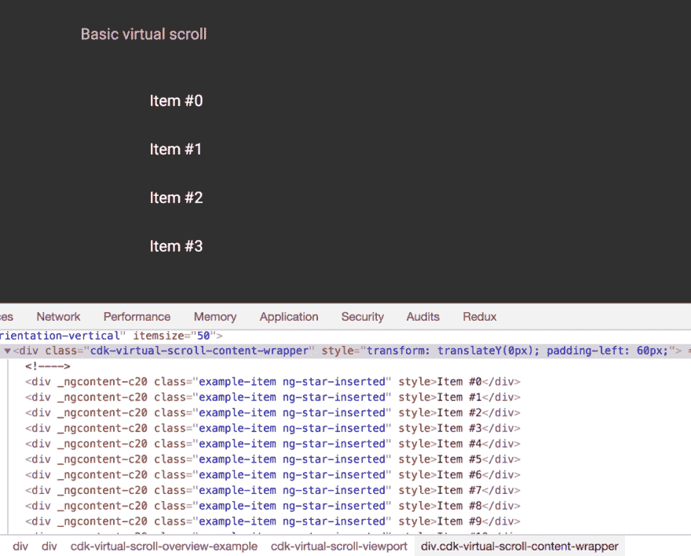

# Angular 7 有什么新功能

> 原文：<https://dev.to/progresstelerik/whats-new-in-angular-7-24b2>

Angular 7 在这里，一点也不诡异！这篇文章重点介绍了 Angular 7 的最新功能和改进，包括 CLI 更新，更好的性能和要注意的假新闻。我们还将解释它与剑道界面的关系。

随着天气转凉，秋天也吹到了 Angular 7 . 0 . 0 版本！这个版本已经被期待很久了，我和我在剑道 UI 团队的同事们非常兴奋地欢迎它。正如斯蒂芬在[官方帖子](https://blog.angular.io/version-7-of-angular-cli-prompts-virtual-scroll-drag-and-drop-and-more-c594e22e7b8c)中所说:

> “这是一个跨越整个平台的主要版本，包括核心框架、Angular Material 和具有同步主要版本的 CLI。”

如果 Stephen Fluin 说过一次，他已经说过一百次了，“管理开发人员的期望。”这个版本也不例外。速度和可靠性将是游戏的名称，因为我们看到了这些即将到来的功能。

## 今天你也可以上 7 版了

与 v6 之后的所有东西一样，在您选择的 Angular 应用程序中，只需运行以下命令:

`ng update @angular/cli @angular/core`

我自己更新了几个应用程序，我必须说，这是一个快速和无痛的更新。

## 牛逼的 CLI 提示

有很多次，我忘记了 CLI 命令的标志(例如，如何使用 SASS 创建一个新项目)。新的 CLI 提示符对于 ng new 或 ng add 这样的命令来说简直太棒了。您可以在全球范围内安装最新版本的 CLI:

`npm install -g @angular/cli@latest`

之后，试着通过简单地输入 ng new + enter 来创建一个新的应用程序。

[T2】](https://res.cloudinary.com/practicaldev/image/fetch/s--fy7W4bm6--/c_limit%2Cf_auto%2Cfl_progressive%2Cq_66%2Cw_880/https://www.telerik.com/sfimages/default-source/blogs/angular-v-7/image_1.gif%3Fsfvrsn%3Dfbe50836_2)

除了提示符之外，Angular.io 现在[还包含了 CLI 的文档！](https://angular.io/cli)

## 角元素

一个微小但令人兴奋的变化:

> “Angular Elements 现在支持使用 web 标准对自定义元素进行内容投影。”
> 
> —斯蒂芬·弗卢因

## 棱角分明的物质得到微小的更新

Angular Material 今年有了许多新的更新，包括 Material 的新主页， [material.io](https://material.io/) 。在这里，您可以获得设计指导、开发组件、工具，并了解最新消息。

[T2】](https://res.cloudinary.com/practicaldev/image/fetch/s--ZfZpy-nk--/c_limit%2Cf_auto%2Cfl_progressive%2Cq_auto%2Cw_880/https://www.telerik.com/sfimages/default-source/blogs/angular-v-7/image_2.png%3Fsfvrsn%3D35fd3885_2)

如果您是一个角度材质用户，从 v7 开始，您应该会注意到一些微小的视觉差异，因为库会根据材质设计的更新规范进行自我调整。

### 选择的可访问性更好

棱角分明的材质也提高了选择的可及性。现在，您可以在 mat-form-field 中使用本地选择。因为它是一个原生元素，所以它比 mat-select 具有更多的可访问性和更好的性能。现在，您可以选择使用 select 或 mat-select。两者现在都有了！

## CDK——现在有了虚拟滚动和拖拽

### 虚拟滚动

CDK 现在有虚拟滚动功能，你可以通过输入`ScrollingModule`！虚拟滚动是基于用户在项目列表中的位置加载/卸载 DOM 元素。这意味着你巨大的滚动列表变得更快了！

`<cdk-virtual-scroll-viewport itemSize="20">` `
{{dog}}
`

T2】

这是 Angular Material 的 StackBlitz，他们创建它来玩虚拟滚动。当我们滚动时，您可以看到 DOM 中的元素发生了变化！

[T2】](https://res.cloudinary.com/practicaldev/image/fetch/s--6QdxxQwC--/c_limit%2Cf_auto%2Cfl_progressive%2Cq_66%2Cw_880/https://www.telerik.com/sfimages/default-source/blogs/angular-v-7/image_3.gif%3Fsfvrsn%3D2d9a393d_2)

### 拖动&下降

CDK 现在还支持拖放功能，包括以下漂亮的特性:

*   当用户移动项目时自动呈现
*   列表中重新排序/转移项目的帮助器方法:moveItemInArray 和 transferArrayItem

[T2】](https://res.cloudinary.com/practicaldev/image/fetch/s--yjNn1oID--/c_limit%2Cf_auto%2Cfl_progressive%2Cq_66%2Cw_880/https://www.telerik.com/sfimages/default-source/blogs/angular-v-7/image_4.gif%3Fsfvrsn%3Dbe68b803_2)

## 提升应用性能

### 为新应用设置预算

我真的很喜欢那些能拯救我们的安全措施。下一个特性就是这样做的，当新的应用程序创建者超出其捆绑包大小的预算时，它会发出警告！默认值为 2MB 的警告和 5MB 的错误。但是不要害怕！这些默认值可以在 angular.json 文件中轻松更改。您只需要添加一些关于预算以及您首选的警告和错误大小的信息:

`"budgets": [`

`{`

`"type": "initial",`

`"maximumWarning": "2mb",`

`"maximumError": "5mb"`

`}`

`]`

#### 检查您自己的应用捆绑包大小

如果您对检查您的包大小感到好奇，您需要做的就是在您的 Angular 应用程序上运行 ng serve:

[T2】](https://res.cloudinary.com/practicaldev/image/fetch/s--NeI3685d--/c_limit%2Cf_auto%2Cfl_progressive%2Cq_auto%2Cw_880/https://www.telerik.com/sfimages/default-source/blogs/angular-v-7/image_5.png%3Fsfvrsn%3D74c117fe_2)

### 剥离生产中的反射元数据聚合填充

说到安全措施，在试图提高性能的过程中，Angular 团队发现许多开发人员(没有指名道姓)在生产中使用反射元数据 polyfill，这是为开发准备的。默认情况下，他们会从生产版本的 polyfill 文件中剥离此内容。

## 常春藤

为了澄清，我们之前写的有棱角的常青藤渲染器([)还没有发布。它的当前版本已经出来了，所以人们可以早点试用，但是 Angular 还没有正式使用它。](https://www.telerik.com/blogs/first-look-angular-ivy)

几周前，我在一个播客上看到了 Uri Shaked 和许多其他你可能认识的很酷的有棱角的 peeps，我们详细讨论了 Ivy 渲染器及其功能。点击查看节目[。](https://youtu.be/XdfAWRKb-oI)

在节目中，Uri 谈到了如何让自己尽早尝试 Ivy。因此，虽然 Ivy 还没有目前的 Angular 版本，但我对它何时首次亮相非常兴奋。

## 谣言&假新闻⚠️

早在 4 月份，就有一篇文章发布了一些关于 Angular 7 即将发布的假新闻，这是一个愚人节玩笑。不幸的是，不是每个人都明白这个笑话，几个月后这些“特征”开始出现在其他文章中。这里有一些假的特征，所以请知道，如果你在未来看到他们，他们不是真的。传播消息！

### 真实特征

*   新的 ng 编译器。
*   @角/芯分裂。
*   @ aiStore。这是一个基于人工智能的存储，与之前创建的 ngrx 代码库向后兼容。
*   @角/我的。最后一点，angular/我的。另一个 npm 包，在它的帮助下，你可以在你的应用程序执行期间挖掘比特币！

## 这会影响剑道 UI 吗？

一旦最终的 RC 发布，我就开始用[剑道 UI 测试所有的东西。到目前为止，我只遇到了几个特殊的问题:](https://www.telerik.com/kendo-angular-ui)

*   kendo-intl 的 v1.4.2 过时版本不起作用，但没关系，只需更新到最新版本就可以了！
*   通知还不能在 v7 上使用。不要害怕，我们在这个案子上
*   你会发现一些关于对等依赖的警告，需要较低版本的 Angular。这些都很好，它们只是意味着我们还没有用每个包测试 v7，因此还没有更新 npm 上的对等依赖。

我们剑道 UI Angular 团队对此激动人心的 v7 版本感到无比高兴！我们有几件事情要解决(见上文)，但总的来说，我们对 v7 中有多少组件开箱即可工作感到兴奋。我们感谢 Angular 团队的辛勤工作，并期待这一光明的常春藤未来。看看我们的恒星剑道 UI 组件，这里有角度的[和快乐的编码！](https://www.telerik.com/kendo-angular-ui-develop/components/)