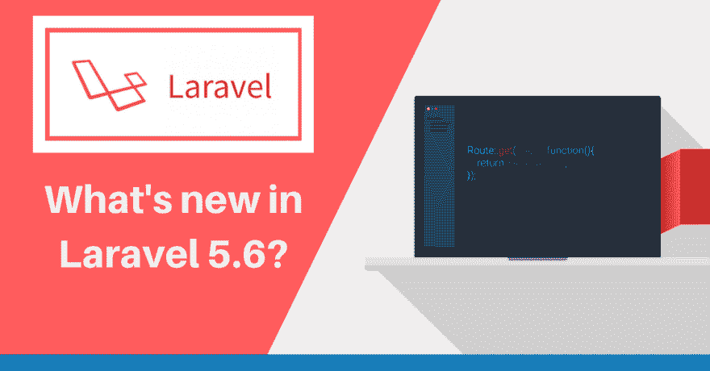

# PHP 框架 Laravel 有什么新趋势？

> 原文：<https://dev.to/rigelnetworks/whats-new-trending-in-php-framework-laravel-5gnn>

[T2】](https://res.cloudinary.com/practicaldev/image/fetch/s--K0gqW5N7--/c_limit%2Cf_auto%2Cfl_progressive%2Cq_auto%2Cw_880/https://www.rigelnetworks.com/wp-content/uploads/2018/08/What%25E2%2580%2599s-New-Trending-in-PHP-framework-Laravel.jpg)

Laravel 是最受欢迎的开源 PHP 框架,设计用于构建具有丰富优雅语法的 web 应用程序。由于这项技术附带了许多现成的特性，所以应用程序的开发速度很快。2018 年第一季度，Laravel 5.6 的发布是 GitHub 上最受欢迎的 PHP 框架的重大发布。

除了 Laravel 5.6 的发布，我们还见证了 Spark 6.0 的发布。根据泰勒和核心团队制定的政策，每六个月就会发布主流的 Laravel 框架。在这篇文章中，我们将了解 Laravel 5.6 中的新特性，以及其他一些变化和废弃之处。所以，事不宜迟，让我们直接进入 Laravel 5.6。

### **API 速率限制**

对动态 API 速率限制的更好支持是 Laravel 最漂亮的内置特性之一。早些时候，在一组路由上，Laravel 的速率限制配置涉及指定硬编码的请求数量。Laravel 5.6 的发布，允许个人根据认证的用户模型属性决定应用程序的最大数量，这是锦上添花。

### **氩气密码哈希**

支持 Argon 密码散列是 Laravel 5.6 的特性之一。对于安全地散列密码，Argon2 是密码散列竞赛推荐的密码散列算法，它是一种现代算法。这种介质有两种不同的口味，氩 2i 和氩 2d。对于 Argon 2i 密码散列，PHP 7.2 最近增加了支持，因此，Michael Lundbol 率先在 Laravel 中增加了对 Argon 散列的支持。

### **新的记录配置**

随着 Laravel 5.6 的发布，我们获得了一个改进的日志功能，允许在 Laravel 5.6 中使用新的日志配置文件。现在，您可以使用该文件将日志消息发送给各种处理程序，因为它可以设置日志堆栈。

### **单服务器任务调度**

以前，如果一个应用程序在许多服务器上运行，并且任务调度程序在这些服务器上处于活动状态，那么您的调度任务会执行多次。但是，在 Laravel 5.6 新版本的情况下就不一样了。也就是说，即使您的应用程序运行在多台服务器上，您现在也可以轻松地将任务安排在一台服务器上执行。

PHP 框架 Laravel 5.6 版本中的这些新特性。作为 PHP 最有用的框架之一，Laravel 被用来构建健壮的和高度可维护的 web 应用程序。利用这项技术，Laravel 开发人员可以在短时间内编写出更好的、可持续的代码。 [***瑞格网络***](https://www.rigelnetworks.com/) 在过去的几年里，瑞格网络一直在为客户提供 Web 应用开发解决方案。

我们拥有专家团队 Laravel 开发人员，从 Laravel Web 应用程序开发、使用 Laravel 的移动应用程序开发、Laravel RESTful 应用程序开发、Laravel 模板设计和模块开发到 Laravel 定制、集成和支持、使用 Laravel 的现有网站迁移、[电子商务开发](https://www.rigelnetworks.com/solutions/enterprise-solutions/ecommerce-solutions/)和 Laravel 扩展开发&集成，在短时间内开发出精美的 Web 应用程序。

因此，如果您想开发符合您的功能需求的 web 应用程序——与您的战略业务目标一致，Rigel Networks 提供了最好的 Laravel web 开发解决方案。凭借在 Laravel 框架方面的丰富经验，我们保证为您提供一个快速、高度可扩展且健壮的 web 应用程序。