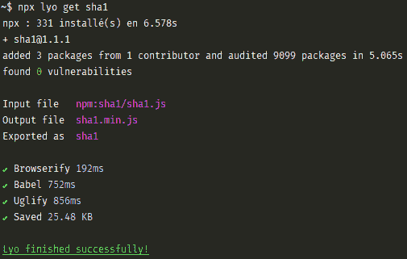

# 作为一个非英语母语的人，软件开发是什么样的？

> 原文：<https://dev.to/shalvah/whats-software-development-like-as-a-non-native-english-speaker-1khh>

我以前也想过这个问题，但最近我被触发写下了这个，感谢这张图片:

[T2】](https://res.cloudinary.com/practicaldev/image/fetch/s--1UKExOf_--/c_limit%2Cf_auto%2Cfl_progressive%2Cq_auto%2Cw_880/https://blog.shalvah.me/store/media/3o3knp6z45jbsx675d9j.png)

(来自[本帖](https://dev.to/gmartigny/awesome-projects-under-1000-stars-3---lyo-2k93))

你会注意到`npx`的输出是法语(我猜那是 [@gmartigny](https://dev.to/gmartigny) 的系统语言)。但是`lyo`的输出是英文。我的推断是 NPM 使用国际化的字符串，而 lyo 使用硬编码的英语。

我不是在责怪 Lyo。国际化是一项非专有的工作(支持哪种语言，机器翻译还是付费翻译，确保 UI 组件在某些语言上看起来不奇怪，...).就我个人而言，我从未开发过支持英语以外语言的应用程序。

如此多的软件世界使用英语作为通用语(编程语言关键字、文档、包命令等等)，以至于英语不流利的开发人员仍然用英语发布包。

但是，我很好奇。对于母语不是英语(或者英语不流利)的开发人员来说是什么感觉？

来到一个 GitHub readme，必须使用 Google Translate 才能弄清楚如何使用这个包是什么感觉？🤔🤔

讽刺的是，这篇文章是英文的，这一点我也没有忘记。😆