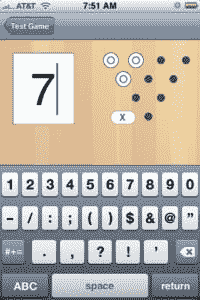

# 我什么时候准备好？

> 原文：<https://dev.to/evandeaubl/when-am-i-ready-5cco>

当我们都开始学习应用程序开发时，有一个首要原因:能够开发和发布应用程序。一旦你有了一些课程、教程和书籍，那些烦人的问题就开始了:

我需要学多少？有哪些事情是我绝对必须知道的？
哪些是正确的决定？最佳实践？
如果我还没有学到正确的东西怎么办？

***我什么时候准备好了？**T3】*

***突发新闻:*没有守门人。**没有一群被钦点的大师会看着你的学习，看到它是好的，然后宣布:“是的，你现在可以开发应用了。”好消息是，如果你问这个问题，答案很简单:**现在**。

* * *

第一步是**挑选一个激励你去构建的问题。**这个因人而异。你可能有一个现成的应用程序的想法。建造它。你可能会在其他应用程序中看到很酷的东西，并想学习如何复制它们。建造它。你可能是一个想要复制现有应用程序来理解事物的人。建造它。当发展变得困难时，你对问题的情感依恋将帮助你度过难关。

当发展遇到困难时，你会怎么做？当你感觉像**时，你不知道自己在做什么**，你在**问自己为什么会陷入这种境地？这是你需要切换回学习模式的信号。在你最喜欢的论坛中搜索答案，寻找教程和示例代码来帮助你，购买可以帮助你做新事情的工具或组件，找到做同样事情的其他开发人员的支持小组。正如有许多方法可以卡住一样，也有许多方法可以解决卡住的问题。**

一旦你开始写应用程序，你就不会停止学习，就像你完成一项任务一样。这是一个持续的、有节奏的过程:你做直到你做不到，然后你为了做得更多而学习。你做的越多，这个循环就越熟悉。

 让我们照亮房间里的大象:**你会犯错误。你会写出糟糕的代码，你会做出丑陋的界面，你会做出错误的选择。**从现在开始，你会回顾你的应用程序，然后大笑。上面的图片是我写的一个追踪保龄球分数的早期版本的旧截图。现在看来，这是值得畏缩的，但这是建造粗糙的东西，学习更好的方法，然后改正错误的循环的一部分。所以通常情况下，如果一开始不犯错误，你就无法找到正确的做事方法。

如果你在学习中已经足够成熟，可以问自己是否准备好了，那么你已经有了被压抑的动力和“足够”的知识来完成你的第一个应用程序。开始吧。

* * *

你喜欢这个建议吗？[直接在您的收件箱中注册获取更多应用开发技巧。](https://www.appsdissected.com/newsletter/)

这篇文章最初发表在 [Apps 剖析。](https://www.appsdissected.com/when-am-i-ready/)