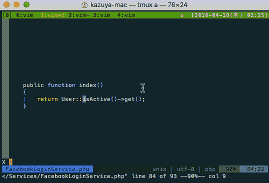

# 用 Vim 开发 Laravel app 的时候，还是可以跳转到魔法方法

> 原文：<https://dev.to/acro5piano/when-developing-laravel-app-with-vim-you-can-still-jump-to-magic-methods-1in3>

[T2】](https://res.cloudinary.com/practicaldev/image/fetch/s--QsiBfcwX--/c_limit%2Cf_auto%2Cfl_progressive%2Cq_66%2Cw_880/https://thepracticaldev.s3.amazonaws.com/i/iujvl0hmu7aufcov2vcx.gif)

我正在用我最喜欢的编辑器 Vim 开发 Laravel 应用程序。

我的冲动曾经是我不能跳到 Laravel 的魔法方法定义，比如`getIsActiveAttribute`和`scopeIsActive`。

所以我设置了适当的`ctags`配置，通过`C-]`跳转到它们。

`~/.ctags`

```
--regex-php=/get([a-z|A-Z|0-9]+)Attribute/\1/
--regex-php=/scope([a-z|A-Z|0-9]+)/\1/ 
```

Enter fullscreen mode Exit fullscreen mode

然后，

*   在项目根目录下运行`ctags`命令。最近的`ctag`自动读取我们的配置文件。
*   用 vim 打开一个文件(当然)
*   将光标设置为魔术方法
*   类型`C-]`

我强烈推荐定制你的`ctags`。我设置下面的配置来跳转到 JavaScript 的类方法的定义。

```
--langmap=javascript:.js.es6.es.jsx
--javascript-kinds=-c-f-m-p-v
--regex-javascript=/^[  \t]*([a-z]+[  \t]+)*class[  \t]+([A-Za-z0-9_]+)[  \t]*([^)])/\2/c,class,classes/
--regex-javascript=/^[  \t]*([a-z]+[  \t]+)*const[  \t]+([A-Za-z0-9_]+)[  \t]*([^)])/\2/c,const/  --regex-javascript=/^[  \t]*([a-z]+[  \t]+)*type[  \t]+([A-Za-z0-9_]+)[  \t]*([^)])/\2/c,type/
--regex-javascript=/^[  \t]*([a-z]+[  \t]+)*[  \t]+([A-Za-z0-9_]+)  ?\(\)[  \t]*([^)])/\2/c,method/
--regex-javascript=/^[  \t]*([a-z|A-Z]+)\(\)/\1/
--regex-javascript=/^[  \t]*([a-z]+[  \t]+)*const[  \t]+([A-Za-z0-9_]+)[  \t]*([^)])/\2/c,class,classes/ 
```

Enter fullscreen mode Exit fullscreen mode

祝 Vim 黑客之旅愉快！