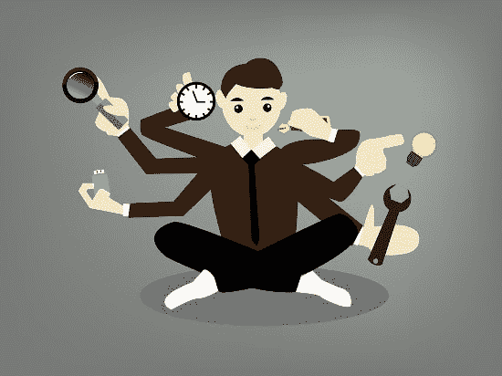

# 当多任务是唯一的选择时

> 原文：<https://dev.to/pbeekums/when-multitasking-is-the-only-option-pga>

多重任务是不存在的。所有的科学都告诉我们，我们只能转换任务。而且任务切换对我们真的不好。每次我们转换任务，我们都会增加我们的认知负荷，使我们在试图同时完成所有任务时效率更低。已经有很多关于这个话题的文章，试图证明创造人们可以集中注意力的工作环境是合理的。

[T2】](https://res.cloudinary.com/practicaldev/image/fetch/s--J1FtRj7E--/c_limit%2Cf_auto%2Cfl_progressive%2Cq_auto%2Cw_880/https://blog.professorbeekums.com/img/2018/multitasking.jpg)

这是一个令人钦佩的目标，但在许多情况下是完全不现实的。对于一些工作来说，同时应付许多任务是这个角色的核心部分。任何兼任系统管理员的项目经理或开发人员都可以证明这一点。我绝对有过这样的角色，我很幸运能有一个小时不被打扰。

我一开始也抱怨过这个。我的团队经常错过我们的 sprint 目标，我对这些错过有不小的贡献。我怎样才能完成工作？我开始记录我的时间被打断的情况，大约每天 20-30 次。可怕。

直到我真正看到了那些干扰的主题。在与我的老板交谈后，我意识到虽然我自己的工作受到了影响，但由于我对其他团队的贡献，我为公司整体提供的价值更高了。除了少数情况，对我来说，处理这些干扰比让我集中注意力要好。所以，如果重新集中注意力平均需要 15 分钟，而这意味着为别人节省几个小时甚至更多的时间，那又怎么样呢？

虽然没人能更高效地同时处理自己的工作，但这并不意味着我们应该放弃，只是说多任务是最大的禁忌，没有人应该这样做。对于我们中的许多人来说，我们也应该研究如何将多重任务的负面影响最小化。有时我可以强迫自己快速回到正确的环境，但这不是一个可靠的策略。“愿意”自己做某事在大多数时候是不可行的。

这是我计划在未来阅读更多的东西，但是有一个策略到目前为止确实帮助了我:把事情写下来。

对于开发人员来说，我们经常在构建复杂的系统，我们试图一次构建并记住所有的复杂性。任何干扰都会让那些脆弱的思想像纸牌搭的房子一样翻滚。但是写下这些想法，即使除了我之外的任何人都无法理解，也能帮助我巩固这些想法。我能够更快地从干扰中恢复过来。很多时候，我甚至不需要看我写的东西。最初写下东西的行为有助于提高我的记忆力。

我相信还有其他的策略。他们只是需要被找到。如果你知道任何，我很乐意收到你的来信！