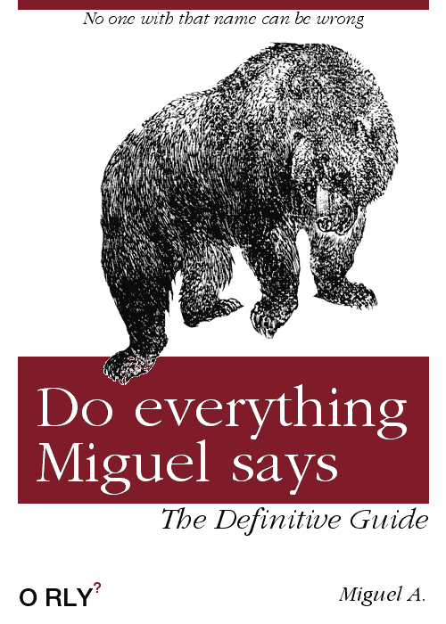

# SCRUM 不是正确选择的时候。

> 原文：<https://dev.to/mangel0111/when-scrum-is-not-the-correct-choice-ae8>

嗨，和你们大多数人一样，我在不同的公司工作过，每家公司都有不同的文化、政策和规则，但他们都与人合作，最终目标是相同的。完成你需要做的事情！嗯，有时候并不那么容易，不断的延迟，最后一刻的变化，噩梦般的最后期限创造了完美风暴的条件，这通常转化为额外的时间，额外的努力和大量的咖啡和咖啡。

我曾经在完全“自由”地管理你的项目的公司工作过，在那里你可以选择框架、库甚至方法论(在一些地方使用的方法论根本就不是方法论)，但是在今天的大多数办公室里，我发现有很多人把“SCRUM”当作圣杯来谈论，这个秘密的工具会让你所有的项目按时完成，让你所有的开发人员满意，让公司成为世界上最好的公司。

使用 SCRUM 并不神奇，你有角色、仪式和很多计划。我并不是说 SCRUM 或者其他敏捷方法是一个不好的选择。如果团队的所有成员都理解自己的角色，尊重仪式的目标，并且是能够以 100%的准确率估计一项任务的时间和精力的机器，那就太好了。在这里，你会发现一些常见的错误，这些错误会使 SCRUM 不是你的最佳选择。

**当一个计划是一种状态，而状态是一种培养，而复古是一个论坛并继续…**
在团队成员中很常见的是失去会议的焦点，出于多种原因，你可以发现自己正在谈论当前计划中的下一个冲刺任务。这通常表明你没有利用当前的会议。如果团队因为必须参加会议而没有编码、验证做某事，他们应该尊重目标，并且是所有人的工作。计划是为冲刺做计划，回顾是了解冲刺中发生了什么，状态是谈论当前状态，站起来是说你在做什么，听起来很傻，但你应该尊重你的仪式。

当起立鼓掌是在上午 11 点，但是星期一是上午 10 点，星期四是下午 3 点，中午是 12 点，有月光的夜晚是 12 点。

站立应该是所有仪式中最快速、简单和干净的会议，你在做什么？，你打算怎么办？，如果你受阻，寻求帮助。开发工作是由负责人来做的，你不应该强迫你的团队停止工作，集中精力去参加一个没有预定时间的会议。站立应该总是在创造习惯的同时。

**每当你发现自己有很多未完成的任务，并且你不愿意改变任何事情**
这是不使用 SCRUM 的最重要的原因。如果你的团队没有完成他的工作，而你又不愿意改变你现在正在做的事情，那么你就在浪费时间。敏捷给你的最大好处之一就是有机会抓住延迟，尝试识别问题，并在此基础上应用可能的解决方案。记住你是在软件开发中，变化是不可避免的。

当你一周中有更多的会议时间实际上是在发展
这表明你的薪水是用来协助会议而不是发展的。

当你可以几个星期不与项目经理或任何产品所有者交谈。
沟通对于任何团队和项目都是至关重要的。如果你的团队正在努力完成项目，但任何项目经理都在那里检查进展情况，参与故事的创作和目标的定义。你不是在 SCRUM 中，而是在一个糟糕的实现瀑布中

当你的团队总是谈论他们有多讨厌 SCRUM
时，所有的团队都应该接受这种方法。所有的团队都应该对目前的工作方式做出妥协。使用 SCRUM 的团队应该是你公司最敏捷的粉丝，否则你会有一个没有动力的团队。

你如何看待这个博客应该被命名为“当你没有正确使用 SCRUM 的时候”，但是这个名字已经决定了，希望这个小的常见错误列表能帮助你更好地理解 SCRUM，并与你的团队分享，看看你是否在正确的道路上。

**在我们信任的代码里！**
[T5】](https://res.cloudinary.com/practicaldev/image/fetch/s--k2usK0Oz--/c_limit%2Cf_auto%2Cfl_progressive%2Cq_auto%2Cw_880/https://thepracticaldev.s3.amazonaws.com/i/20zcz2fdx2k7ha9a4iaw.png)