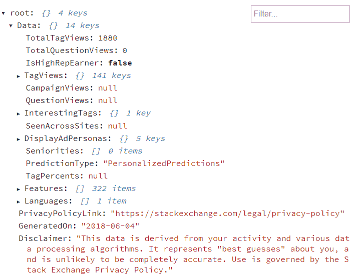
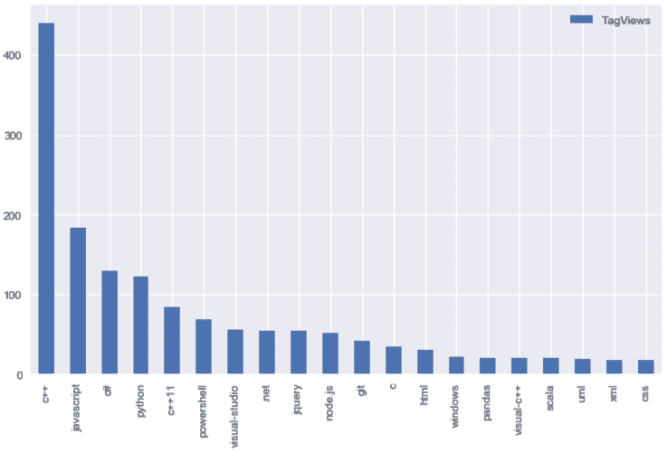
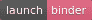

# 当我们读取堆栈溢出时，堆栈溢出从我们这里读取了什么？

> 原文：<https://dev.to/tomoyukiaota/when-we-read-stack-overflow-what-does-stack-overflow-read-from-us-3b1i>

###### (此处有日文翻译[。)](https://qiita.com/TomoyukiAota/items/e9f9a8290891ec9017f2)

在互联网出现之前，一个著名的笑话被创造出来。

> 在美国，你看电视。在苏联，电视会看着你！

在互联网之后，我们像脸书一样观看网络服务的内容。网络服务在监视我们。

公司必须通知用户收集信息。这不仅是因为规章制度，也是为了赢得用户的信任。

许多 web 服务通知我们收集的信息种类，而不是实际的数据。然而，为了获得我们的信任，Stack Overflow 允许用户下载从用户现场活动中收集的[个性化预测数据](https://meta.stackexchange.com/users/prediction-data)。在本文中，我将下载并探索我的[个性化预测数据](https://meta.stackexchange.com/users/prediction-data)，看看它是什么样子的。

# 下载并分析个人预测数据

要下载您的[个性化预测数据](https://meta.stackexchange.com/users/prediction-data)，您需要登录 Stack Exchange，点击蓝色的“开始下载”按钮。(如果您未登录，个性化部分中的值将为空。)

下载的文件是一个 JSON 文件，如下所示:

[T2】](https://res.cloudinary.com/practicaldev/image/fetch/s--Ui_fMuCA--/c_limit%2Cf_auto%2Cfl_progressive%2Cq_auto%2Cw_880/https://thepracticaldev.s3.amazonaws.com/i/btughqkw3exldiaumu87.PNG)

没有文件解释每个值的含义，所以我看了一些猜测的数据。
感兴趣的数据是 root/Data/TagViews 中的{ tag: value }样式数据。这是一个键-值对，其中键是堆栈溢出中的标记。比如看起来是这样的。

```
TagViews : {
  c++: 440,
  javascript: 183,
  ...
} 
```

Enter fullscreen mode Exit fullscreen mode

前 20 个标签会是这样的。

[T2】](https://res.cloudinary.com/practicaldev/image/fetch/s--kb8A_WbG--/c_limit%2Cf_auto%2Cfl_progressive%2Cq_auto%2Cw_880/https://thepracticaldev.s3.amazonaws.com/i/klodwnh4de9bre9favsh.PNG)

这个图表中的标签和它们的值非常符合我的工作感受。看起来堆栈溢出对我目前的技能有很好的猜测。

有关分析的详细信息，请阅读[我的 GitHub 资源库](https://github.com/TomoyukiAota/stack_exchange_personalized_prediction_data)中的 Jupyter 笔记本。单击下面的徽章将带您进入由 Binder 运行的笔记本。
T3T5】

# 关闭

查看从我的现场活动中收集到的堆栈溢出非常有趣。我希望其他公司也这样做。