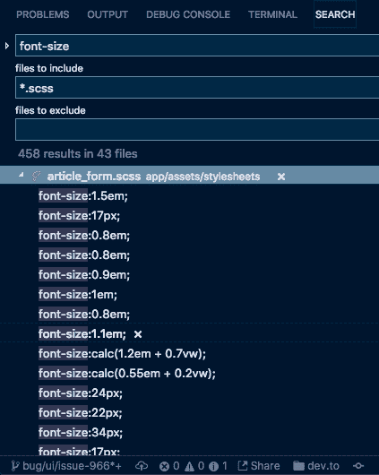
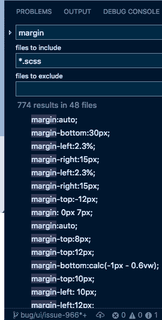

# 你在 CSS 中使用哪些度量单位，为什么？

> 原文：<https://dev.to/nickytonline/which-units-of-measure-do-you-use-and-why-in-css-nf4>

我刚刚在 dev.to repo 中发表了一个关于考虑标准化代码库 CSS 部分的度量单位的问题。简而言之，我正在推广`rem`(必要时还有`em`)的用法，就像我在日常工作中使用的一样，因为我在`rem`上很受欢迎。

# [ 考虑使用雷姆单位 #987](https://github.com/thepracticaldev/dev.to/issues/987) 

 **[nickytonline](https://github.com/nickytonline)** posted on [<time datetime="2018-10-23T14:18:37Z">Oct 23, 2018</time>](https://github.com/thepracticaldev/dev.to/issues/987)

**您的功能请求是否与某个问题相关？请描述一下。**这与#966 有关

我注意到在大多数 SASS 文件中有一些应该解决的问题。`font-size` s 和其他有测量值的属性设置为`em`、`px`、`%`。

**描述您想要的解决方案**

考虑使用`rem`(必要时使用`em`)。浏览器默认认为`1rem`是根元素上的`16px`，但是如果用户有不同的字体设置，那么`1rem`将等于那个值。因此，使用`rem`，一切都将根据浏览器或用户的字体大小设置来调整大小。`em`在被调整大小的内容依赖于其元素的字体大小而不是根元素的字体大小时也很有用。

关于这一切，Bootstrap repo 中有一个很大的讨论，【Bootstrap 4 为什么改为使用 rem？问题#19943 twbs/bootstrap GitHub 。这是一个很好的评论，[https://github . com/twbs/bootstrap/issues/19943 # issue comment-224439306](https://github.com/twbs/bootstrap/issues/19943#issuecomment-224439306)

这不是一个快速简单的解决办法，但是考虑到这是 OSS，我确信会有很多人能在这方面有所帮助。

旁注:我认为这可能是一个很好的问题，可以由对 CSS 感兴趣的导师/学员来解决。

**描述你考虑过的替代方案**不适用

**附加上下文**

[T2】](https://user-images.githubusercontent.com/833231/47332360-09338f80-d64d-11e8-8b4a-2a8bbce8d05e.png)

[T2】](https://user-images.githubusercontent.com/833231/47335514-7f3df380-d659-11e8-82ce-306d64e17d74.png)

[View on GitHub](https://github.com/thepracticaldev/dev.to/issues/987)

有很多文章对此进行了详细的讨论。一个简单的谷歌“雷姆对”将为你提供大量的文章。

[T2】](https://res.cloudinary.com/practicaldev/image/fetch/s--u9zNDK-z--/c_limit%2Cf_auto%2Cfl_progressive%2Cq_auto%2Cw_880/https://thepracticaldev.s3.amazonaws.com/i/cr6f97fremx336vzba08.png)

很好奇大家对此的想法。欢迎在这里和 GitHub 上发表评论。