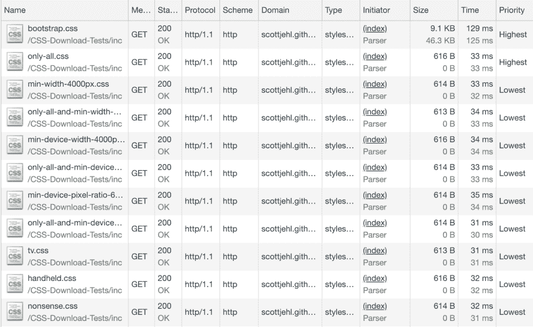

# 为什么浏览器下载带有不匹配媒体查询的样式表

> 原文：<https://dev.to/chromiumdev/why-browsers-download-stylesheets-with-non-matching-media-queries-4gcn>

(原载于[blog . tomayac . com/2018/11/08/why-browsers-download-style sheets-with-non-matching-media-queries-180513](https://blog.tomayac.com/2018/11/08/why-browsers-download-stylesheets-with-non-matching-media-queries-180513)。)

前几天，我读了一篇由达里奥·吉塞拉尔写的关于通过移除无用的媒体查询来优化 CSS 的文章。其中一个核心思想是，您可以在包含样式表时使用 [`media`属性](https://developer.mozilla.org/en-US/docs/Web/HTML/Element/link#attr-media)，如下所示:

```
<link href="print.css" rel="stylesheet" media="print">
<link href="mobile.css" rel="stylesheet" media="screen and (max-width: 600px)"> 
```

在这篇文章中，Dario 链接到了 Scott Jehl 的[CSS 通过媒体查询下载](http://scottjehl.github.io/CSS-Download-Tests/)测试套件，Scott 在其中展示了*浏览器如何仍然下载样式表，即使它们的媒体查询不匹配*。

我[指出](https://github.com/scottjehl/CSS-Download-Tests/issues/11#issue-378471829)这些下载的优先级是`Lowest`，所以它们至少不会与页面上的核心资源竞争:

[T2】](https://res.cloudinary.com/practicaldev/image/fetch/s--mF-cPePN--/c_limit%2Cf_auto%2Cfl_progressive%2Cq_auto%2Cw_880/https://thepracticaldev.s3.amazonaws.com/i/mqcf1iuqvc2giqdq1pyl.png)

乍一看，这似乎不是最理想的，我认为即使优先级是`Lowest`，浏览器也不应该触发下载。所以我做了一些研究，令人惊讶的是，CSS 规范的作者和浏览器实现者在这一点上非常聪明:

事情是这样的，用户*可以*总是决定调整他们的窗口大小(影响[宽度](https://developer.mozilla.org/en-US/docs/Web/CSS/@media/width)、[高度](https://developer.mozilla.org/en-US/docs/Web/CSS/@media/height)、[长宽比](https://developer.mozilla.org/en-US/docs/Web/CSS/@media/aspect-ratio)、[打印](https://developer.mozilla.org/en-US/docs/Web/CSS/Media_Queries/Using_media_queries#Media_types)文档、*等)。*甚至乍一看*似乎*静态的东西(如[分辨率](https://developer.mozilla.org/en-US/docs/Web/CSS/@media/resolution))也可以改变，当具有多屏幕设置的用户将窗口从例如 *Retina* 笔记本电脑屏幕移动到更大的桌面显示器时，或者用户可以拔掉他们的[鼠标](https://developer.mozilla.org/en-US/docs/Web/CSS/@media/any-pointer)，等等。

不能改变的真正静态的东西(一个电视设备不能突然变成别的东西)实际上正在被*弃用*在[媒体查询级别 4](https://drafts.csswg.org/mediaqueries) (见[黄色注释框](https://developer.mozilla.org/en-US/docs/Web/CSS/Media_Queries/Using_media_queries#Media_types))；建议将[媒体功能](https://drafts.csswg.org/mediaqueries/#media-feature)作为目标(参见[红色问题框](https://drafts.csswg.org/mediaqueries/#media-types)下的文字)。

最后，根据规范中的[忽略规则](https://www.w3.org/TR/CSS2/conform.html#ignore)，甚至像`media="nonsense"`这样的无效值也需要被考虑。

长话短说，浏览器试图通过应用优先级变得尽可能聪明，对于 Scott 的[测试](http://scottjehl.github.io/CSS-Download-Tests/)中的情况来说，`Lowest`是一个合理的值。