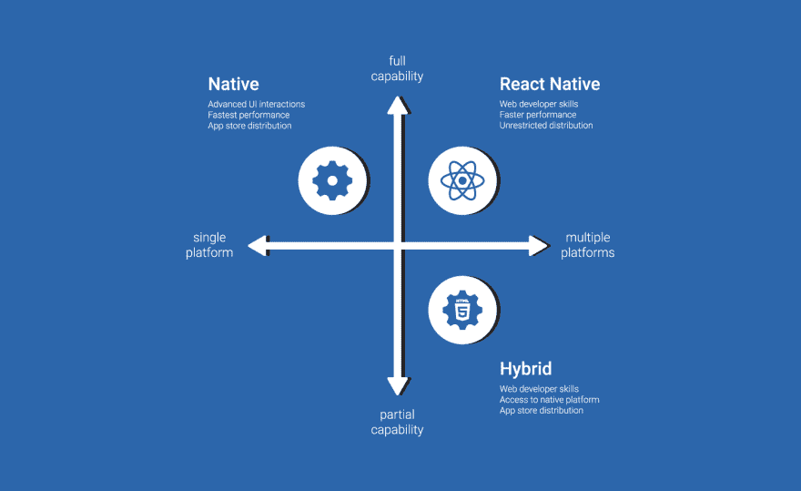

# 为什么选择 React Native 开发你的手机 app？

> 原文：<https://dev.to/diogomqbm_/why-choose-react-native-to-develop-your-mobile-app-392p>

在这篇文章中，我将告诉你我是如何意识到我应该用 React Native 而不是 native (Swift，Kotlin)开发我的启动应用程序的...).

让我们从头开始，我们是一小群人，我们的梦想是让我们的项目成为现实，接触真实的人！我说的小团队指的是 4 个人(前端/移动开发，后端开发，设计师和商人)。每个人都在尽可能努力地学习，以便在每个领域做出最佳选择，我最大的问题是“我应该选择什么堆栈来开发这个应用程序？”。

经过大量的研究，React Native 让我着迷，我是唯一的开发者，需要一些相对快速和明显的混合。对于那些不了解 React Native 的人来说，你编写的基本上是 JavaScript，它可以在 Android 和 IOS 上运行。很神奇吧？！它也有一个大公司支持它，脸书。然后我开始从头开始学习它，我几乎看了所有的帖子和在线课程，也读了写得非常好的 [React 原生文档](https://facebook.github.io/react-native/docs/getting-started.html)。

React Native 的一些优点是，它在混合移动技术中具有最好的性能，您可以使用“create-react-native-app yourApp”引导环境，您可以使用由 [Expo](https://expo.io/) 支持的 Linux/Windows/Mac 为 IOS 和 Android 开发，您可以使用您的手机作为开发环境而不是模拟器，您不需要学习新的编程语言来开发，它只是 JavaScript！

[T2】](https://res.cloudinary.com/practicaldev/image/fetch/s--z18QTbAl--/c_limit%2Cf_auto%2Cfl_progressive%2Cq_auto%2Cw_880/https://thepracticaldev.s3.amazonaws.com/i/hyfjpxmfl8ocqxchzvnj.png)

一些缺点是，你会受到 React 原生库和元素的限制(但它们几乎涵盖了所有内容)，我说的是你希望在你的应用程序中有一些不同的细节，但它不支持这一点，你可能会在 Github 上找到一些 repo，它为这一细节制作了一个组件，但在更新后可能会中断。或者您可以使用本机代码对其进行编码，并将其集成到您的应用程序中。如果你正在寻找一个长期的应用程序，或者你有更多可以使用移动设备的开发人员，这不是一个好的选择，因为你在制作应用程序的特殊性和单个细节方面会有更少的问题。

[T2】](https://res.cloudinary.com/practicaldev/image/fetch/s--xqhx6iEG--/c_limit%2Cf_auto%2Cfl_progressive%2Cq_auto%2Cw_880/https://thepracticaldev.s3.amazonaws.com/i/rhau2pzjaugqqq0vuzlq.png)

总的来说，我选择 React Native，因为我的目标是尽快在市场上推出 MVP(最小可行产品),然后我们肯定会迁移到原生环境。在我们的例子中，我们有一些对用户体验至关重要的细节，我们不能错过！

对于那些正在寻找在线课程的人，我可以建议 [Udacity React 开发者 Nanodegree](https://br.udacity.com/course/react-nanodegree--nd019) 他们的老师是 React-Router 的创造者！还有[丹·阿布拉莫夫的 Redux 在线课程](https://egghead.io/courses/getting-started-with-redux)也很棒！

如果你想问我什么或者只是聊聊天，这是我的推特！

关于创业，我们将很快宣布一些消息！我会让你们知道的！

如果你有什么要分享的，请在下面留言评论！