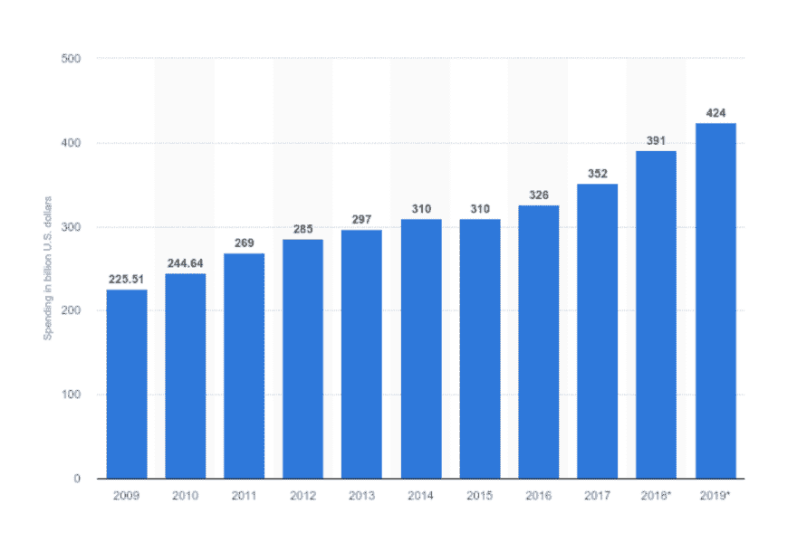
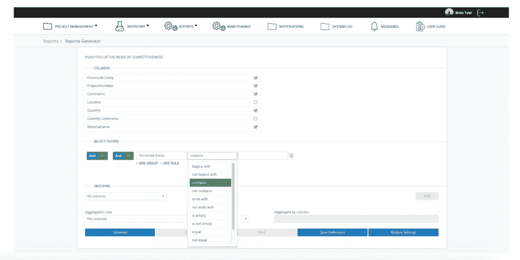
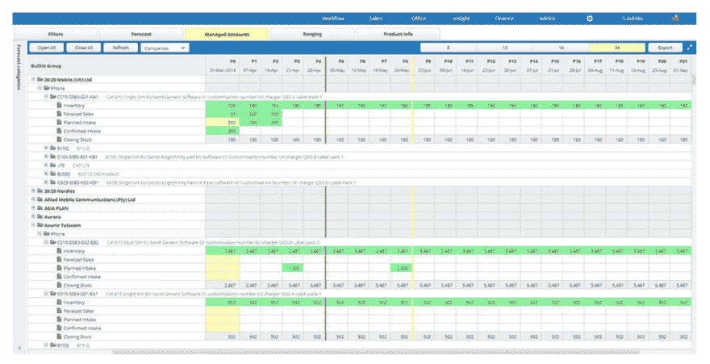
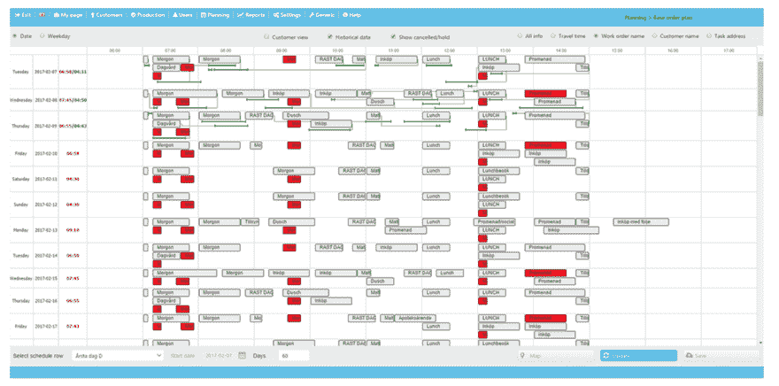

# 为什么考虑为您的企业定制 ERP 解决方案:好处，使用案例

> 原文：<https://dev.to/apium_hub/why-consider-customized-erp-solutions-for-your-business-benefits-use-cases-3k9o>

正确选择的 ERP(企业资源规划)软件可以帮助您组织、自动化和改善您的业务。定制的 ERP 解决方案可以提高效率并保持持续增长。不幸的是，随机选择这种软件，你有浪费金钱的风险，而不会促进你的业务。在本文中，我们将考虑使用定制 ERP 解决方案的主要好处，并与您分享一些提示，帮助您选择正确的 [ERP 解决方案](https://xbsoftware.com/enterprise-resource-planning-software/)。

## 可扩展的定制 ERP 解决方案如何促进中小企业业务

ERP 应用程序是一种数据管理工具，允许查看和共享数据，以优化和自动化基本业务运营。有一种普遍的误解，认为 ERP 软件只适合大型组织。事实是，即使是中小型企业也可以从使用定制的 ERP 解决方案中受益。这种系统有一个模块化的体系结构，可以随着业务的变化和复杂性的增加而修改。因此，越来越多的时候，我们可以面对这样的情况，当中小企业部门的公司遵循降低成本的愿望，决定放弃从头开发 ERP 应用程序的想法。相反，他们决定通过添加实现缺失功能的定制模块来更新现有的软件解决方案。

由于组织结构、部门之间复杂的相互联系和其他问题，可能很难收集和分析数据。ERP 是一种工具，允许从各种业务交易中收集、组织和解释数据，包括:

*   客户关系
*   供应链
*   库存
*   采购
*   人力资源
*   金融
*   销售
*   制造业
*   工程

没有经过处理，这样的信息就没有背景和视角。除此之外，你看不到数据不同部分之间的联系。定制的 ERP 解决方案允许提取、自动化和组织此类数据，这有助于开发智能业务移动所需的洞察力。ERP 软件通过做出基于数据的决策，使组织变得更加灵活和高效。

世界各地的公司都对 ERP 解决方案表现出浓厚的兴趣。根据 [Statista 网站](https://www.statista.com/statistics/203428/total-enterprise-software-revenue-forecast/)的数据，在 2010-2017 年期间，全球 ERP 支出增长了 40%以上:

[T2】](https://apiumhub.com/wp-content/uploads/2018/06/Screen-Shot-2018-06-21-at-08.50.25.png)

为了确保 ERP 仍然是一项值得您关注的前景技术，让我们来看看 ERP 市场中顶级影响者的观点。

## 2018 年定制化 ERP 解决方案展望。专家意见

根据长期技术创新者 Bernard Golden 的观点，“向云计算的转变将会继续并加速。采用的驱动因素之一是规模:大多数企业正在处理更多种类的商品、服务、客户互动和营销活动。这将导致更多的交易触及 ERP 系统，并导致企业要求新的面向云的 ERP——不是驻留在云中的 ERP 系统，而是适合云驻留企业的 ERP 解决方案。期待 2018 年围绕 ERP 解决方案开发的 ERP 客户/供应商讨论，这些解决方案可以帮助企业成为云原生组织。”

技术评估中心(Technology Evaluation Centers)的企业应用行业分析师 Predrag Jakovljevic 表示:“新的 ERP 软件将越来越多地建立在创新的云架构之上，这种架构是从头开始设计的，旨在应对实时处理全球企业数据的巨大计算挑战。这些平台将具有以下特点:

*   [微服务](https://apiumhub.com/tech-blog-barcelona/microservices-architecture-implementation/)和开放式 API，便于集成和扩展；
*   快速内存计算，能够瞬间处理大量数据；
*   具有管理工作流和模块交互的灵活且适应性强的规则的领域模型；
*   统一的信息架构消除了对单独数据仓库的需求，并简化了所有用户对分析的访问。

传统上，ERP 用户花费太多时间来验证过去，并花费太多时间进行耗时、资源密集型操作，如批量交易处理、账户关闭流程和定期审计，这些操作只有在发现问题并采取行动时为时已晚的情况下才有助于发现问题。"

Panorama Consulting Solutions 的管理合伙人兼创始人 Eric Kimberling :“随着全球经济持续改善，更多公司扩大增长规模，资本投资持续增长，更多公司将更有可能投资于他们的数字化转型计划。所有这些因素将导致更多的公司在新的一年及以后重新审视他们的企业系统战略。供应商不太可能引入新功能或为这些过时的产品提供长期支持，这导致许多组织认为他们别无选择，只能迁移到更现代的企业技术。越来越多的组织似乎对“组织变革管理”这一术语变得过敏…这意味着组织必须认识到对成熟的组织变革专业知识和工具集的需求。”

目前的事态允许我们说，ERP 软件的世界正处于一个关键时刻。目前情况有点争议。主要软件供应商正在推广高效、前沿的技术，以实现最佳的定制 ERP 解决方案。另一方面，许多首席信息官和其他高管对这类产品的相对不成熟感到紧张。

尽管如此，有一件事是不变的。为特定客户的需求灵活开发 ERP 解决方案仍然是一个竞争激烈的行业。在许多方面，2018 年将带来需要注意的新趋势。

## 定制的 ERP 解决方案如何帮助提升您的业务

除了实时跟踪关键绩效指标(KPI)的能力之外，ERP 系统还可以整合业务部门、监控工作流程、识别重复项和分析数据完整性。

以下是 ERP 软件的主要功能，可以帮助公司节省资金:

*   自动化员工工作的某些部分
*   单一用途软件故障排除
*   确保在一个地方收集的所有公司数据的安全性
*   创建用于分析和报告的单一解决方案
*   简化库存跟踪和销售
*   改善公司不同部门员工之间的合作

为了更好地满足特定公司的需求，ERP 解决方案可以在两个层面上工作:

*   **ERP 作为一个系统或从零开始的单一解决方案**。如果您不使用任何 ERP 应用程序，并计划申请软件开发公司的服务，此选项更可取。业务分析师将进行一系列的访谈，以确定您的业务问题，并开发适当的软件解决方案来解决这些问题。
*   **ERP 作为现有系统的集成模块**。该选项允许改进使用的业务流程，而无需在新软件解决方案的开发和部署上花费资源。相反，您可以向已经在使用的应用程序中添加新的模块，并根据需要进行相应的定制。可能的选项包括报告模块、客户和订单管理工具、工作量管理工具、时间跟踪系统、项目仪表板等等。这种解决方案有助于提高分析效率，改进报告，并允许在不中断任何业务流程的情况下做出更好的业务决策。

## 选择 ERP 软件时的常见错误

**缺乏坚实的战略**

当你在寻找一个新的 ERP 系统时，你的主要任务之一就是明确你的业务需求。你应该对自己的战略和主要业务目标有一个清晰的愿景。你应该定义你的公司需要什么样的 ERP 解决方案。可能的替代方案包括从头开始开发的系统和一个单独的模块(财务、制造、人力资源、销售、CRM、项目管理)。

记住，没有必要急于选择一个特定的 ERP 系统。在这样做之前，你必须花足够的时间来了解你的业务需要什么，成本会有多高。清楚 ERP 系统或模块将带来的好处是至关重要的。原因是所选择的解决方案将在您的业务前景中发挥关键作用。

**非标准需求规格**

在选择 ERP 解决方案时，许多公司要求实施非常具体的模块。例如，一个从官方网站下载一些法律信息到系统的模块。不要试图提供将来可能需要或不需要的所有特性，你应该把重点放在保证市场竞争优势的特性上。比如信息采集自动化，一键生成报告等等。

**使用演示版本评估系统**

软件供应商将很乐意向您展示他们根据您的需求设计的 ERP 软件的可能性。不同的公司有不同的开发方法和使用的技术。因此，可能很难比较他们的工作结果。

一个可能的解决方案是要求一个允许比较“苹果与苹果”的结构化演示目标是为每个潜在的软件供应商提供相同的测试计划。这样的计划应该描述你想要测试的所有场景。您应该关注开发的解决方案如何满足您的需求。该测试必须确认在 ERP 解决方案中实现的功能可以改进您的业务流程。

**关注成本而非收益**

每个客户都希望自己的 ERP 解决方案能够按照预算按时交付。达到这些目标通常被认为是成功的结果。确保软件开发和部署的成本保持在最初的预期之内是一件非常自然的事情。但不幸的是，这种方法没有考虑到潜在的前景。

请记住，长期利益应该优先于初始开发成本。不要只关注某个 ERP 应用程序会给你的公司带来多少成本，而要尝试评估长期前景。最糟糕的事情之一就是仅仅因为成本原因而选择一个 ERP 解决方案。你应该考虑在根据你的业务特点设计的 ERP 软件上多花 10%或 15%的钱，最终会使你的财务收益成倍增加。

**定制 ERP 软件的优势及实例**

定制 ERP 软件可以为任何公司提供业务优势，因为它的设计完全符合客户的要求。现成的解决方案有一定的优势，但这种软件并不适合每个人，因为每个企业都是独特的。一些公司在开始使用现成的解决方案后面临不同的麻烦，因为需要根据这类软件的具体情况调整工作流程。

让我们考虑一下使用定制的 ERP 软件的主要好处。

**减少额外开支**

现成的 ERP 解决方案实施的功能应符合一般组织的要求。这可能会给你的公司带来不同的后果。软件开发需要时间和努力，这反映在最终成本中。即使有些功能你的企业并不感兴趣，你也必须支付全额费用。另一方面，缺少您的特定业务所需要的特性将会导致实现上的额外损失。

定制 ERP 解决方案的主要优势在于，软件公司完全按照您的要求从头开始创建此类应用程序。软件供应商会尽最大努力了解您业务的每个独特方面，例如您工作的行业、您使用的数据的性质以及当地立法的特殊性。这种方法可以保证最终的软件产品将实现对您的业务问题的解决方案，而不会违反本地法规，比如说，与个人数据存储相关的法规。

**不改变工作流程**

有时，实施新的 ERP 系统意味着员工必须根据将要使用的软件相应地改变工作流程。选择定制的 ERP 解决方案可以避免这样的后果。这样的软件是根据你的业务具体情况制作的，所以它可以自动化人工操作，而不改变习惯的做事方式。

如果您想避免工作流程中的任何延迟，在您的系统中集成一个 ERP 模块将是一个不错的选择。Skyline 是集成 ERP 报告模块的一个示例:

[T2】](https://apiumhub.com/wp-content/uploads/2018/06/Screen-Shot-2018-06-21-at-08.58.57.png)

本模块旨在减少为进一步报告而收集和分析重要信息的工作量。要创建符合特定要求的报告，用户可以创建自定义模板、筛选和分组可用数据。制作的报告可以保存或导出为 Excel、PDF 或 CSV 格式。

## 提高系统性能和可用性

通常，定制的 ERP 解决方案比其他解决方案提供更好的性能。在这种情况下，软件架构是从头开始设计的，以实现高性能和更好的应用程序可用性。定制的 ERP 软件是可扩展的，因此您可以重新配置它并集成更多的模块来适应您业务的增长。

面向企业的[工作流应用程序](https://xbsoftware.com/case-studies-webdev/workflow-app-for-business/)旨在帮助员工处理与业务合作伙伴、供应商、客户和其他参与者相关的大量信息:

[T2】](https://apiumhub.com/wp-content/uploads/2018/06/Screen-Shot-2018-06-21-at-09.01.48.png)

该解决方案允许用户立即接收当前业务事件的最相关信息。可视化数字报告模块以易于理解的形式呈现复杂的业务数据，有助于更快地做出重要的业务决策。此外，用户可以即时访问股票可用性、客户资料和订单历史。

## **改进了用户界面**

当您处理一项需要分析大量数据的复杂任务时，最重要的是设计合理的用户界面。用户必须能够容易地理解屏幕上显示的是什么数据，以及所有控件的用途是什么。由于定制的 ERP 解决方案是为满足特定公司的需求而设计的，因此您可以放心，软件供应商的业务分析师和开发人员将会做出必要的努力来获得最佳的用户体验。

## 自动化和统一的报告系统

定制的 ERP 解决方案提供了有关您公司不同部门运营流程的完整信息，如财务、人力资源管理、制造、营销、供应链、仓库管理等。ERP 软件可以实现从一个部门或职能到另一个部门或职能的工作流程自动化。这有助于确保该部的所有活动都由一个单一的报告系统进行监测，从而简化了统计数据的分析。

作为一个旨在管理公司不同阶段工作流程的 ERP 应用程序的示例，您可以查看[劳动力和设施管理套件](https://xbsoftware.com/case-studies-webdev/workforce-and-facility-management-suite/):

[T2】](https://apiumhub.com/wp-content/uploads/2018/06/Screen-Shot-2018-06-21-at-09.04.03.png)

该解决方案简化了从合同创建到报告的公司工作流程监控。该应用程序允许即时访问联系人、订单、工作班次计划和主要关键绩效指标。

## 结论:定制的 ERP 解决方案

为中小型企业选择 ERP 解决方案可能是一个相当具有挑战性的问题。与定制软件相比，您更喜欢现成的解决方案，因此您可能会在不能完全反映您业务特点的解决方案上花钱。购买现成的 ERP 解决方案，你可能会面临重要功能的缺乏。为了满足您的期望，定制软件开发公司花时间来更好地了解您的公司，并为您的业务问题提供软件解决方案。客观地评估 ERP 开发者的潜力，你会有信心选择最佳的解决方案，以最小的风险满足你可预见的需求。

## 如果您对这篇关于定制 ERP 解决方案的文章感兴趣，您可能会喜欢…

BDD:用户界面测试

[Scala 中泛型类型的 F-bound](https://apiumhub.com/tech-blog-barcelona/f-bound-scala-generics/)

[微服务 vs 整体架构](https://apiumhub.com/tech-blog-barcelona/microservices-vs-monolithic-architecture/)

[“几乎无限”的可扩展性](https://apiumhub.com/tech-blog-barcelona/almost-infinite-scalability/)

[软件架构的重要性](https://apiumhub.com/tech-blog-barcelona/importance-good-software-architecture/)

软件架构师的软技能

[软件架构书籍](https://dev.to/apium_hub/top-19-software-architecture-books-blf)

[软件架构的优势](https://apiumhub.com/tech-blog-barcelona/benefits-of-software-architecture/)

[巴塞罗那软件架构会议](https://dev.to/apium_hub/apiumhub-software-architecture-meetups-in-barcelona-31df)

帖子[为什么考虑为你的企业定制 ERP 解决方案:好处、用例](https://apiumhub.com/tech-blog-barcelona/customized-erp-solutions/)最先出现在 [Apiumhub](https://apiumhub.com) 上。