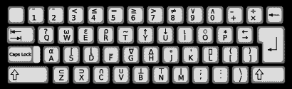
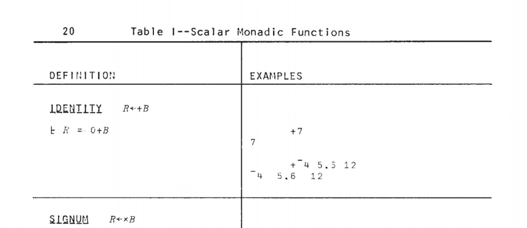
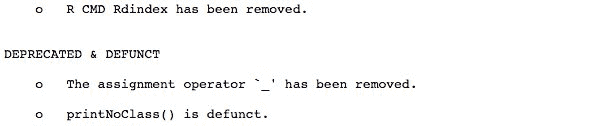
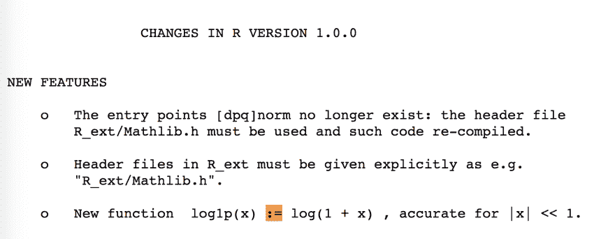

# 为什么我们使用 arrow 作为赋值操作符？

> 原文：<https://dev.to/colinfay/why-do-we-use-arrow-as-an-assignment-operator-10m1>

一个 Twitter 帖子变成了一篇博客文章。

六月，我在 Twitter 上发布了一个关于 r 中的`<-`赋值操作符的历史的小[帖子](https://twitter.com/_ColinFay/status/1006139974377443328)。

## 历史原因

众所周知，R 来自 S。但是你可能不太了解 S(我不了解)。这种语言使用`<-`作为赋值操作符。部分原因是它受到了一种叫做 APL 的语言的启发，这种语言也有赋值的符号。

但是为什么呢？APL 是在一个特定的键盘上设计的，键盘上有一个键用于`<-`:

[T2】](https://res.cloudinary.com/practicaldev/image/fetch/s--W8LDHN5v--/c_limit%2Cf_auto%2Cfl_progressive%2Cq_auto%2Cw_880/https://upload.wikimedia.org/wikipedia/commons/thumb/9/9f/APL-keybd2.svg/410px-APL-keybd2.svg.png)

当时之所以选择它，也是因为没有测试等式的`==`:等式是用`=`来测试的，所以给一个变量赋值需要用另一个符号来完成。

[T2】](https://res.cloudinary.com/practicaldev/image/fetch/s--Nn9IASpw--/c_limit%2Cf_auto%2Cfl_progressive%2Cq_auto%2Cw_880/https://colinfay.me/assets/img/blog/apl.jpg)

> 来自 [APL 参考手册](http://www.softwarepreservation.org/projects/apl/Books/APL360ReferenceManual)

直到 [2001](http://developer.r-project.org/equalAssign.html) 之前，在 R 中，`=`只能用来赋值函数参数，像`fun(foo =
"bar")`(记得 R 是 1993 年出生的)。所以在 2001 年之前，`<-`是给变量赋值的标准(也是唯一的方式)。

在此之前，`_`也是一个有效的赋值运算符。它在 [R 1.8](https://cran.r-project.org/src/base/NEWS.1) 中被删除:

[T2】](https://res.cloudinary.com/practicaldev/image/fetch/s--RFbFvYRp--/c_limit%2Cf_auto%2Cfl_progressive%2Cq_auto%2Cw_880/https://colinfay.me/assets/img/blog/runderscore.jpg)

(所以没有，当时没有 snake_case_naming_convention)

科林·吉莱斯皮在 2000 年初发表了他的一些代码，任务是这样的:)

引入“相等赋值”的主要原因是因为其他语言使用`=`作为赋值方法，并且因为它增加了与 S-Plus 的兼容性。

## 而今天呢？

### 可读性

如今，很少有什么情况下你不能用一个代替另一个。几乎在任何地方使用`=`都是安全的。然而，`<-`是 R 编码风格指南中的首选和建议:

*   [https://google.github.io/styleguide/Rguide.xml#assignment](https://google.github.io/styleguide/Rguide.xml#assignment)
*   [http://adv-r.had.co.nz/Style.html](http://adv-r.had.co.nz/Style.html)

选择`<-`的一个原因(如果不是历史原因的话)是它清楚地说明了你在哪边赋值(你可以在 R 中从左到右或者从右到左赋值):

```
a <- 12
13 -> b 
a

## [1] 12

b

## [1] 13

a -> b
a <- b 
```

例如，RHS 分配可用于分配管道
的[结果](https://rud.is/b/2015/02/04/a-step-to-the-right-in-r-assignments/)

```
library(dplyr)
iris %>%
  filter(Species == "setosa") %>% 
  select(-Species) %>%
  summarise_all(mean) -> res
res

## Sepal.Length Sepal.Width Petal.Length Petal.Width
## 1 5.006 3.428 1.462 0.246 
```

此外，在这里的最后一行代码中，更容易区分相等比较和赋值:

```
c <- 12
d <- 13
e = c == d
f <- c == d 
```

注意`<<-`和`->>`也存在:

```
create_plop_pouet <- function(a, b){
  plop <<- a
  b ->> pouet
}
create_plop_pouet(4, 5)
plop

## [1] 4

pouet

## [1] 5 
```

而且罗斯伊哈卡使用`=`:[https://www . stat . Auckland . AC . NZ/~伊哈卡/downloads/JSM-2010.pdf](https://www.stat.auckland.ac.nz/~ihaka/downloads/JSM-2010.pdf)

### 环境

存在一些环境和优先级差异。例如，`=`的赋值只在函数级完成，而`<-`作为函数参数在内部调用时在顶层完成。

```
median(x = 1:10)

## [1] 5.5

x

## Error in eval(expr, envir, enclos): object 'x' not found

median(x <- 1:10)

## [1] 5.5

x

## [1] 1 2 3 4 5 6 7 8 9 10 
```

在第一段代码中，您将传递`x`作为`median`函数的参数，而第二段代码在环境中创建了一个变量 x，并将它用作`median`的第一个参数。注意，它之所以有效，是因为`x`是函数的参数名，与`y` :
不起作用

```
median(y = 12)

## Error in is.factor(x): argument "x" is missing, with no default

median(y <- 12)

## [1] 12 
```

当涉及到这两个操作符时，解析也有区别(但我猜这在现实世界中从来不会发生)，一个失败而另一个没有:

```
x <- y = 15

## Error in x <- y = 15: could not find function "<-<-"

x = y <- 15
c(x, y)

## [1] 15 15 
```

这也是很好的实践，因为它清楚地表明了函数参数和赋值之间的区别:

```
x <- shapiro.test(x = iris$Sepal.Length)
x

## 
## Shapiro-Wilk normality test
## 
## data: iris$Sepal.Length
## W = 0.97609, p-value = 0.01018 
```

还有这个怪异的行为:

```
rm(list = ls())
data.frame(
  a = rnorm(10),
  b <- rnorm(10)
)

## a b....rnorm.10.
## 1 0.6457433 -0.5001296
## 2 0.2073077 -0.4575013
## 3 -0.4758076 -0.2820372
## 4 0.2568369 -0.4271579
## 5 0.4775034 -1.8024830
## 6 0.9281543 -0.2811589
## 7 0.3622706 -1.5172742
## 8 0.5093346 -1.9805609
## 9 -1.7333491 0.5559907
## 10 -2.0203632 1.9717890

a

## Error in eval(expr, envir, enclos): object 'a' not found

b

## [1] -0.5001296 -0.4575013 -0.2820372 -0.4271579 -1.8024830 -0.2811589
## [7] -1.5172742 -1.9805609 0.5559907 1.9717890 
```

## 一点点无关但

我喜欢这个:

```
g <- 12 -> h
g

## [1] 12

h

## [1] 12 
```

这当然不能用`=`来实现。

## 其他运算符

一些用户在 Twitter 上指出，如果你来自另一种语言，这可能会使代码更难阅读。`<-`is use“only”在 F#、OCaml、R 和 S 中使用(据维基百科所知)。即使`<-`在编程中很少见，我想它的意思也很容易理解。

注意，第二个最常用的赋值操作符是`:=` ( `=`是最常见的)。在`{data.table}`和`{rlang}`中用的特别多。`:=`操作符在当前的 R 语言中没有定义，但也没有被移除，仍然被 R 解析器理解。顶级不能用:

```
a := 12

## Error in `:=`(a, 12): could not find function ":=" 
```

但是正如解析器所理解的，您可以使用`:=`作为不带任何%%的中缀，用于赋值，或者用于其他任何东西:

```
`:=` <- function(x, y){
  x$y <- NULL
  x
}
head(iris := Sepal.Length)

## Sepal.Length Sepal.Width Petal.Length Petal.Width Species
## 1 5.1 3.5 1.4 0.2 setosa
## 2 4.9 3.0 1.4 0.2 setosa
## 3 4.7 3.2 1.3 0.2 setosa
## 4 4.6 3.1 1.5 0.2 setosa
## 5 5.0 3.6 1.4 0.2 setosa
## 6 5.4 3.9 1.7 0.4 setosa 
```

你可以看到`:=`被用作赋值运算符[https://developer.r-project.org/equalAssign.html](https://developer.r-project.org/equalAssign.html):

> 所有以前允许的赋值运算符(

或者在 R 新闻 1:

[T2】](https://res.cloudinary.com/practicaldev/image/fetch/s--2ckcP2ao--/c_limit%2Cf_auto%2Cfl_progressive%2Cq_auto%2Cw_880/https://colinfay.me/assets/img/blog/colonequal.png)

## 亦见

*   29 分左右':[https://channel 9 . msdn . com/Events/useR-international-R-useR-conference/useR 2016/years-of-S](https://channel9.msdn.com/Events/useR-international-R-User-conference/useR2016/Forty-years-of-S)
*   使用=或< -进行赋值？
*   R 中的“=”和“< -”有什么区别？
*   [赋值运算符](https://stat.ethz.ch/R-manual/R-devel/library/base/html/assignOps.html)